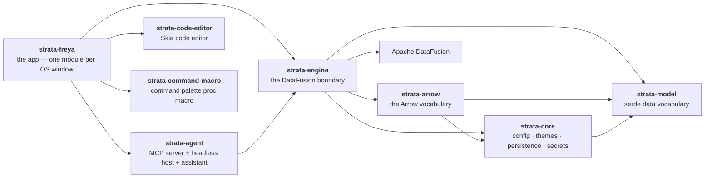

# Strata — Agent & Contributor Guidelines

Strata is a native macOS SQL workbench for parquet, CSV and JSON: a [Freya](https://freyaui.dev/)
(Skia) UI over [Apache DataFusion](https://datafusion.apache.org/). This document is for anyone
changing the code, human or AI agent alike — the architecture in brief, the principles the
codebase is held to, and the checks a change must pass. The user-facing story is the
[README](README.md); the system end to end is [docs/ARCHITECTURE.md](docs/ARCHITECTURE.md), and
[docs/README.md](docs/README.md) indexes the rest.

## Architecture

A virtual Cargo workspace with no root package; `cargo run` at the root builds the app.



`strata-arrow` is a layer below the engine, not a layer in front of `strata-core`: the engine
still reads core's services and model's vocabulary directly, and both edges stay drawn. What the
new crate buys is the *other* direction — a consumer can take the Arrow vocabulary without the
DataFusion boundary above it.

- **`strata-freya`** — the Freya (Skia/native) frontend and the default build target.
- **`strata-engine`** — query, snapshots, the statement pipeline, export, profiling, the SQL
  language service. **The only crate that touches DataFusion**; the arrow never points back up.
- **`strata-arrow`** — the Arrow-level vocabulary below the engine, DataFusion-free: the
  `ColumnInfo` an Arrow field becomes, the value tree, the Copy serializers, the EXPLAIN plan
  model, the engine-key and client-option catalogues. Arrow is pinned once at the workspace so it
  is the same arrow `datafusion::arrow` resolves.
- **`strata-core`** — app services below the engine, DataFusion-free: config, keymap, themes,
  `.strata/` project persistence, the OS-keystore secret store, the updater mechanism.
- **`strata-model`** — leaf data vocabulary, serde only. No logic.
- **`strata-code-editor`** — the vendored Skia code editor (Rope buffer + tree-sitter) the SQL
  surface is built on.
- **`strata-agent`** — agent access and the assistant: the read-only tool vocabulary, the MCP
  server, the headless stdio host, the chat loop. Deliberately Freya-free, which is what lets one
  implementation serve HTTP, stdio and the in-app pane.
- **`strata-command-macro`** — the command palette's registration proc macro.

The UI framework is [our Freya fork](https://github.com/alexparlett/freya), an ordinary git
dependency pinned by `Cargo.lock`. When app code starts working *around* a framework limitation —
a registry, a scale-factor correction, a duplicated theme token, a hand-rolled copy of a built-in
component — the right fix is usually *in* the fork, kept upstream-shaped (themed tokens, doc
comments, examples).

Three load-bearing ideas:

**The engine is a direct-call async facade.** `strata_engine::Engine` owns a private multi-thread
Tokio runtime, spawns each call onto it, and the caller awaits the result — no channels, no
request ids, no UI-side runtime, no worker loop. A Run materializes an immutable snapshot, and
every later read — page, sort, chart, export — is a bounded read of that
snapshot, which is what makes paging stable and caching sound. Where a snapshot's bytes live is a
`SnapshotStore`, held to typed fidelity, the row-order ordinal, exact null counts and
immutability but never to a format; the default writes Arrow IPC. It is built one way, by
`Engine::builder()`, which is where an embedder's choices go — config, secrets, SQL functions, data
sources, file formats, the snapshot store, the memory pool — and every method on the built engine takes `&self`, so a
handle reaches all of them through `Deref` and no wrapper needs forwarders. Those methods are
reached through six borrowed **group handles** naming what the call is about — `ws(id)`, `snapshot(id)`, `catalog()`,
`sources()`, `lang()`, `work()` — plus a short root set for the engine itself; the mapping is
total, and a test fails when a new public method escapes it.

**One statement pipeline in front of dispatch.** `Workspace::run` puts every statement through
`statements::accept` — parse, resolve its bare names, classify — and spends the answer: run it as a
query, perform it with a real implementation, or refuse it by name with the reason. The stages are
typed so their order cannot be got wrong, the grammar and the policy are separate questions, and
anything refused is refused in one place with one wording. Every surface that creates or changes
something — a table, a view, an export — is a gesture into a funnel that already exists, never a
second implementation of one.

**Who may do what is data an embedder supplies.** `EngineBuilder::with_policy` takes a
`PolicyProvider` that answers in codes, never prose, so the engine mints every refusal; the shipped
one is a `Capability` — a set of grants over a local/remote axis, with a per-connection scope for
the remote half. Unset, it allows everything: restriction is something you say, not something you
switch off. A caller's own capability narrows the engine's and never widens it, which is how one
engine serves a full editor and a read-only agent at once.

**Writes only touch data Strata owns, or a database that opted in.** Your source files are read,
never written. Write statements are gated on the parsed plan's target; a database connection is
read-only until its own `read_only` setting says otherwise, and then it takes the statements
DataFusion can plan against it (`INSERT`, `CREATE TABLE AS SELECT`) and the ones only the server
can run (`CREATE VIEW`, the `DROP`s, a column-list `CREATE TABLE`, `UPDATE`, `DELETE`), the second
group dispatched as the text you typed with the connection's qualifier cut out. The agent surface
is opened read-only; exports refuse to land inside storage Strata manages.

## Principles

- **Generic capability, not hardcoded subsets.** Build the real mechanism, not a stub that passes
  today's case.
- **Real end-states, not placeholders.** No TODO scaffolding as the deliverable.
- **Model impossible states out of existence; fail loud on the rest.** Expected absences get
  defaults; unrecoverable faults are surfaced, never papered over with a silent blank fallback.
  Never reshape a production signature just to make a test fit.
- **Framework-native idiom.** Standard Freya components first — themed, not hand-rolled. Colours
  come from theme roles, spacing from the shared scale, fonts from the typography components;
  never a literal at a call site.
- **Doc comments describe the code, not the change.** **One sentence**, or a short paragraph where
  one sentence genuinely cannot carry it — stating a decision, a constraint, or the failure it
  prevents. Never the task, the review or the conversation that produced it, and **a task id is a
  task reference**: no `(DB-11)`, no "DB-04 adds this", no "corrected in review". Where the *why*
  needs more than a paragraph, it belongs in `.agent/`, not in the file. No inline `//` comments
  inside bodies; extract or rename instead. A `pub` item's comment is library documentation for a
  stranger — read [reference/COMMENTS.md](.agent/reference/COMMENTS.md) before writing one, and
  again before calling a change done.
- **Verify from source before agreeing.** Check the crate or the fork before confirming a claim
  about an API — including your own.
- **User-facing text reads like a standard IDE.** Terse plain sentences, single-quoted
  identifiers, no hedges, no ellipses.

## Testing

Every feature has a test, and a bug fix carries the test that would have caught it.

Two integration tests drive real servers (MinIO and PostgreSQL) through
[testcontainers](https://rust.testcontainers.org/), so `cargo test` needs a container runtime —
Docker, colima or Testcontainers Cloud all serve. Without one those tests **fail rather than
skip**, deliberately: "no runtime" must not look like "the code is fine".

After any change to the theme system, regenerate and verify the committed schema:

```bash
UPDATE_SCHEMA=1 cargo test -p strata-freya schema_in_sync
```

## Checks

CI runs these on macOS on every PR; run them locally first:

```bash
cargo fmt --all
cargo clippy --workspace --all-targets --locked -- -D warnings
cargo test --workspace --locked
```

The curated lint set lives in `[workspace.lints]` in the root `Cargo.toml`, with thresholds in
`clippy.toml`. A lint that is wrong for this codebase is allowed once at the workspace with a
one-line reason — not suppressed per site; an inline `#[allow]` is reserved for a fact about one
specific site and carries the reason it is true there.

If you work with Claude Code, the repo ships a `run-app` skill in `.claude/skills/` that
launches the app the right way.

## Pull requests

- Target `main`.
- Open with a short human-written paragraph: why the work was done and who it helps. Any
  generated technical description goes below it.
- If a change alters behaviour that a document in `docs/` describes, the document changes in the
  same PR — `docs/` describes the code as built, always.
- Keep the diff scoped to the thing you're doing. No drive-by reformatting or speculative
  refactors.

AI assistance is welcome — much of Strata is built with it — but whoever opens the PR must
understand the change and its consequences, whether they typed it or an agent did. The full
policy is in the [README](README.md#use-of-ai).
