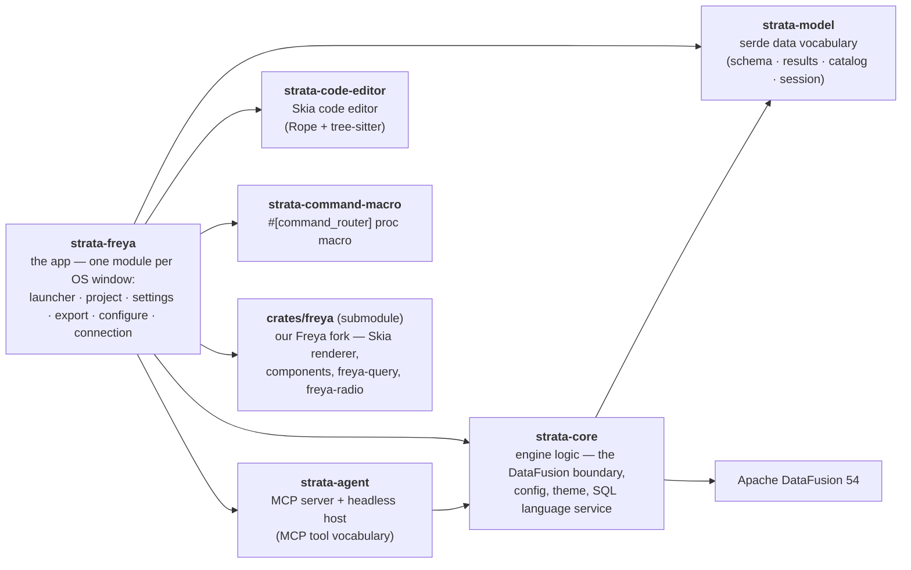

# Strata

A local, **Athena-style parquet query workspace** — a polished native IDE for querying parquet, CSV and JSON with SQL,
with no Glue catalog or schema setup. Built with [Freya](https://freyaui.dev/) 0.4 (Skia, native — no webview) and
[Apache DataFusion](https://datafusion.apache.org/).

Work is organised into **projects**: a folder with a `.strata/` directory holding its catalog, session and query
history. Open one per window; the app reopens what you had at last quit.

---

## What it does

### Data in

- **Catalog** of external **tables** (parquet / CSV / JSON / Arrow over files, directories, or globs — one table over
  any mix) and **views** (saved SQL), in a filterable sidebar with type-coloured columns, `PART` badges on
  Hive-partition columns, and an `INTERNAL` badge on tables Strata itself wrote. A table whose source is missing stays
  in the list as a failed row with its reason — the catalog shows what the project *says*, not just what registered.
- **Connections** — read the same formats straight out of **S3**, **GCS**, or any **S3-compatible** store (Cloudflare
  R2, MinIO, …via a custom endpoint), plus plain HTTP(S) for a single public file. Strata never stores, prompts for,
  or reads a secret: a connection carries a bucket, a provider and an auth *mode* (ambient credentials, a named
  `~/.aws` profile, a service-account key *file path*), and credentials resolve at query time from the machine's own
  chains — `aws sso login` in another terminal just works. Connections live in `project.json` beside the tables, so a
  colleague who has the bucket has the connection. Hive-partitioned lakes over a bucket work, pruning included.
- **Table Config** — register or edit a table: multi-path sources with browse, per-format read options (CSV delimiter,
  header, quoting, compression…; JSON as one-record-per-line or a whole-document array), and Hive-partition detection
  that *lists* the `key=value` levels rather than asking you to type them, with typed partition columns.

### Querying

- **Query workspace** — tabs (drag to reorder, duplicate, rename, close-others/right/all, reopen closed), each owning
  its own editor buffer, undo history and results view; all of it restored at reopen.
- **SQL editor** (DataFusion dialect) — syntax highlighting, completion fed by the engine's own vocabulary (keywords,
  tables, views, columns, CTEs, and functions with their real signatures), and live diagnostics that go well past
  parse errors: policy refusals name the surface that owns the statement, *every* unknown table and column is flagged
  with its span, and each statement is dry-planned against the live session so type errors surface before you run.
  Format SQL, Run / Cancel (⌘↵), Explain and Explain analyze, Save and Save-as-view.
- **Statements** — the editor runs queries (`SELECT`, `EXPLAIN`, `SHOW`, `DESCRIBE`) and `CREATE TABLE` /
  `CREATE TABLE … AS SELECT`, which spool real, durable tables into the project (`.strata/tables/`, Arrow IPC) and
  register them like any other — that's the `INTERNAL` badge. The rest of the statement surface (`INSERT`,
  `DROP`, `CREATE VIEW`, `COPY … TO`, `SET`, …) is classified and routed but still being lifted statement by
  statement: today those answer "not implemented yet" at Run. A short list is refused outright with the reason
  (`CREATE DATABASE`/`SCHEMA`, `UPDATE`/`DELETE`, `INSERT OVERWRITE`). One statement per Run; an intercepted
  statement reports its outcome in the results pane without disturbing the tab's last result.
- **Query history** — successful runs only, deduplicated, in the drawer: press to load, double-press to load and run.
  Persisted per project (`.strata/history.jsonl`).

### Results

- **Results grid** — virtualized, type-coloured cells with per-column resize and double-click autofit, whole-snapshot
  sort, find-in-results, pagination (100–1000 rows a page), and Excel-style selection — cells, rows or columns — with
  copy as TSV / CSV / JSON / Markdown. The status bar shows a live selection aggregate (count / Σ / avg / min / max)
  and the result's age. Double-click the row gutter for a record view; double-click a nested cell for a lazy,
  virtualized value tree.
- **Chart view** — flip the results pane from Table to Chart: bar, line, area, scatter, histogram and pie, with X / Y /
  Series encoders constrained to what each mark can draw, a legend, a hover readout, and sort as a pure repaint.
  The chart renders the result you already ran — it computes nothing SQL can say — so a refusal ("more than one row
  per cell") names the `GROUP BY` that fixes it rather than aggregating behind your back.
- **Explain plan** — `EXPLAIN` renders as an operator tree (physical or logical, raw text a toggle away);
  `EXPLAIN ANALYZE` adds real metrics: per-operator self-time with a share bar, a `HOTSPOT` badge on the operator
  that dominates, and the full metric set grouped behind a disclosure.
- **Column inspector** — type, nested-field tree, and **only facts that were actually read**: parquet footer
  statistics and the table row count, plus an opt-in full **scan** (behind a cost confirm) for the numbers the footer
  can't answer.
- **Export window** — CSV, JSON, Parquet or Arrow with per-format options, Hive partitioning with a tree preview
  built from the run's real rows, and a preview of the file itself. The window pins the snapshot it was opened on,
  so re-running the query while it's open can't truncate the write: what you export is what was on screen.

### The app around it

- **Bottom drawer** — **Problems** (live SQL diagnostics for every open tab, plus project-scope conditions like
  failed registrations), **Events** (what the session did), **History**.
- **Command palette** (⌘K) — actions, tables, views, saved queries and columns in one search.
- **Settings window** — Theme (with sync-with-OS), System, Data display, **Keymap** (every command rebindable, with
  conflict detection and reassign), **Agent access**, and **Engine ▸ Properties**, which edits DataFusion's own
  configuration keys directly and badges the ones that need an engine restart.
- **Themes** — `Midnight` (dark) and `Daylight` (light) ship built in; user themes are JSON files of ~100 named
  colour roles dropped into the themes directory. See [`docs/FREYA_THEME_SPEC.md`](docs/FREYA_THEME_SPEC.md).
- **Multi-window** — one window per project, a launcher for recents, native menubar with Open Recent, and child
  windows (settings, export, configure, connection) that pin to their owner. Window geometry and layout persist.
- **Agent access** — an opt-in MCP server so an AI agent (Claude Code, Cursor, Copilot…) can list your catalog,
  inspect schemas and run **read-only** SQL. Its queries are real runs on your engine, shown in the sidebar's
  **Agents** pane — a press opens any of them in a new tab. Your tabs stay yours. The same tools are available with
  the app closed, over stdio: `strata mcp <project>`. See [Agent access](#agent-access) below.

---

## Installing

macOS, from Homebrew:

```bash
brew tap alexparlett/strata
brew trust alexparlett/strata
brew install --cask strata
```

The tap is [alexparlett/homebrew-strata](https://github.com/alexparlett/homebrew-strata). Both of the first two
steps are Homebrew's own: it no longer taps a third-party repository on your behalf, and it will not load a cask
out of one until you have said you trust it. Or take the DMG straight from the
[latest release](https://github.com/alexparlett/strata/releases) and drag Strata to your Applications folder; the
cask installs the same file.

Updating is the app's own job either way (**App ▸ Check for Updates…**, or the version line in the launcher), so
the cask is marked `auto_updates` and a plain `brew upgrade` leaves it alone rather than reinstalling over a newer
build it cannot see. `brew upgrade --cask --greedy strata` hands the job back to Homebrew.

The rest of this file is about building it yourself.

---

## Prerequisites

- A Rust toolchain via [rustup](https://rustup.rs).
- **The `crates/freya` submodule.** Freya is our fork, and the build resolves it from the **local checkout path**
  (root `Cargo.toml`, `[workspace.dependencies]`) — without it nothing compiles:

  ```bash
  git submodule update --init --checkout
  ```

  `git submodule status crates/freya` should print no `+` or `-` prefix. (`git worktree add` does **not** update
  submodules — run the command above in each new worktree.)

There is no webview and no system GUI dependency to install; Freya renders with Skia, which compiles from source on
the first build. macOS is the platform Strata ships and is tested on — CI runs on macOS, and the menubar,
traffic-light gutter and child-window pinning are macOS-specific.

---

## Build & run

```bash
cargo run
```

The root's `default-members` is the Freya app, so a bare `cargo run` at the repo root is the app. `cargo run --release`
is the one to use for real work. Either way the first build pulls DataFusion and compiles Skia — give it time.

To try it against real data, open the repo's **`sample/`** folder as a project: it registers parquet, CSV and JSON
tables, a Hive-partitioned `events/` directory, internal tables, saved views and queries.

For the federated half, start the sample database — a seeded PostgreSQL in a container, with no password to enter:

```bash
docker build -t strata-sample-pg sample/postgres && docker run -d --name strata-sample-pg -p 127.0.0.1:55432:5432 -e POSTGRES_USER=strata -e POSTGRES_DB=strata_sample -e POSTGRES_HOST_AUTH_METHOD=trust strata-sample-pg
```

The project already carries the connection, so `SELECT * FROM orders` joins the parquet users straight onto live
PostgreSQL. **[`sample/postgres/README.md`](sample/postgres/README.md)** is what is in it and what to try —
including the deliberate name clashes that show which source a bare name means.

### Tests

```bash
cargo test --workspace --locked
```

`--workspace` rather than a bare `cargo test`, which `default-members` would narrow to `strata-freya` alone. The
connections integration test drives a real MinIO through testcontainers and deliberately **fails** (rather than
skipping) without a container runtime — Docker, colima or Testcontainers Cloud all serve. After any theme change,
regenerate and verify the committed schema:

```bash
UPDATE_SCHEMA=1 cargo test -p strata-freya schema_in_sync
```

---

## Getting a build

For a distributable `.app` and DMG:

```bash
./scripts/bundle-macos.sh
```

Universal binary and DMG land in `target/dist/`; `--arch arm64` is roughly half the build time, `--no-dmg` stops at
the `.app`. The same script runs on a GitHub runner via **Actions → Release**, which can attach the DMG to a run or
publish a release page.

**[`docs/RELEASING.md`](docs/RELEASING.md)** is the full account — the workflow's inputs, cutting a version, what
signing rung the build took, and the `xattr -dr com.apple.quarantine` step testers need while builds are unsigned.

---

## Agent access

Strata can serve its own catalog and query engine to an AI agent over the
[Model Context Protocol](https://modelcontextprotocol.io). The agent lists tables, inspects schemas and runs
**read-only** SQL — every write-shaped statement is refused with the same wording the editor would use. Its queries
are real runs against the same engine, materializing the same immutable snapshots your own do, so anything it finds
you can page, sort, export or take over.

The one thing an agent can write is a **file**: `export_result` saves a result it has already run to a path it names,
in CSV, NDJSON, Parquet or Arrow. It never overwrites an existing file, never creates folders, and cannot write inside
the project's own `.strata` directory. Nothing else about your project is writable — an agent cannot register a table,
save a view or change a setting.

The agent works in **query sessions** of its own, not in your tabs: the sidebar's **Agents** pane shows each connected
agent, what it is working on and every query it has run, with the figures each one came back with. Press a query and it
opens in a **new** tab, yours to read, edit and run. Nothing an agent does opens, focuses or closes a tab of yours, and
none of it reaches your query history — a query you promote and run goes in there like any other. Only connected agents
appear: a client that disconnects takes its query sessions with it.

Turn it on in **Settings ▸ Agent access**, which is also where the port and the bearer token live. It is **off by
default**. The token is minted once and persisted, so a client stays configured across restarts — regenerating it
invalidates every client you have set up.

The header bar shows a dot to the left of the search button: **grey** while nothing is paired, **green** once an agent
connects, **amber** if the setting is on but the server could not start — almost always a port already in use.

Everything a client needs is three facts:

| | |
|---|---|
| **URL** | `http://127.0.0.1:<port>/mcp` — `47821` by default |
| **Header** | `Authorization: Bearer <token>` |
| **Transport** | Streamable HTTP (some clients spell it `streamable-http`) |

The server lives *inside* the running app, so there is no command for a client to spawn — Strata has to be open, with
the project you want the agent to see open in a window. A client that only speaks stdio needs a proxy; see Claude
Desktop below.

### Claude Code

```bash
claude mcp add --transport http strata http://127.0.0.1:47821/mcp --header "Authorization: Bearer YOUR_TOKEN"
```

`--scope user` makes it available in every project; `claude mcp list` reports `✔ Connected` when it is working. The
equivalent `.mcp.json` entry — `"type"` is required, since Claude Code reads a typeless entry as a stdio server:

```json
{
  "mcpServers": {
    "strata": {
      "type": "http",
      "url": "http://127.0.0.1:47821/mcp",
      "headers": { "Authorization": "Bearer YOUR_TOKEN" }
    }
  }
}
```

### Claude Desktop

Desktop launches its servers itself and speaks stdio, which an in-app server cannot offer — so it needs a stdio↔HTTP
proxy. In `claude_desktop_config.json` (Settings ▸ Developer ▸ Edit Config), with Node.js installed:

```json
{
  "mcpServers": {
    "strata": {
      "command": "npx",
      "args": ["-y", "mcp-remote", "http://127.0.0.1:47821/mcp",
               "--header", "Authorization: Bearer YOUR_TOKEN"]
    }
  }
}
```

### VS Code (Copilot agent mode)

`.vscode/mcp.json` for one project, or your profile's `mcp.json` for all of them. `${input:…}` prompts for the token
rather than committing it:

```json
{
  "servers": {
    "strata": {
      "type": "http",
      "url": "http://127.0.0.1:47821/mcp",
      "headers": { "Authorization": "Bearer ${input:strata-token}" }
    }
  }
}
```

### Cursor

`.cursor/mcp.json` for one project, `~/.cursor/mcp.json` globally:

```json
{
  "mcpServers": {
    "strata": {
      "url": "http://127.0.0.1:47821/mcp",
      "headers": { "Authorization": "Bearer ${env:STRATA_TOKEN}" }
    }
  }
}
```

### Gemini CLI

`~/.gemini/settings.json`, or `.gemini/settings.json` per project. The field is `httpUrl`, not `url`:

```json
{
  "mcpServers": {
    "strata": {
      "httpUrl": "http://127.0.0.1:47821/mcp",
      "headers": { "Authorization": "Bearer YOUR_TOKEN" }
    }
  }
}
```

### Codex CLI

`~/.codex/config.toml`, or `.codex/config.toml` in a trusted project. Codex takes the **name of an environment
variable**, not the token itself:

```toml
[mcp_servers.strata]
url = "http://127.0.0.1:47821/mcp"
bearer_token_env_var = "STRATA_TOKEN"
```

Older Codex versions only pick up stdio servers; add `[features]` with `experimental_use_rmcp_client = true` above it,
or upgrade.

### Anything else

Point it at the URL as a Streamable HTTP server with that header. The token is checked before a request reaches a
tool, so a missing or wrong one is a plain `401`; the scheme is matched case-insensitively, the secret is not.

### With Strata closed

The same tools without the app: `strata mcp <project folder>` serves one project over **stdio**, which is the
transport for a server the client spawns itself — so there is no port, no token and no window, and the client owning
the process is the whole of the access control.

```bash
claude mcp add strata-headless -- /Applications/Strata.app/Contents/MacOS/Strata mcp /data/sales
```

The equivalent entry for a client that reads a config file (Claude Desktop, and anything else that speaks stdio):

```json
{
  "mcpServers": {
    "strata": {
      "command": "/Applications/Strata.app/Contents/MacOS/Strata",
      "args": ["mcp", "/data/sales"]
    }
  }
}
```

It runs happily beside the app, including on the same project — two engines, each with its own snapshots. What it does
not share is anything of yours: it never reads or writes your settings, your window session or your query history, and
a folder with no project in it is refused rather than turned into one. It also cannot see your `datafusion.*` overrides
(those live in app settings), so it runs the engine's defaults. A table whose source is missing is served as a `failed`
catalog row with its error, exactly as the app lists it, and the rest of the project queries normally.

### What you are exposing

The server binds loopback only and requires the token on every request, but within those bounds an agent can read
**any data the open project can reach** — every registered table and anything a query can join to it. It cannot write:
there is no table registration, no view creation and no export in the vocabulary, and blocked statements come back
with the same message the editor shows. Turn it off when you are not using it, and treat the token as a credential.

The design — the tool vocabulary, the policy gate, the error taxonomy and the Tokio↔Freya bridge — is
[`docs/AGENT_ACCESS_SPEC.md`](docs/AGENT_ACCESS_SPEC.md).

---

## Architecture

A virtual Cargo workspace (no root package). The app began life on Dioxus (webview); it was rewritten on Freya for
native rendering, and the Dioxus frontend has since been deleted.



- **`strata-freya`** — the Freya (Skia/native) frontend and the default build target.
- **`strata-core`** — the only place DataFusion is touched: query, plan, profile, export, the statement router, the
  SQL language service, config and themes.
- **`strata-model`** — leaf data vocabulary, serde only. No logic.
- **`strata-code-editor`** — the vendored code editor the SQL surface is built on.
- **`strata-agent`** — agent access: the tool vocabulary, the MCP server, and the headless stdio host. Deliberately
  Freya-free, which is what lets one implementation serve the in-app HTTP server and `strata mcp` alike.
- **`strata-command-macro`** — the command palette's registration mechanism.
- **`crates/freya`** — our Freya fork (git submodule), resolved by local path — excluded from the workspace, but the
  build depends on this checkout.

The engine (`strata_core::engine::Engine`) is a **direct-call async facade**: it owns a private multi-thread Tokio
runtime, spawns each call onto it, and the caller awaits the `JoinHandle` — so query CPU never touches the render
thread and Freya's non-Tokio UI executor awaits engine methods like any async fn. There are no channels, no request
ids and no worker loop. A Run materializes an immutable on-disk **Arrow IPC snapshot**; every later read — page, sort,
chart, export — is a bounded read of that snapshot, which is what makes paging stable and caching sound.

**[`docs/ARCHITECTURE.md`](docs/ARCHITECTURE.md)** is the guided tour — how a query round-trips, how statements are
routed, where state lives, how windows relate. The full per-module map is
[`docs/reference/MODULE_MAP.md`](docs/reference/MODULE_MAP.md).

---

## Docs

**[`docs/README.md`](docs/README.md)** indexes everything. The short version:

- [`docs/ARCHITECTURE.md`](docs/ARCHITECTURE.md) — the system as built, end to end. Start here.
- [`docs/reference/`](docs/reference) — the engineering reference behind [`CLAUDE.md`](CLAUDE.md) (the map) and
  [`AGENTS.md`](AGENTS.md) (the rules): the module map, the architecture invariants and their reasoning, the UI
  conventions, the engine model, the workflow, and what each finished task settled.
- Feature deep-dives: [`SNAPSHOT_SPEC.md`](docs/SNAPSHOT_SPEC.md) (the result read model),
  [`STATEMENTS_SPEC.md`](docs/STATEMENTS_SPEC.md) (the statement router),
  [`CONNECTIONS_SPEC.md`](docs/CONNECTIONS_SPEC.md), [`CHART_SPEC.md`](docs/CHART_SPEC.md),
  [`COMPLETION_SPEC.md`](docs/COMPLETION_SPEC.md), [`EXPLAIN_PLAN_SPEC.md`](docs/EXPLAIN_PLAN_SPEC.md),
  [`AGENT_ACCESS_SPEC.md`](docs/AGENT_ACCESS_SPEC.md), [`FREYA_THEME_SPEC.md`](docs/FREYA_THEME_SPEC.md).

---

## Status

Under active development, and substantially built: the catalog, connections, editor, statement router, results grid,
chart view, explain plan, inspector, drawer, export, settings, themes, multi-window and agent access are all in
place. The two open workstreams are the statement lift (implementing the intercepted statements one by one —
`INSERT`, `DROP`, `CREATE VIEW`, `COPY`, `SET`…) and the in-app agent chat pane. The backlog lives in
`.claude/tasks/`.

## License

MIT.
