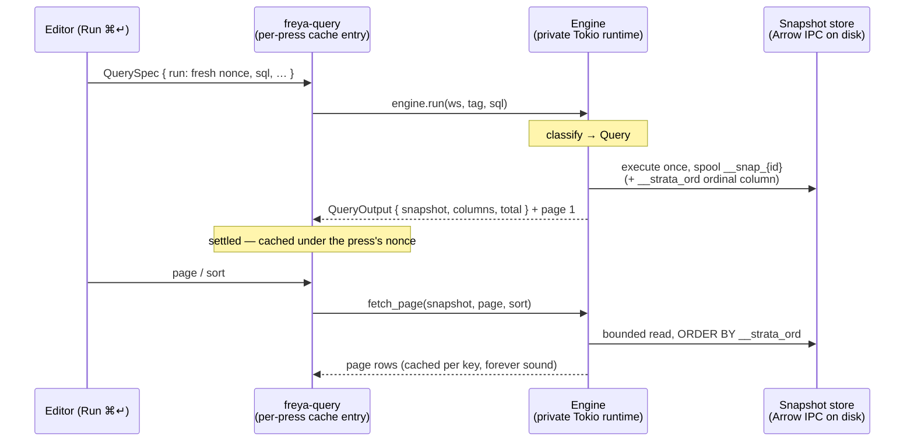
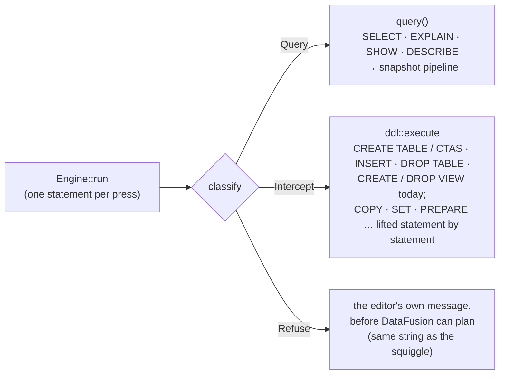

# Architecture — the system as built

How Strata is put together, end to end: the workspace, the engine, the query round trip, the
statement router, where state lives, and how windows relate. This is the guided tour; each section
links the document that owns its detail. If you are changing code rather than reading about it,
[reference/](reference/) holds the engineering rules and their reasoning.

---

## The workspace

A virtual Cargo workspace, six member crates plus a vendored fork:

| Crate | Role |
|---|---|
| `strata-freya` | The app — Freya (Skia, native) frontend. One module per OS window under `apps/`: launcher, project, settings, export, configure, connection. The default build target. |
| `strata-core` | Engine logic, and the only place DataFusion is touched: query execution, the statement router, snapshots, export, profiling, the SQL language service, config, keymap, themes. |
| `strata-model` | The leaf data vocabulary — schema, results, catalog, session, history, connections. Serde only, no logic, so every other crate can speak it without dragging dependencies. |
| `strata-code-editor` | The vendored Skia code editor (Rope buffer, tree-sitter highlighting, completion popup, diagnostic squiggles) the SQL surface is built on. |
| `strata-agent` | Agent access: the read-only MCP tool vocabulary, the HTTP server, and the headless stdio host. Deliberately Freya-free — one implementation serves the in-app server and `strata mcp` alike. |
| `strata-command-macro` | One proc macro: `#[command_router]` / `#[command]`, the command palette's registration mechanism. Knows nothing of Strata's types. |
| `crates/freya` | Our Freya fork, a git submodule resolved by **local path** — excluded from the workspace, but every build compiles against this checkout. |

The dependency direction is strict: `strata-freya` sits on top; `strata-core` and `strata-agent`
never depend on UI; `strata-model` depends on nothing of ours. When a Freya limitation shows up,
the fix goes **into the fork**, not around it in app code.

## The engine: a direct-call async facade

`strata_core::engine::Engine` owns a private multi-thread Tokio runtime (DataFusion's operators
need a Tokio context, and query CPU must never run on the render thread), spawns each call onto
it, and the caller awaits the `JoinHandle`. That await is executor-agnostic, so Freya's non-Tokio
UI executor awaits engine methods like any async fn. There are no channels, no request ids, no
event stream, no worker loop — a caller gets its own call's return value, and errors arrive as
that call's `Err`, not through a side channel.

In the app the handle is `EngineCtx` — an `Arc<Engine>` with `Deref`, held in context. One engine
per project window; the headless host builds the same engine over the same project without any of
the app around it.

## The query round trip: snapshots

Raw SQL is never a cache key — the same SQL over the same tables can read different files a
second later. So a **Run executes exactly once** and spools the full result to an immutable
on-disk **Arrow IPC** snapshot (LZ4-compressed; Arrow rather than parquet so a result's type
always survives — parquet cannot write a union at all). Every later read — page, sort, chart,
export — is a bounded read of that snapshot. Immutability is what makes the page cache sound and
paging stable.

The load-bearing rules, each held by construction rather than by care:

- **A Run is keyed by a per-press nonce**, so pressing Run is the only thing that executes, and
  revisiting a tab re-reads the cache rather than re-running the SQL.
- **Reads have no order of their own** — above DataFusion's file-split threshold an unordered
  `LIMIT/OFFSET` is measured-nondeterministic — so the spool writes a `__strata_ord` ordinal
  column and every reader orders by it (and projects it away; an export never writes it).
- **Retire-on-dispatch**: a new Run retires the tab's previous snapshot when it starts. A reader
  that outlives one press — the export window — **pins** the snapshot it reads (RAII); a retire
  arriving while pinned is deferred, never skipped.
- **DDL and catalog changes never retire a snapshot.** A result is point-in-time, Athena-style;
  result freshness is the Run button.

The full read model — identity, the lock-file sweep, pins, the ordinal measurements — is
[SNAPSHOT_SPEC.md](SNAPSHOT_SPEC.md).

## The statement router

One classification sits in front of dispatch: `classify(statement, capability)` answers from the
parsed statement, and `Engine::run` spends the answer.

- The classification carries a **capability axis**: the editor runs queries and intercepts
  statements; the agent surface is read-only and refuses every non-query. Both answers come from
  the same match arm, so the two surfaces cannot drift.
- An implemented interception lands in an app funnel that already exists: `CREATE TABLE` / CTAS
  spools into `.strata/tables/<slug>/` as Arrow IPC and registers through the ordinary external-
  table path — the def it produces is a plain `TableDef` flagged `origin: Internal`, so persist,
  replay and the headless host need no new code.
- A statement's outcome is a value the app folds — a `StatementReport` carrying a `StoreEffect` —
  never something read back out of DataFusion. Strata owns the catalog and schema providers for
  identity and visibility only; lifecycle is intercepted in front of `ctx.sql`, because a sync
  `register_table` with no caller identity can neither spool a CTAS nor authorize a `DROP`.

The statement surface and its policy tables are [STATEMENTS_SPEC.md](STATEMENTS_SPEC.md).

## Where state lives

Each project window is one **Session**, and the design splits two concerns that are easy to
tangle:

1. **Tab management** — a Radio store (`SessionState`) of stateful tabs. Each `QueryTab` owns its
   editor buffer (rope, cursor, undo), its run request, its results-view choice and its chart
   config, under granular per-concern channels — a keystroke wakes that tab's editor subscribers
   and nothing else.
2. **Query execution** — freya-query, keyed as above. **The store holds specs, never results**;
   there is no runs-by-id store, and cache-entry lifetime is subscriber presence (an invisible
   per-tab keeper holds a background tab's press alive).

Around those, satellites with one job each: the project store (the catalog — a store, **not** a
query against DataFusion; a def whose registration failed is exactly the row it must keep
showing), the event log, the agents pane's record, query history (a `.jsonl` file, not a store
field), and one app-global config store whose single write path also persists.

The full design — the channel vocabulary, persistence, the menu seam, the diagnostics driver —
is [FREYA_STATE_ARCHITECTURE.md](FREYA_STATE_ARCHITECTURE.md).

## Windows

Every OS window is its own Freya tree with its own state; nothing reactive is shared across
windows except the app-global config store and the theme registry.

- The **project window** is the workspace: rail, sidebar (catalog / connections / agents),
  tabbed workbench, inspector, drawer. One project per window; opening a project that is already
  windowed focuses it — that decision lives in one pure function.
- The **launcher** shows when no project is open and closes when one does.
- **Settings** is app-wide, one instance, pinned above the window that asked for it. Its edits
  are a draft; Apply commits a per-field diff against the seed.
- **Export**, **Configure** and **Connection** are child windows owned by a project window —
  closing the owner closes them, and their lifetime is tied to the project subtree they were
  opened from. Export pins the snapshot it was opened on.

Anything that must survive a project re-root lives on the window; the project subtree is keyed on
the project folder, and there is no reopen-in-place path.

## Agent access

`strata-agent` packages the same read-only questions the app answers — list tables, describe,
validate, run, page — as MCP tools over a `Host` seam, with two deployments today: the in-app
HTTP server (loopback, bearer token, off by default) and the headless stdio host
(`strata mcp <project>`). Agent runs are real engine runs on query sessions of the agent's own,
so they share the snapshot machinery and none of the user's tabs, history or settings. The
vocabulary, identity model and UI bridge are [AGENT_ACCESS_SPEC.md](AGENT_ACCESS_SPEC.md).

## Data in and out

- **Registration** — a table def names its sources (files, directories, globs; local or
  bucket-relative through a named connection) and its per-format read options; the registration
  pass connects object stores first, then tables, then views to a fixed point. Failures land on
  the def's row, visible with their reason. [CONNECTIONS_SPEC.md](CONNECTIONS_SPEC.md),
  [IMPORT_OPTIONS.md](IMPORT_OPTIONS.md).
- **Export** — the export window renders an `ExportSpec` into one `COPY … TO` over the pinned
  snapshot, with per-format options and Hive partitioning. [EXPORT_OPTIONS.md](EXPORT_OPTIONS.md).

## Reading on

| Question | Document |
|---|---|
| What runs, and what a result is | [SNAPSHOT_SPEC.md](SNAPSHOT_SPEC.md) |
| What the editor accepts, intercepts, refuses | [STATEMENTS_SPEC.md](STATEMENTS_SPEC.md) |
| How completion works | [COMPLETION_SPEC.md](COMPLETION_SPEC.md) |
| The EXPLAIN plan view | [EXPLAIN_PLAN_SPEC.md](EXPLAIN_PLAN_SPEC.md) |
| The chart view | [CHART_SPEC.md](CHART_SPEC.md) |
| Remote data | [CONNECTIONS_SPEC.md](CONNECTIONS_SPEC.md) |
| Per-window state | [FREYA_STATE_ARCHITECTURE.md](FREYA_STATE_ARCHITECTURE.md) |
| Agent access | [AGENT_ACCESS_SPEC.md](AGENT_ACCESS_SPEC.md) |
| Themes | [FREYA_THEME_SPEC.md](FREYA_THEME_SPEC.md) |
| Shipping a build | [RELEASING.md](RELEASING.md) |
| The annotated module tree | [reference/MODULE_MAP.md](reference/MODULE_MAP.md) |
| The rules and their reasoning | [reference/](reference/) |
