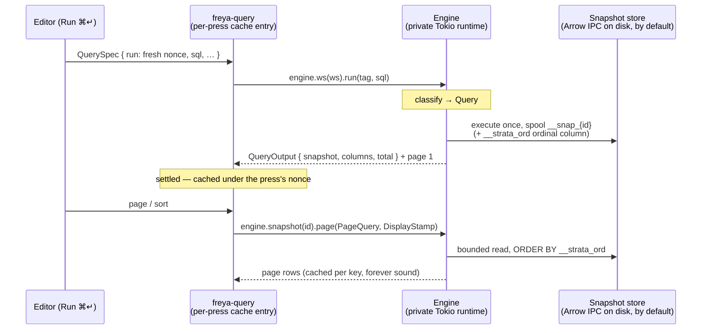
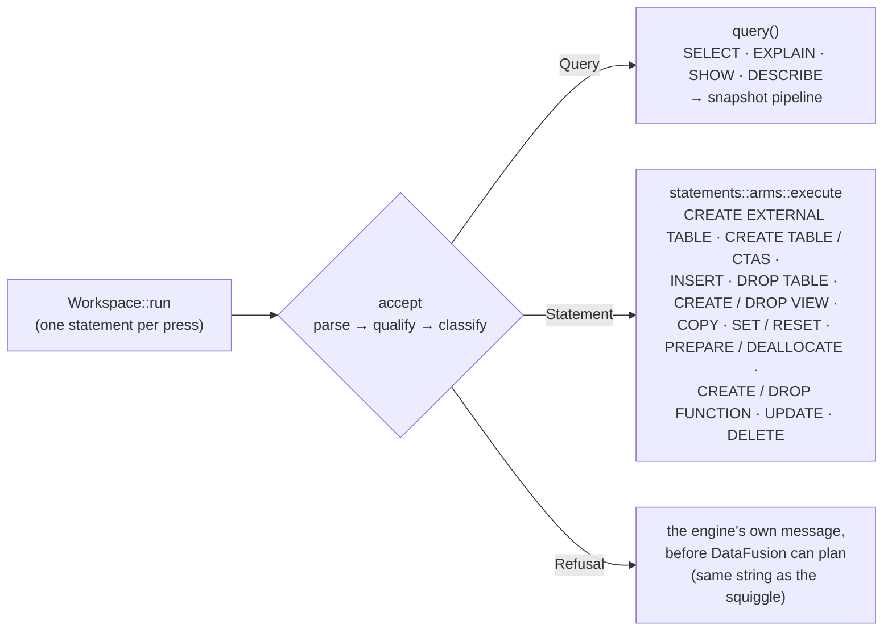

# Architecture — the system as built

How Strata is put together, end to end: the workspace, the engine, the query round trip, the
statement pipeline, where state lives, and how windows relate. This is the guided tour; each section
links the document that owns its detail. If you are changing code rather than reading about it,
[AGENTS.md](../AGENTS.md) holds the conventions and principles.

---

## The workspace

A virtual Cargo workspace, eight member crates plus a vendored fork:

| Crate | Role |
|---|---|
| `strata-freya` | The app — Freya (Skia, native) frontend. One module per OS window under `apps/`: launcher, project, settings, export, configure, source. The default build target. |
| `strata-core` | App services, DataFusion-free: config, keymap, themes, `.strata/` project persistence, the OS-keystore secret store, the model-listings satellite, the updater mechanism, shared `util`. |
| `strata-arrow` | The Arrow-level vocabulary, DataFusion-free: the `ColumnInfo` row an Arrow field becomes, the value tree, the Copy/record-view serializers, the EXPLAIN plan model, and the two written-down catalogues (DataFusion's config keys, `object_store`'s client options). Sits on `strata-core`. |
| `strata-engine` | The only place DataFusion is touched: query execution, the statement pipeline, snapshots, export, profiling, the SQL language service, the registration pass. Sits on `strata-arrow`. |
| `strata-model` | The leaf data vocabulary — schema, results, catalog, session, history, data sources. Serde only, no logic, so every other crate can speak it without dragging dependencies. |
| `strata-code-editor` | The vendored Skia code editor (Rope buffer, tree-sitter highlighting, completion popup, diagnostic squiggles) the SQL surface is built on. |
| `strata-agent` | Agent access: the read-only MCP tool vocabulary, the HTTP server, and the headless stdio host. Deliberately Freya-free — one implementation serves the in-app server and `strata mcp` alike. |
| `strata-command-macro` | One proc macro: `#[command_router]` / `#[command]`, the command palette's registration mechanism. Knows nothing of Strata's types. |
| the Freya fork | [github.com/alexparlett/freya](https://github.com/alexparlett/freya) — an ordinary git dependency pinned by `Cargo.lock`; every build compiles against it. |

The dependency direction is strict: `strata-freya` sits on top; `strata-engine` sits on
`strata-arrow`, `strata-core` and `strata-model` alike; `strata-arrow` sits on the last two;
`strata-core` and `strata-agent` never depend on UI; `strata-model` depends on nothing of ours.
`strata-arrow` is a layer **below** the engine rather than one in front of `strata-core` — the
engine still reads core's services directly, and what the crate buys is the other direction: a
consumer can take the Arrow vocabulary without the DataFusion boundary above it. That is why
`strata-freya` and `strata-agent` name **both**: the engine for what only a planner can answer,
`strata-arrow` for everything else. The engine re-exports none of it — a `strata_engine` path to
an Arrow-vocabulary item fails the use-direction check
(`crates/strata-engine/src/boundaries.rs`), which reads the frontend's own `use` declarations
because a re-export added back here would silently undo the split. The same check holds the
engine's one internal boundary, the peer modules `sources` and `sql`. When a Freya limitation
shows up, the fix goes **into the fork**, not around it in app code.

**Arrow is pinned once, at the workspace.** `strata-arrow` names `arrow` directly while
`strata-engine` reaches the same crate through `datafusion::arrow`, and the two must resolve to
one arrow or a `RecordBatch` built on either side is a different type to the other. DataFusion 54
is on arrow 58, so the root manifest's `arrow` line and the engine's `datafusion` line move
together or not at all. This is what lets a surface that formats a cell, expands a nested value or
offers a config key depend on `strata-arrow` alone and compile no query planner to do it —
a claim `crates/strata-arrow/Cargo.toml` keeps rather than care does.

**Two reqwest majors, on purpose.** `strata-core` pins reqwest **0.12** because that is what
`strata-engine`'s `object_store` resolves, so the updater's HTTP client is the crate already
compiled into the graph rather than a second stack; it takes `default-features = false` with
exactly object_store's features, since reqwest's defaults would pull `native-tls` in beside the
rustls this graph resolves and a second TLS backend is a second root store to keep straight.
`strata-agent` pins **0.13** because `genai` does. The two coexist — nothing passes a reqwest
type across that seam, so there is no unification to force and no version to reconcile. Neither
pin is free to move on its own: each follows the dependency that chose it.

## The engine: a direct-call async facade

`strata_engine::Engine` owns a private multi-thread Tokio runtime (DataFusion's operators
need a Tokio context, and query CPU must never run on the render thread), spawns each call onto
it, and the caller awaits the `JoinHandle`. That await is executor-agnostic, so Freya's non-Tokio
UI executor awaits engine methods like any async fn. There are no channels, no request ids, no
event stream, no worker loop — a caller gets its own call's return value, and errors arrive as
that call's `Err`, not through a side channel.

In the app the handle is `EngineCtx` — an `Arc<Engine>` with `Deref`, held in context. One engine
per project window; the headless host builds the same engine over the same project without any of
the app around it.

**An engine is built one way, and everything an embedder may decide is decided there.**
`Engine::builder()` carries one `with_*` slot per seam — the data directory, the config overrides,
the secret provider, the data sources, the file formats, the snapshot store, the internal-table
store, UDF packages, the memory pool and the policy provider — each taking `impl Trait + 'static`
by value and Arc'd internally, so no caller ever constructs an `Arc<dyn …>`; the repeatable ones
(`with_source`, `with_format`, `with_udfs`) are additive. `build()` answers an `Arc<Engine>`
through `Arc::new_cyclic`, which is why every method is on `&self` and a handle needs no
forwarders. `SessionState`, `RuntimeEnv` and `CacheManager` are never exposed.

**Every public call is reached through one of six group handles**, each borrowing the engine and
carrying the identity the call is about: `ws(id)` (run, explain, cancel — the nonce family),
`snapshot(id)` (page, chart, trend, export, pin, live), `catalog()` (registration, `sync`,
profiling, the generation and the ledger), `sources()` (connect, disconnect, the one listing read
and the registry questions), `lang()` (`analyze` for every diagnostic a buffer draws, `bundle()` for the one snapshot
completion is assembled from, and the policy verdicts the agent gate reads) and `work()` (the
engine-owned in-flight flag).
Beside them sits a short root set — `builder`, `id`, `set_data_dir`, `formats` and the config
trio. The mapping is **total**: a doc test in `facade/mod.rs` fails when a new public method
escapes it, so a new call goes on the handle its subject names.

## The query round trip: snapshots

Raw SQL is never a cache key — the same SQL over the same tables can read different files a
second later. So a **Run executes exactly once** and spools the full result to an immutable
snapshot. Every later read — page, sort, chart, export — is a bounded read of that snapshot.
Immutability is what makes the page cache sound and paging stable.

Where those bytes live is a seam (`snapshots::SnapshotStore`, `EngineBuilder::with_snapshot_store`):
the contract is immutability, typed fidelity, the row-order ordinal and exact null counts from
the write pass, and the format and location are the store's own. The default is
`LocalIpcSnapshotStore` — one LZ4-compressed **Arrow IPC** file per snapshot, Arrow rather than
parquet so a result's type always survives (parquet cannot write a union at all) — beside
`MemSnapshotStore`, which keeps them in RAM.

The load-bearing rules, each held by construction rather than by care:

- **A Run is keyed by a per-press nonce**, so pressing Run is the only thing that executes, and
  revisiting a tab re-reads the cache rather than re-running the SQL.
- **Reads have no order of their own** — above DataFusion's file-split threshold an unordered
  `LIMIT/OFFSET` is measured-nondeterministic — so the spool writes a `__strata_ord` ordinal
  column and every reader orders by it (and projects it away; an export never writes it).
- **Retire-on-dispatch**: a new Run retires the tab's previous snapshot when it starts. A reader
  that outlives one press — the export window — **pins** the snapshot it reads (RAII); a retire
  arriving while pinned is deferred, never skipped.
- **DDL and catalog changes never retire a snapshot.** A result is point-in-time, Athena-style;
  result freshness is the Run button.

The full read model — identity, the lock-file sweep, pins, the ordinal measurements — is
[SNAPSHOT_SPEC.md](SNAPSHOT_SPEC.md).

## The statement pipeline

One pipeline sits in front of dispatch — `statements::accept`, three typed stages
(`Parsed → Qualified → Admitted`) whose order the types enforce — and `Workspace::run` spends the
answer. Each `Admitted` variant carries a `Proof` whose constructor is private, so holding one
*means* classification ran: the order is the types end to end, with no trust step.

- **Grammar and policy are two questions.** `classify_stmt` answers what a statement *is*, purely
  from the parsed AST; an injected `PolicyProvider` answers whether the caller may perform it,
  in **codes** rather than prose so the engine mints every sentence from one table. The shipped
  provider is data — a `Capability` of grants over a local/remote axis — and its two presets are
  the app's editor (`full()`) and its agent (`read_only()`). A caller's capability narrows the
  engine's and never widens it, which is what lets one engine serve both. It is asked twice:
  coarsely at classification, and again at the arm once `resolve_target` has said whether the name
  is the workspace's, a live data source's or nowhere — the second derived from that answer, so an
  arm names neither the grant nor the locality.
- **Dispatch is one axis and one contract.** `Target` says where a managed name points, `Mechanism`
  says how a kind reaches one that is not the workspace's (planned into the source's sink,
  dispatched to the server as text, or refused), and `StmtCtx` is what the engine hands every arm —
  so all sixteen share the signature
  `(&StmtCtx, &Principal, &Qualified) -> Result<StatementOutcome, String>` and adding a kind is
  five compile errors. A remote write then passes three named gates in order — the caller's grants,
  the caller's remote scope, and the source def's own caller-blind `read_only`.
- An interception lands in an app funnel that already exists: `CREATE TABLE` / CTAS publishes
  its result through the engine's internal-table store (`engine::tables`, the EA-08 seam — under
  the default store, Arrow IPC in `.strata/tables/<slug>/`) and registers through the ordinary
  external-table path —
  the def it produces is a plain `TableDef` flagged `origin: Internal`, so persist, replay and the
  headless host need no new code. A typed `CREATE EXTERNAL TABLE` is that same funnel with the def
  read off the statement instead, which is what makes it and Table Config two gestures at one
  registration — and is why its `LOCATION` names a **data source** the project already has rather
  than describing a bucket of its own.
- A statement's outcome is a value the app folds — a `StatementReport` carrying a `StoreEffect` —
  never something read back out of DataFusion. Strata owns the catalog list, catalog and schema
  providers for identity and visibility only; lifecycle is intercepted in front of `ctx.sql`,
  because a sync `register_table` with no caller identity can neither spool a CTAS nor authorize a
  `DROP`. The **workspace** catalog is one catalog with one flat, bare-name schema, and **every data
  source registers a sibling catalog beside it**: a database's has as many schemas as the server
  has, an object store's has one and is fed by the project's own table defs, which is what makes
  forgetting a bucket take its tables with it. A name qualified into a database's is read like any
  other and managed by nothing it does not opt into; one qualified into a store catalog is one of
  the project's own rows reached the long way, so `Target::Store` answers for it and every arm
  behaves as it did when the tables lived in the workspace. Two predicates draw two different
  lines: `providers::in_workspace` is the `__snap_` reserved namespace and is deliberately
  unmoved, while `providers::def_backed` is *checkability* — whether a name has a project row
  behind it — which is what a view's recorded dependencies split on.

The statement surface and its policy tables are [STATEMENTS_SPEC.md](STATEMENTS_SPEC.md).

## Where state lives

Each project window is one **Session**, and the design splits two concerns that are easy to
tangle:

1. **Tab management** — a Radio store (`SessionState`) of stateful tabs. Each `QueryTab` owns its
   editor buffer (rope, cursor, undo), its run request, its results-view choice and its chart
   config, under granular per-concern channels — a keystroke wakes that tab's editor subscribers
   and nothing else.
2. **Query execution** — freya-query, keyed as above. **The store holds specs, never results**;
   there is no runs-by-id store, and cache-entry lifetime is subscriber presence (an invisible
   per-tab keeper holds a background tab's press alive).

Around those, satellites with one job each: the project store (the catalog — a store, **not** a
query against DataFusion; a def whose registration failed is exactly the row it must keep
showing, and whether it failed is the engine's own record joined onto that row), the event log, the agents satellite (bookkeeping only — no surface shows it), query
history (a `.jsonl` file, not a store
field), the assistant's model listings (`strata_core::models` — what each provider last reported
serving, beside the config file rather than in it, because a fetched list is a cache of a remote
fact and not something the user edited), the update status (`state::updates` over
`strata_core::update` — what the newest release is and where a verified download is staged; not
persisted, because a check result is a fact about a request made minutes ago), and one app-global
config store whose single write path also persists.

The updater is the one thing that outlives the event loop. It never mutates the running bundle:
the press records the swap and calls the ordinary `quit()`, so every close confirm keeps its say,
and `main` performs it after `launch` has returned and no window is left. What makes a download
installable is its signature rather than where it came from — strict `codesign`, the team id, the
bundle id, failing closed — so the network is untrusted by construction. What it *offers*, and
what a press means, is one pure answer (`updater::Affordance`) that the launcher rail's version
line, App ▸ Check for Updates… and the update dialog all read, so a dev build
offers nothing, a bundle that cannot be replaced degrades to the release page, and a staged
update is a restart. The status is app-global; the question the dialog asks is per window — the
restart, or the report the menubar item raises, which answers the check where it was asked and
shows the release's own Markdown when there is something to install.

**No file Strata writes holds a secret.** There are two classes and both resolve the same way,
through the OS keystore (`strata_core::secret`, opened once in `main`). The app's own — third-party
provider keys for the assistant — is referenced from `config.json` by a minted `SecretRef`. A data
source's is referenced from the committed `project.json` the same way: the def records which of the
kind's secret-typed settings this machine has filed and **which slot each is in**, recorded rather
than derived so a rename moves nothing and a colleague entering their own password writes their own
entry under the id already in the file. Both are enforced by the types rather than by care: the
in-memory `Secret` derives no `Serialize`, so there is no path from a pasted key to either file at
all.

The full design — the channel vocabulary, persistence, the menu seam, the diagnostics driver —
is [FREYA_STATE_ARCHITECTURE.md](FREYA_STATE_ARCHITECTURE.md).

## Windows

Every OS window is its own Freya tree with its own state; nothing reactive is shared across
windows except the app-global config store and the theme registry.

- The **project window** is the workspace: two 48px rails, a sidebar (the data-sources
  tree — the project's own catalog and its data sources in one tree), the tabbed workbench, a right pane (column inspector *or* the assistant's chat — the
  right rail picks one) and the drawer. One project per window; opening a project that is already
  windowed focuses it — that decision lives in one pure function.
- The **launcher** shows when no project is open and closes when one does.
- **Settings** is app-wide, one instance, pinned above the window that asked for it. Its edits
  are a draft; Apply commits a per-field diff against the seed.
- **Export**, **Configure** and **Data source** are child windows owned by a project window —
  closing the owner closes them, and their lifetime is tied to the project subtree they were
  opened from. Export pins the snapshot it was opened on.

Anything that must survive a project re-root lives on the window; the project subtree is keyed on
the project folder, and there is no reopen-in-place path.

## Agent access

`strata-agent` packages the same read-only questions the app answers — list tables, describe,
validate, run, page — as MCP tools over a `Host` seam, with two deployments today: the in-app
HTTP server (loopback, bearer token, off by default) and the headless stdio host
(`strata mcp <project>`). Agent runs are real engine runs on query sessions of the agent's own,
so they share the snapshot machinery and none of the user's tabs, history or settings.
Connecting a client is [MCP_CLIENTS.md](MCP_CLIENTS.md).

## Data in and out

- **Registration** — a table def names its sources (files, directories, globs; local or
  bucket-relative through a named data source) and its per-format read options; the registration
  pass connects data sources first, then tables, then views to a fixed point. Failures land on
  the def's row, visible with their reason. [CONNECTIONS_SPEC.md](CONNECTIONS_SPEC.md),
  [IMPORT_OPTIONS.md](IMPORT_OPTIONS.md).

  The pass is one call, `catalog().sync(desired, settled)`, and it **reconciles**: the spec is the
  whole catalog, so what the engine holds that the spec no longer names is deregistered and
  reported. There is no additive whole-catalog call beside it — a defs file that shrank would
  otherwise leave a ghost table answering for the rest of the session. Both hosts make the same
  call: the app's scan driver over the store's rows, and the headless host over the defs it loaded.
  Narrower gestures are their own calls (`register` for one table, `create_views` for a set), and a
  row Refresh is deliberately one of those — a work list handed to the reconciliation would read as
  "the project is now one table".

  Each pass leaves the engine at a **catalog generation** (`catalog().generation()`), a number the
  engine mints on every registry write and on nothing else. The window adopts it rather than
  counting its own: it is what a tab's diagnostics are stamped against and what the remote-columns
  cache is keyed by, so a gesture that changed nothing re-derives nothing.

  What each registration **answered** is the engine's too, and it keeps it: the *ledger*
  (`catalog().registrations()`), one `Ready`-or-`Failed`-with-its-reason entry per def, stamped
  with the generation it was answered at, and forgotten when the def is taken out. So a catalog
  row is a **join** — the def from the store, the verdict from that read — and every embedder
  renders one record rather than keeping its own: the window's rows and Problems drawer, the
  headless host's catalog answers, and the agent's `list_tables`, which is where a refused data
  source is finally named in the engine's own words instead of only through the tables it took
  down with it.
- **Data sources** — everything the project reads that is not local disk is one kind of thing.
  `DataSource` is a single publicly implementable trait; a companion `SourceKind` carries the
  identity as consts, `NAME` among them, and `EngineBuilder::with_source` registers under it. The
  shipped five — `s3`, `gcs`, `http`, `postgres`, `mysql` — are ordinary registrants of that call,
  so an embedder adds a sixth exactly the way we added ours; the two servers are behind cargo
  features, and an engine built with neither still works, which is what proves the registry is the
  only path in. `connect` answers the **mode**:
  `Sourced::Store` for a bucket, `Sourced::Catalog` for something that enumerates itself, and the
  mode-specific vocabulary rides those arms so a bucket cannot be asked what relations it holds —
  the method is not there. Everything a source *takes* is declared too: `settings()` answers a
  table of `SourceSetting` rows, and the source editor renders that table rather than knowing any
  kind's fields. One persisted `SourceDef` serves them all — a kind, the name the user gave it,
  the settings that kind declared, and which of its secret keys this machine has filed.
  [CONNECTIONS_SPEC.md](CONNECTIONS_SPEC.md).
- **Databases** — a PostgreSQL or MySQL source registers a DataFusion **catalog** of relations the
  server enumerates, so the whole database is queryable as `pg.public.orders` with no per-table
  declaration, and a same-source subplan is pushed back to the server as one statement
  (`datafusion-federation`). Discovery gets catalogs; declaration gets defs. An object store
  registers a catalog too, but a **def-fed** one: its relations are the project's own table rows
  bound to that source, which is what makes forgetting a bucket take its tables with it.
  [CONNECTIONS_SPEC.md](CONNECTIONS_SPEC.md).
- **Export** — the export window renders an `ExportSpec` into one `COPY … TO` over the pinned
  snapshot, with per-format options and Hive partitioning. [EXPORT_OPTIONS.md](EXPORT_OPTIONS.md).

## Reading on

| Question | Document |
|---|---|
| What runs, and what a result is | [SNAPSHOT_SPEC.md](SNAPSHOT_SPEC.md) |
| What the editor accepts, intercepts, refuses | [STATEMENTS_SPEC.md](STATEMENTS_SPEC.md) |
| How completion works | [COMPLETION_SPEC.md](COMPLETION_SPEC.md) |
| The EXPLAIN plan view | [EXPLAIN_PLAN_SPEC.md](EXPLAIN_PLAN_SPEC.md) |
| The chart view | [CHART_SPEC.md](CHART_SPEC.md) |
| Remote data | [CONNECTIONS_SPEC.md](CONNECTIONS_SPEC.md) |
| Per-window state | [FREYA_STATE_ARCHITECTURE.md](FREYA_STATE_ARCHITECTURE.md) |
| Connecting MCP clients | [MCP_CLIENTS.md](MCP_CLIENTS.md) |
| Themes | [FREYA_THEME_SPEC.md](FREYA_THEME_SPEC.md) |
| Shipping a build | [RELEASING.md](RELEASING.md) |
| **Embedding the engine in something else** | `strata_engine::guide` — rustdoc, so its examples compile ([docs/README.md](README.md#embedding-the-engine)) |
