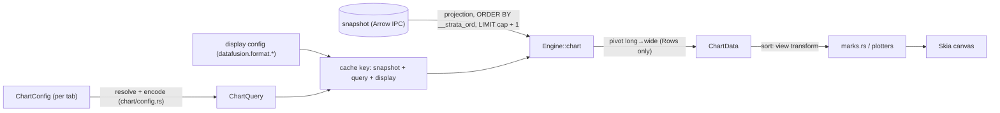

# Strata — Chart view

The results **Chart** surface, as built: what it does, where its data comes from, and how it
renders. The chart is a second body for the results pane — a plot of the same immutable snapshot
the grid pages — behind the toolbar's Table/Chart toggle. The designer's handoff bundle
(`screenshots/chart-*.png`) remains the **visual** reference for layout and control dress.

---

## 1. Principles

1. **Chart the result, not the files.** The chart is a view of the current result set — the same
   immutable snapshot the grid pages (`docs/SNAPSHOT_SPEC.md`). It never queries source files;
   a new Run reads the new snapshot.
2. **The chart computes nothing SQL can say** (renderer-first — the Athena/Snowsight shape). SQL
   is the aggregation language: it already has every `GROUP BY`, `date_bin`, percentile and
   window function the chart could ever grow, the user can read and edit it, and the editor is
   two keystrokes away. The chart maps result **columns onto marks**; it never aggregates,
   buckets, or re-orders behind the user's back. Switching mark, encoding or sort is a repaint,
   never a re-query.

   This is a settled decision, not a preference: an engine-side aggregation pipeline was built,
   reviewed and withdrawn, and the principle must not be re-litigated —
   `docs/reference/INVARIANTS.md` (the chart entry) holds the evidence trail. The short form:
   a `GROUP BY` has no output order, so re-aggregating an already-shaped result structurally
   destroys the order the user asked for; a renderer cannot lose what it never recomputes.

   One deliberate exception: the **histogram** (§5) bins engine-side — binning a raw column
   needs a min/max pass and DataFusion 54 has no `width_bucket`. It is the only mark that
   computes.
3. **No shadow query language.** No aggregate menu, no bucket control, no engine algebra.
   Aggregation is the user's own SQL, in the editor (§8).
4. **Honest boundaries.** Never silently sample, truncate, or aggregate. Above a cap, or when
   the data's shape doesn't fit the mark, the chart refuses, and the message names the fix (§7).
5. **Rendering is `freya-plotters-backend`** (fork, `plot` feature) on a `canvas` — plotters'
   `ChartBuilder`/series machinery, never a hand-rolled axis/tick/mark stack (§9).
6. **Result order is the axis order, and it is real.** Rows draw in the order the user's query
   produced them, backed by the snapshot ordinal (`SNAPSHOT_SPEC.md` §9) — never scan order,
   which is measured-nondeterministic above 10 MB. Re-ordering is the strip's explicit sort
   toggle (§6), chosen by the user, never imposed by the engine.

## 2. Where it lives

The results toolbar carries a Table/Chart `SegmentedToggle`. The mode is **per tab** —
`ResultsView` on `Chan::View(tab)`, persisted in the tab's `TabSnapshot` — so switching tabs
restores it and it survives re-runs and a restart. Find is grid-only; Reload and Download ride
the shared toolbar in both modes (`results/toolbar.rs`).

The chart body (`results/chart/`) is two panes under that toolbar:

- **Left control strip** (232 logical px, its own scroll — `chart/strip.rs`): the mark tiles
  (six, three to a row), the X / Y / Series encoders, the sort toggle, and the legend.
- **Right canvas pane**: the plot, a non-blocking high-cardinality banner across the top when
  warranted, and a refusal notice in place of the canvas when there is nothing honest to draw.

## 3. Column roles (from the Arrow type)

Each result column carries a `ChartRole` beside its `Kind`, derived from its Arrow `DataType`
where that type is still in hand: `engine::catalog::chart_role`, called by `column_info`. A role
comes from the type — never from a column's name, and never from a type's *spelling* (which is a
rendering of a type, not the type). The measure arm **is** `DataType::is_numeric`, the same
predicate the read gates a Y on, so an encoder cannot offer a measure the read then refuses.
Roles drive the encoder menus and the defaults — they never change what the engine computes,
because it computes nothing.

| role | DataTypes |
|---|---|
| **Measure** (Y, scatter axes, histogram value — valid on X too) | anything `is_numeric` (Int*/UInt*/Float*/Decimal*) |
| **Instant** (X; defaults to line) | Date32/Date64/Timestamp* |
| **Clock** (X; defaults to line) | Time32/Time64 |
| **Dimension** (X, series) | Utf8/LargeUtf8/Utf8View/Boolean/Dictionary |
| **Other** — offered nowhere | everything else: nested, binary, interval, duration, … |

A dictionary is a dimension whatever it encodes: it is a category by construction, and a
dictionary of numbers is not a measure the read accepts. `Other` is the safe default in the
direction that matters — a variant Arrow grows later is excluded from the encoders, not
mis-plotted.

**Instant and clock are one thing on an axis and two in SQL.** Both order, both default to a
line, and the encoders read them together (`config::is_time`). They are separate roles because
they differ wherever a **stride** does: `date_bin(interval '1 day', …)` is a coarser reading of
a calendar instant and is refused outright over a time of day ("DATE_BIN stride for TIME input
must be less than 1 day"). Nothing reads the distinction today; it is kept because chart-side
bucketing needs it, and the only way to recover it later is a type's spelling — the thing this
taxonomy exists to rule out. A Utf8 column that holds a timestamp is a **cast** the user makes
in SQL.

## 4. Marks and encodings

Six marks (`strata_model::ChartMark`), in the picker's order: **Bar, Line, Area, Scatter,
Histogram, Pie**.

| Mark | X | Y | Series | Notes |
|---|---|---|---|---|
| Bar | any column, or none (row index) | one or more measures | optional dimension | grouped bars |
| Line / Area | any column, or none | one or more measures | optional dimension | NULL Y cells are gaps, never interpolated |
| Pie | dimension or temporal | exactly one measure | — | cap 24 slices |
| Scatter | measure | measure | — | raw points, non-finite coordinates dropped |
| Histogram | — | measure (the value) | — | engine-binned (§5) |

Three rules make the encoding model:

- **Multiple Y columns are multiple series**, named by column — `SELECT month, revenue, cost …`
  is two lines with no configuration. Analytical presets arrive the same way: a candlestick is
  four Y columns in named roles, not an engine computation (§10).
- **A series column pivots long → wide**: rows `(x, series, y)` become one series per distinct
  series value, named by value (`value: column` when there are also multiple Y columns). The
  pivot is a reshape, not an aggregation — and it is the **only** operation that can conflate
  rows, so it is the only thing that refuses on duplicates (§7).
- **Without a series column there is no pivot**: each row is its own mark in result order.
  Duplicate X labels draw as duplicate marks — the chart shows what the result holds.

The per-mark option sets live beside the strip (`chart/config.rs`: `x_options`, `y_options`,
`series_options`, `allows_row_index`, `takes_many_ys`, `sortable`) and both the menus and the
resolution validate against them — so an encoding a mark cannot take is **unreachable rather
than reported**: no control ever offers the column. A scatter has no series row; a pie's Y
replaces instead of accumulating; a histogram shows no X row at all.

## 5. Data: `Engine::chart` over the snapshot

One engine method (`Engine::chart` → `engine/chart.rs::run_chart`), one freya-query capability
in front of it (`query/chart.rs`), no confirm — a projected, capped read of a local snapshot is
`fetch_page`-tier work. The call holds the snapshot pin for its own duration (a histogram is two
passes, and a re-run between them must not retire the table mid-call).



**Cache identity is `(snapshot, query, display config)`** — `ChartSpec` in `query/chart.rs`,
`stale_time(MAX)`. The third key is not optional: axis labels render through the engine's live
`datafusion.format.*` overrides (`CellFormat`), which Settings changes with no restart and no new
snapshot, so an entry keyed on the first two alone would serve labels rendered under a format the
user has since changed. `ChartSpec.display` carries `config::display_subset` of the app's engine
overrides, which makes a format change a new entry rather than a stale one.

**Vocabulary (`strata_model::chart`).** All hash/eq-able — `ChartQuery` is cache identity, built
in exactly one place (§6).

```
ChartQuery::Rows      { x: Option<String>, ys: Vec<String>, series: Option<String>, cap }
ChartQuery::Raw       { x, y, cap }                      // scatter
ChartQuery::Histogram { col, bins: Option<usize> }       // the one computed mark

ChartData::Table  { axis: Axis, series: Vec<ChartSeries> }
ChartData::Points (Vec<ChartPoint>)                      // unordered; a scatter draws marks
ChartData::Bins   (Vec<ChartBin>)
ChartData::OverCap    { unit, cap }                      // refusal: nothing to draw
ChartData::Duplicates { x, series }                      // refusal: pivot found 2 rows in one cell

Axis { labels: Vec<String>, positions: Option<Vec<Option<f64>>> }
```

`Axis.labels` render through the engine's `CellFormat` (the grid's own display config — a date
column uses `date_format`, not `timestamp_format`), clipped to `DISPLAY_CHARS`, with NULL
reading `(null)` — a **label, never a key**. `positions` is `Some` when X is numeric or temporal
(epoch milliseconds; clock times in their own ticks), so line/scatter renderers may place marks
truly rather than equally spaced; a NULL X has no position.

**Engine mechanics.** `Rows` is a *projection*, not a query: select the referenced columns plus
the ordinal, `ORDER BY __strata_ord`, `LIMIT cap + 1` — `cap + 1` rows back is `OverCap`, never
a truncated chart. Then pivot in Rust: with a series column, cell identity is the (X value,
series value) **pair of values** (`ScalarValue`s, never their renderings — a NULL and a literal
`"(null)"` stay distinct), and a second row landing in one cell answers `Duplicates` rather than
silently keeping either. NULL Y decodes to `None` (a gap). No aggregation, no bucketing, no
reordering — the engine adds nothing the result didn't contain. An *encoding* mistake (a text
column as Y, a column that doesn't exist) is an `Err` in the engine's own words, refused before
DataFusion can answer in its own.

`Raw` (scatter) filters to finite coordinates (NaN and both infinities out — Arrow's null bitmap
is unset for a NaN), caps at `cap + 1`, returns points. `Histogram` runs a min/max pass over the
finite values, then uniform bins counted engine-side: `√n` clamped to `6..=24` when the bin
count is open, at most `MAX_BINS` (200) always; the last bin closes at the measured maximum.

**Caps** (`chart/config.rs`): `ROWS_CAP` 1 000 rows, `PIE_CAP` 24 slices, `RAW_CAP` 6 000
scatter points.

## 6. Config and state

`ChartConfig` (serde, strata-model): `{ mark, x, ys, series, sort }` — column references and a
view preference, no results. It lives on `QueryTab` under **`Chan::Chart(tab)`** (so an encoder
edit re-charts this body and wakes nothing else) and persists via `TabSnapshot::chart`.

The config holds **intent**: `mark` and `ys` are `Option` (unset ⇒ derive), and `x` is a
three-state `ChartX { Auto, RowIndex, Column(name) }` — "not chosen" and "chosen to be the row
index" are different answers, and an `Option<String>` would let the next result's date column
overrule a deliberate row-index axis. `Some(vec![])` on `ys` is a real state too: the user
deliberately unpicked every Y, and the canvas says so rather than quietly re-deriving.

**`resolve` → `encode` (`chart/config.rs`) is the one construction site.** `resolve` merges the
schema's defaults *under* the user's choices, channel by channel: take the choice if the result
can still answer it, otherwise derive. Re-deriving is a **read-time fallback**, never a write
back into the config, so a column that disappears from one result and returns in the next brings
the user's choice back with it; a mark that takes one Y narrows the resolved encoding and leaves
the config holding the rest. `encode` then turns the resolved encoding into the `ChartQuery` —
the single place cache identity is built.

Defaults, merged under user-set keys: X = the first time column (instant or clock), else the
first dimension, else the row index; Ys = the leading measures (up to four, minus the column X
took — a column is never plotted against itself by default); mark = line when **the charted X**
is temporal, bar otherwise (the default reads the axis actually being drawn, not the result's
column list); series = none.

**`sort` is a view transform, not part of the read** (`chart/sort.rs`). `ResultOrder` (default)
| `ByX` | `ByYDesc`, applied client-side to the settled `ChartData::Table` — flipping it is a
re-render, not a re-query, and cache identity stays untouched. The comparator is **total in both
directions** (`total_cmp`; the direction is a flag inside the comparison, not a `reverse()` at
the call site): a gap or NaN is not a small value, so it sorts last either way rather than
heading a descending chart. The sort is stable, so equal keys keep result order — a refinement
of the query's own order, never a reshuffle. `ByX` sorts by true position where the axis has one
(so `"10"` sorts after `"9"`), else by label. Only a `Table` has an order to permute: scatter
points are unordered and histogram bins are ascending by construction, so the strip offers the
toggle for neither.

## 7. Guardrails

Computed from the settled `ChartData` or the encoding — never re-derived in the UI. Every
refusal renders as one notice in place of the canvas (a glyph tile, a title, the condition, and
where there is a fix, the fix in prose — `chart/mod.rs::notice`), because the alternative to a
notice is a *blank pane*, indistinguishable from a bug:

| Condition | Message gist |
|---|---|
| `Rows` returned > cap rows (1 000; pie 24) | too much data to chart honestly — aggregate it in SQL |
| `Duplicates { x, series }` | more than one row per category — aggregate them in SQL |
| Scatter > 6 000 points | over the cap — aggregate it in SQL |
| No Y chosen / no numeric column | pick a column to plot / pick a numeric column (two messages — an empty pick and a result with nothing numeric are different problems) |
| Scatter with < 2 measures | pick two numeric columns |
| Pie with no category column | pick a category column |
| Histogram with no finite values | nothing to chart — no finite values to bin |
| Histogram over a single distinct value | every value is the same — no range to spread over bins |
| Scatter with no finite point | nothing to chart |
| Empty result / no series plotted | nothing to chart |
| Pie over a negative value | a pie cannot show negative values — chart it as a bar (dropping the slice would silently change the total every percentage reads against; a zero or NULL is arithmetic, drawn around) |

Plus the **non-blocking banner** over the canvas when `axis.labels.len() > 60` (`CROWDED`) — the
labels are already in hand, so the nudge costs no second query, and the chart still renders
beneath it, unaltered. It wears the Export window's warning banner (the `chart` theme's
`warning_*` box, the sheet's semantic `warning` for glyph and text).

There is deliberately **no materialize cap, no sampling, and no aggregation fallback**: the
answer to "too much data" is always the user's own SQL. The refusals name the fix in prose, and
there is no control behind it (§8).

## 8. Deliberately absent

**No aggregate control in the strip.** The design handoff's Aggregate toggle and function menu
are absent, and nothing stands in their place: every control in the strip changes what is
*drawn*, none changes the data (§1.2, §1.3). A press that wrote the SQL for the user —
*Aggregate in SQL*, composing a `GROUP BY` from the resolved encoding and opening it unrun in a
new tab — was built and cut. The capability is well precedented (DBeaver's Grouping panel,
Metabase/Superset/Looker's eject-to-SQL), but every tool that has it puts it in a menu or a
surface of its own — none beside the encoders, where it was the one control in the strip that
*left* the chart rather than changing it. It also stood in for the chart-side aggregation that
is the thing actually worth revisiting; a shortcut that makes a gap tolerable is a reason not to
close it. Do not re-add it to the strip (`chart/strip.rs` records the same rule at the surface).

What survived that cut on its own merits is the **instant/clock role split** (§3), because
chart-side bucketing needs exactly that distinction and it belongs where the Arrow `DataType`
still is.

**No trendlines or regression presets.** A scatter draws raw points only. SQL already computes
an honest fit (`regr_slope`/`regr_intercept`/`regr_r2` — `docs/CHART_FUNCTIONS.md`); a computed
overlay would be the one exception beyond the histogram and has not been built.

## 9. Rendering

`canvas(RenderCallback)` through `PlotSkiaBackend` (`freya::plot`, fork feature), logical units
only, explicit repaint requests. The frame (data + mark + dress) is published into a slot the
render callback **peeks**, and the effect that fills the slot requests the redraw —
`RenderCallback`'s `PartialEq` is always true, so a callback that captured the frame by value
would paint the first frame forever. The `chart` component theme dresses the plot, with the
categorical ramp as `series_1`…`series_10` (a pie slice past the tenth blends a step toward the
pane, so wrapped neighbours never read as one wedge); theme changes go through
`UPDATE_SCHEMA=1 cargo test -p strata-freya schema_in_sync`.

Marks draw per §4 through plotters' own machinery: ~5 horizontal gridlines, a nice value
maximum, abbreviated ticks, thinned X labels (one per ~64 logical px), a zero baseline on
negative spans, point markers on lines up to 60 categories. Two mechanisms keep this from
becoming a hand-rolled axis stack:

- The category axis is a plotters **`Ranged`** (`chart/axis.rs::Categories`) that hands plotters
  its own key points, so every gridline and tick lands *on* a category and is labelled with that
  category's own text; thinning is the key-point stride.
- True `Axis.positions` placement is taken only when the positions are present, finite and
  **strictly increasing** — the case where result order and value order coincide. Otherwise
  placing marks by value would re-order the axis §1.6 says is the user's, so it falls back to
  equal spacing.

**Hover readout** (`chart/paint.rs`). The paint that draws a mark records its **hit region** —
a box for bars, bins and points, a wedge (start angle + sweep, so the arc crossing zero tests
correctly) for pie slices — because the paint is the only place the true geometry exists;
recomputing it for the pointer would be a second answer to "where is this bar". The pointer
takes the *nearest* containing region (overlapping reaches happen), and the readout is a
standard `Tooltip` anchored to the **mark**, not the pointer — which is what lets a `!=` guard
suppress re-renders across a slow drag. The card flips to the other side of its anchor rather
than running off the pane, sits on `Layer::Relative(1)` so it paints in front of its sibling
plot, and is never a pointer target (a hit-testable card under the pointer would fire
`pointer_leave` and unmount itself). A new frame or a resize rebuilds the hit regions and clears
the hover.

**Legend** (`chart/strip.rs`, entries resolved in `chart/mod.rs::legend`). The legend lives in
the strip, not on the canvas — a plot-overlay legend has nowhere to go when it outgrows its box,
while the strip already scrolls, so the legend grows down and the plot keeps its width. Only
marks that draw in more than one colour have anything to key: a series legend names each series
in ramp order; a pie legend lists the **drawn** slices — from the same walk the wedges are drawn
from, so a colour is never keyed to a category the plot skipped — with each slice's share as a
percentage. Scatter and histogram, one colour by construction, show none.

## 10. Analytical charts are SQL, mapped

Analytical chart shapes are ordinary SQL results whose columns play named roles, not engine
computations: a candlestick is open/high/low/close columns over a bucketed X; a box plot is
p25/p50/p75 columns the user computes with `percentile_cont(…) WITHIN GROUP`; error bands are
`y`, `y_lo`, `y_hi`. The chart has no aggregation of its own, so shaping the result is done in
the query — `docs/CHART_FUNCTIONS.md` is the practical reference for which SQL buys which chart
shape.
