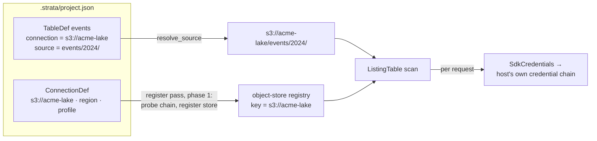

# Connections — reading from remote object stores

How Strata reads parquet/CSV/JSON out of S3, GCS and plain HTTP(S). A **connection** is a
project-scoped description of one remote object store: the bucket (or origin) it names, the
provider that serves it, and a *reference* to where credentials live. Tables then read through a
connection by naming it.

Two rules shape everything below:

- **Strata never stores, prompts for, or reads a secret.** A connection carries only non-secret
  metadata — bucket, region, endpoint, an auth *mode* — plus at most a named `~/.aws` profile or a
  service-account key **file path**. Credentials resolve at query time from the machine's own
  provider chains. There is no key, token or secret field anywhere in the model
  (`crates/strata-model/src/connection.rs`), so one cannot be persisted by accident.
- **DataFusion resolves nothing itself.** There is no built-in "read `s3://…`": the embedder
  builds an `object_store` and registers it per bucket, or every scan fails with *"No suitable
  object store found"*. Registering that store is the whole of what a connection *does*
  (`crates/strata-core/src/engine/store.rs`).

## Providers

Three providers — **S3**, **GCS**, **HTTP** (`ProviderId::ALL`, pinned at three by test). The
provider is an **explicit picker** in the editor, never inferred from a typed URL scheme.

- **S3-compatible** stores (Cloudflare R2, MinIO, Alibaba OSS, Tencent COS) ride the S3 provider
  via its **Endpoint** field plus an **Allow plain HTTP** toggle — they are not separate
  providers. An `http://` endpoint without the toggle is refused by name, because the underlying
  HTTP client is built `https_only` and would otherwise fail every request with a bare
  "builder error".
- **HTTP** is a public origin: always anonymous, no auth control, no region — the address itself
  is a whole URL, scheme included.

## Identity and persistence

**A connection's identity is its URL** — scheme *and* authority, `ConnectionDef::url()` — because
that is exactly what DataFusion's object-store registry keys on. Never the bucket alone:
`s3://lake` and `gs://lake` share a bucket and are two different connections over two different
stores. Everything that addresses a connection (a registration outcome, a store row, the
Configure picker, a table def) names it by this URL. The pane's sort order is the **address**, so
`upsert_connection` replaces by URL and inserts in address order.

The def stores the **address** and derives the scheme from the provider:

- **S3 / GCS** — the bucket name alone (`acme-lake`). Storing the scheme too would be two
  statements of one fact that can disagree: an `s3://` bucket under a GCS provider would read one
  way and register another.
- **HTTP** — the whole origin (`http://aserver:8484`). `http` and `https` are two different
  origins, so the scheme is part of the address and only the person typing knows which their
  server speaks.

Defs persist in the committed `.strata/project.json` (`ProjectDefs::connections`), beside the
tables and views. Nothing in a def needs gitignoring: a profile *name* and a key *file path* hold
nothing a colleague may not have. The shape is a tagged provider — the provider *is* its own
settings, so an S3 region cannot be written down on a GCS bucket:

```json
{ "address": "acme-lake",
  "provider": { "provider": "s3", "region": "eu-west-2",
                "auth": { "mode": "profile", "name": "analytics" },
                "endpoint": "", "allow_http": false },
  "client_config": { "timeout": "30s" } }
{ "address": "lake",                "provider": { "provider": "gcs", "auth": { "mode": "service-account", "path": "…" } } }
{ "address": "http://aserver:8484", "provider": { "provider": "http" } }
```

`client_config` is absent unless set; every provider setting is `#[serde(default)]`, so a def
written before a setting existed still loads. Older files that stored the field as `bucket` (and,
for HTTP, without a scheme) load through a serde alias plus `ConnectionDef::migrated`.

## Auth modes

Per provider, and only secret-free options exist (`S3Auth` / `GcsAuth` in
`crates/strata-model/src/connection.rs`):

| Provider | Modes |
|---|---|
| S3 | **Ambient** (the host's whole chain) · **Named profile** (a profile from `~/.aws/config`) · **Anonymous** (unsigned, public bucket) |
| GCS | **Ambient** (Application Default Credentials) · **Service-account file** (a key-file *path*, never inline JSON) · **Anonymous** |
| HTTP | none — always anonymous |

## How credentials resolve

Credentials resolve **at query time** from the machine's own chains; the app never copies a key
out of them.

**S3** wraps the AWS SDK's resolved credential provider in an `object_store`
`CredentialProvider` (`engine::store::SdkCredentials`) that re-resolves **per request**, not once
at build. That is the point of wrapping the provider rather than copying a key out of it:
SSO / assumed-role / IMDS credentials expire in minutes, and the SDK's provider is the thing that
knows how to refresh them — an `aws sso login` in another terminal just works. The `aws-config`
dependency exists because `object_store` alone is env-only: it reads `AWS_*` variables plus
IMDS/ECS/web-identity, but does not parse `~/.aws` profiles, does not do SSO, and ignores
`AWS_PROFILE`.

**Ambient and Named profile are two different providers, not one chain with a setting.**
Naming a profile on `aws-config`'s default chain only configures that chain's *Profile arm* —
the chain stays `Environment → Profile → WebIdentity → ECS → IMDS` — so a Strata launched from a
shell exporting `AWS_ACCESS_KEY_ID` would sign as the *environment* identity while the row showed
the chosen profile, and a misspelled profile name would still connect green. So **Ambient** is
`aws_config::defaults(…)` (the whole chain, whatever answers) and **Named profile** is
`ProfileFileCredentialsProvider` standalone: that profile's own mechanism (`source_profile`,
`role_arn`, `sso_session`, `credential_process`) and no fallback to anyone else's identity.
Pinned by test (`store.rs`, `a_named_profile_signs_as_that_profile_and_not_as_the_environment`).

**GCS** is native `object_store`: Ambient is ADC (`GOOGLE_APPLICATION_CREDENTIALS`, then the
gcloud ADC file, then the GCE/GKE metadata server); Service-account uses
`with_service_account_path` — the key file's path, never its contents. One consequence worth
knowing: the builder installs the GCE metadata arm without a request, so an ambient GCS
connection on a machine with no credentials at all still registers cleanly and fails at first
read — the one arm whose status cannot be known without asking the bucket.

**S3 region is required and never defaulted.** `AmazonS3Builder` silently assumes `us-east-1`
when the region is blank (arrow-rs#2795), which resolves to a real endpoint serving a different
bucket's worth of nothing — so the engine refuses a blank region rather than letting the default
stand, and the editor blocks Save on the same terms.

## Connecting is all-or-nothing

`engine::store::connect` **probes the credential chain before registering**: it resolves the
chain once, throws the answer away, and only then registers the store. On `Err` nothing is
registered — including anything an earlier pass registered under the same URL, which is
deregistered rather than left behind. A connection is never both refused and live, which is what
makes its status a single honest row: without the probe, a credential-less connection would
register happily and the diagnosis would land on every table over the bucket as one opaque
signing error each.

One honest limit: the probe checks that the host can *produce* a credential, not that the bucket
*accepts* it. Wrong-but-well-formed credentials connect green and surface at the first read.

## Address rules

Each provider's published naming rules live in **one place** — `Provider::check_address` — called
by both the engine's `connect` and the connection editor, so a name refused at the field is
refused by the engine in the same words:

- **S3** — AWS's four general-purpose bucket rules: 3–63 characters;
  lowercase/digits/dots/hyphens; alphanumeric at both ends; no `..`. The S3-compatible stores are
  all at least this strict, so applying AWS's rules refuses nothing they would have accepted.
- **GCS** — Google's rules, which are deliberately *not* the same: underscores allowed, a dotted
  name may run to 222 characters (each part to 63), no dotted-decimal IP, no `goog` prefix, no
  `google` anywhere.
- **HTTP** — a whole origin URL. Anything after the authority is **refused by name** rather than
  trimmed: the registry keys on scheme + authority, so a path here would register under a key
  nothing looks up. The message quotes the part to drop and says it belongs to the table that
  reads through the connection.

The checks are deliberately not exhaustive — each provider reserves further names no local check
can settle — they catch what is *statically* wrong so the user is told at the field instead of by
a signing error.

## Client options

`client_config` is `object_store`'s own `ClientConfigKey` map, offered on every provider because
all three stores are built on one HTTP client: timeouts, connection pooling, proxy settings, HTTP
version and keep-alive, user agent, certificate trust — 16 keys, enumerated in
`engine::store::CLIENT_KEYS` with a description each (the editor offers them with autocomplete).
`check_client_config` validates the map in both the editor and `connect`: an unknown name or a
blank value is refused by name rather than silently dropped at build time.

`allow_http` is deliberately **not** among them, because it is already said elsewhere and a
second control for one setting is two controls that can disagree: on S3 it is the endpoint's own
toggle, and on HTTP it is derived from the scheme the user typed.

## The connection editor

A **child window** of the project window (`crates/strata-freya/src/apps/connection/`), one per
def. Its rows, top to bottom — and which rows exist depends on the provider, and only on the
provider (a control that cannot mean anything for the chosen provider is not shipped disabled):

1. **PROVIDER** — segmented pill, S3 / GCS / HTTP.
2. **The address box** — bucket for S3/GCS, whole origin URL for HTTP.
3. **AUTHENTICATION** (S3 and GCS only) — the mode pill plus whatever it refers to. The S3
   profile is picked from a `Select` over the machine's own configuration
   (`Engine::aws_profiles` reads the section headers of `~/.aws/config` and `~/.aws/credentials`
   — names only, nothing from a profile's body).
4. **REGION** and **ENDPOINT** (S3 only). A new connection opens with a **blank** region —
   `us-east-1` is the placeholder, never the value, because a seeded `us-east-1` is exactly the
   silent builder default in the user's handwriting. Blank blocks Save and says why.
5. **CLIENT OPTIONS** — the key/value table, edited as rows and committed as a map.
6. A standing note saying where credentials actually come from — the no-secrets rule, stated in
   the window that would otherwise look like the place to type a key.

A field's error lives in the **footer**, not on the field: one value both disables Save and
explains it, so the form cannot hold two accounts of its own validity.

Save writes the def, persists the project, **deregisters the old URL itself** when the edit moved
the bucket or the provider (nothing downstream ever sees the def it replaced), and asks for a
whole-catalog registration pass; the window then watches its own row and closes when the
connection settles.

## The Connections pane

A sidebar pane beside the Catalog, reached from the activity rail (clicking the active pane
collapses the sidebar). Each row is a catalog-style row:

- a **provider badge** (`S3` / `GCS` / `HTTP`),
- the bucket (or origin),
- a **status glyph**: nothing when connected, a spinner while the registration pass is out, or a
  warning triangle whose hover shows the engine's refusal in full. The status *is* the connect
  outcome — no separate liveness poll, no request to the bucket.
- a trailing **⋮** menu (also right-click) with **Edit** and **Forget**. The row itself is not
  clickable: a connection is a thing you look at, not a thing you open.

The header's `+`, the empty state's CTA and a row's Edit all open the editor window. **Forget has
a consequence**, since table defs can name the connection: the confirm lists the tables whose
sources read through it and the views behind those, then removes the def and deregisters the
store.

## Registration order

Connections are the **first phase** of the project registration pass
(`strata_core::register::register_pass`): every connection registers before any table, because a
table's source path cannot resolve to an object store that is not registered yet — an ordering
bug there would look exactly like a broken table. A whole-catalog ↻ re-connects everything; a
single table's Refresh does not re-connect anything.

## Tables over a connection

`TableDef::connection` holds the chosen connection's `url()` — a *reference*, never a copy of the
bucket, provider or auth — and it is the one field that says a table is remote. Exactly when it
is set, the table's sources are **bucket-relative** (`events/2024/**/*.parquet`), stored as
typed. `strata_core::project::resolve_source` is the single place the two halves compose: given
the connection it prepends the URL, and without one it joins onto the project folder. One
function taking the connection, rather than a local rule with a remote one beside it, so a
bucket-relative source can never be silently resolved against the local disk.

In the Configure window, **LOCATION** is an explicit Local / Remote toggle — never inferred from
a path's scheme. Remote mode shows a single bucket-relative SOURCE PATH (rendered with the
non-editable bucket prefix), a TYPE segmented control that *filters* a CONNECTION dropdown (a
filter, never the table's provider), and a **New connection…** entry that opens the editor. A def
naming a connection the project no longer has keeps naming it, and Save is blocked with:

> 's3://gone' is not a connection in this project. Choose one, or add it back.

Rewriting it to local disk would silently re-point the table at a relative path on the user's own
machine.

### The typed form (ED-10)

A `CREATE EXTERNAL TABLE` typed into the editor reaches the same def, and its `LOCATION` is where
the two halves meet from the other direction:

```sql
CREATE EXTERNAL TABLE events STORED AS PARQUET
  LOCATION 's3://acme-lake/events/2024/'
```

lands `connection: Some("s3://acme-lake")` and the bucket-relative source `events/2024/` —
`project::split_remote`, which is `resolve_source` read backwards and asserted to round-trip. The
URL has to be a connection **this project has**, and is refused by name otherwise, on the terms the
Configure footer is blocked on:

> 's3://acme-lake' is not a connection in this project. Add it in Connections

A statement cannot mint one. A connection carries a provider, a region and where its credentials
come from — none of which the statement says, and one of which it must never carry — and it also
carries a *status*, which comes from a probe rather than from a sentence. Refusing here is also
what keeps DataFusion's "No suitable object store found" off a table row, which is the whole point
of registering connections first.

Membership is `Engine::connections`: the URLs `connect` was handed, noted **whatever the outcome**
and removed by `disconnect`. A connection whose region is blank or whose SSO session expired is
still one the user may point a table at — the fix comes afterwards — so asking DataFusion's
object-store registry instead would have answered *no* for exactly the rows the user is on their
way to repair.

The lookup **resolves** rather than merely tests: it falls back to a case-insensitive match,
because `Url::parse` lower-cases a scheme and a host on the way into the registry (so
`S3://acme-lake/events/` names a store that is registered), and it answers with the *connection's*
spelling, which is the string the def then stores — the same string the Configure picker,
`resolve_source` and the Forget confirm all address it by.

This is not the LOCATION toggle read differently. That toggle is an explicit choice precisely so a
typed **path** is never re-read as remote; in a statement the scheme is the only thing said about
where the files are. And the statement's `OPTIONS` cannot carry any of the connection's settings:
`aws.*`, `gcp.*`, client timeouts and the rest are refused toward this pane, on the key alone,
without the value ever being read (`STATEMENTS_SPEC.md` §6.7).

## Hive-partitioned lakes over a bucket

Partition detection is format-agnostic and works over any registered store:
`engine::catalog::detect_partitions` reads `key=` levels from glob segments in the path, or finds
them by **listing** — `list_with_delimiter` through the session's registered object store, the
same call for a local disk and a bucket. Partition columns register typed, rows come back
carrying their folder's values, and a filter on a partition column takes DataFusion's pruning
path through the same store.

The whole arm is proven against a real MinIO in
`crates/strata-core/tests/object_store_minio.rs` — deliberately not `#[ignore]`d, because it is
the only thing that would catch a regression in the S3 credential bridge (see CLAUDE.md for the
container-runtime requirement).

## How a query reaches a bucket


