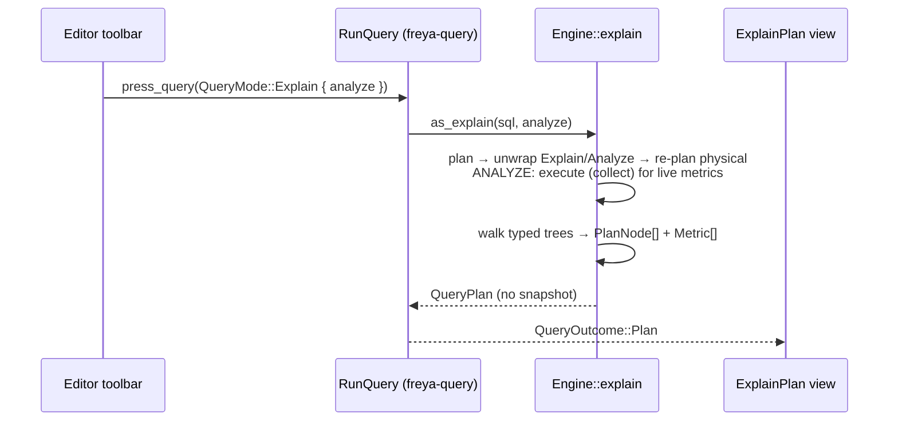

# Strata — EXPLAIN Plan View (as built)

The EXPLAIN plan view: the results pane's rendering of an `EXPLAIN [ANALYZE]` as an
indented tree of operator cards, with per-operator self-time, a time-share bar, hotspot flagging,
insight callouts, and a grouped full-metrics grid.

The design's one load-bearing idea: **the engine does all the work.** `engine::run_explain` walks
DataFusion's own typed `LogicalPlan` / `ExecutionPlan` trees and each operator's live `MetricsSet`,
and hands the UI one plain, typed, unit-formatted data structure (`QueryPlan`). There is no JSON
and no plan-text parsing anywhere — the raw indent text exists only as an opaque string for the
Raw toggle. The view does no unit math; every number arrives with a ready-to-print label.

Code lives in two places:

- **Model:** `crates/strata-arrow/src/plan/` (`tree.rs`, `metrics.rs`, `detail.rs`, `sql.rs`,
  `fmt.rs`) — DataFusion-free, which is why it lives a crate below the engine.
- **Engine:** `crates/strata-engine/src/explain.rs` (the walk).
- **View:** `crates/strata-freya/src/apps/project/views/workbench/results/explain_plan/`
  (`mod.rs` shell + toolbar, `node.rs` the card, `palette.rs` colour resolution).

---

## 1. Reaching the view

The editor toolbar has two presses next to Run — **Explain plan** and **Explain analyze**
(`editor/toolbar.rs`). Each calls the shared press funnel with
`QueryMode::Explain { analyze }` (`actions::press_query`), which snapshots the tab's editor text
into a fresh-nonce `QuerySpec` on the tab's request slot. The results pane subscribes that press
(`RunQuery` in `query/run_query.rs`); its Explain arm rewrites the SQL with
`plan::as_explain(sql, analyze)` — strip any leading `EXPLAIN [ANALYZE] [VERBOSE]`, prepend the
requested prefix — and calls `Engine::explain`. The buffer itself is untouched; the rewrite
applies to the press's snapshot at dispatch.

The settled outcome is `QueryOutcome::Plan(QueryPlan)` — a third outcome beside `Rows` and
`Statement`, because Explain is something the *press* asked for, not something the router decided.
The results pane renders it as `ExplainPlan`, and the status bar summarises the shown tree
(`Physical plan · N operators`).

Two engine facts (see `docs/SNAPSHOT_SPEC.md` §4):

- **An explain materializes no snapshot.** `Engine::explain` supersedes the workspace's in-flight
  run (mutually exclusive, like a re-run) but leaves the tab's settled snapshot alone — the
  previous result grid is still there behind the plan.
- **Cancel works the same as for a run** — the press's nonce, `Engine::cancel`, settles
  `Err("cancelled")`.

A statement *typed* as `EXPLAIN SELECT …` and dispatched through Run is classified `Query` by the
statement router and executes as an ordinary rows query — DataFusion returns the plan text as a
result table. The structured plan view is only built by the two toolbar presses.



---

## 2. The data model

All types are in `strata_arrow::plan` (re-exported from `plan/mod.rs`), with no DataFusion
dependency — the view links against the model, never the planner.

### `QueryPlan` (`plan/tree.rs`)

One object per explain:

```rust
pub struct QueryPlan {
    pub logical: Vec<PlanNode>,
    pub physical: Vec<PlanNode>,
    pub logical_text: String,   // raw indent text, for the Raw toggle
    pub physical_text: String,  // ditto (with metrics under ANALYZE)
    pub analyze: bool,          // true = EXPLAIN ANALYZE
}
```

- Both trees are **flat arrays in pre-order**, each node tagged with a `depth` (0 = root). The
  view renders an indented list; no recursion.
- **Plain `EXPLAIN`** → both trees populated, `analyze == false`, no metrics anywhere.
- **`EXPLAIN ANALYZE`** → `analyze == true`; the query is actually executed so `physical` nodes
  carry live metrics. `logical` is still populated (structure only — logical nodes never carry
  metrics).
- `is_some()` (at least one tree present) gates the view; `run_explain` returns `Err` if both
  trees came back empty.
- `max_ms()` is the largest per-node self-time across the physical tree, floored at `1.0` — the
  normaliser for the time-share bars and the hotspot threshold.

### `PlanNode` (`plan/tree.rs`)

```rust
pub struct PlanNode {
    pub name: String,        // "ParquetExec", "HashJoinExec", "Projection"
    pub detail: String,      // one-line operator config (parsed by the card, §5)
    pub kind: PlanKind,      // Source | Join | Exchange | Agg | Sort | Proj | Limit | Util
    pub depth: usize,
    pub rows: Option<u64>,   // output_rows — ANALYZE only; None where absent (RepartitionExec)
    pub self_ms: Option<f64>,// derived self-time (§3); None on plain EXPLAIN
    pub self_label: String,  // self_ms formatted ("2.1 ms")
    pub metrics: Vec<Metric>,// typed, pre-labelled (ANALYZE only; empty otherwise)
}
```

`PlanKind::classify` buckets by operator name (physical `*Exec` and logical node names, including
the file-format sources — `ParquetExec`, `CsvExec`, … — which don't contain "scan"). The kind
drives only the accent colour and the self-time attribution arm.

Two absences the layout handles: `rows` is `None` on every `RepartitionExec` (it emits no row
count), and there is no reliable single "time" field on a raw operator — which is exactly why
`self_ms` exists.

### `Metric` (`plan/metrics.rs`)

There is **no flat metrics string**. Each operator carries a typed list:

```rust
pub struct Metric {
    pub name: String,     // "bytes_scanned", "metadata_load_time", …
    pub value: u64,       // raw aggregate: ns for Time, bytes for Bytes/Memory, else a count
    pub kind: MetricKind, // Count | Time | Bytes | Memory | Ratio
    pub label: String,    // unit-aware, ready to print ("15.6 ms", "605 B", "48,213")
    pub zero: bool,       // value == 0 — lets the UI hide the many zero counters
}
```

The engine builds these in `explain.rs::node_metrics` from each operator's aggregated
`MetricsSet`: the `MetricKind` comes from DataFusion's `MetricValue` **variant** first (stable —
`elapsed_compute`'s name contains no "time"), then a name heuristic for generic operator-defined
counts/gauges. Timestamps are dropped (not metrics); `output_rows` surfaces as the headline `rows`
*and* stays in the list (tier-3 "Output" group). `Ratio`/pruning metrics have no single scalar
unit, so their label is DataFusion's own display string; everything else is formatted by
`MetricKind::format` (`fmt_ns` / `fmt_bytes` / `fmt_int` in `plan/fmt.rs`).

### The walk (`engine/explain.rs`)

`run_explain` is handed the **parsed, resolved** statement (`Engine::explain` → `sql::parse_one`,
so an EXPLAIN's bare names reach the same relations a Run's do — DB-09) and plans it under
`SQLOptions` with DML/DDL/statements disallowed (`query::plan_statement`), unwraps
the `LogicalPlan::Explain` / `Analyze` wrapper to the inner plan, walks it into `logical`, then
re-plans it physical. Under ANALYZE it executes the physical plan (`collect`) so live metrics land
on the operators, then walks `physical` — reading each node's name, one-line display
(`split_name_detail` on `"Name: detail"`), and metrics directly from the typed objects.
`physical_text` uses `DisplayableExecutionPlan::with_metrics` under ANALYZE, plain `displayable`
otherwise.

---

## 3. Self-time attribution

There is no universal per-operator time: `elapsed_compute` is `~0` on scans and absent on
joins/exchanges, and each operator family reports its own time metrics. `self_time_ms(kind,
metrics)` (`plan/metrics.rs`) derives the one comparable "work done here" number per node:

| kind | self-time = | fallback |
|---|---|---|
| `Source` | `time_elapsed_processing` | `time_elapsed_scanning_total` → `elapsed_compute` |
| `Join` | `build_time` + `join_time` | `elapsed_compute` (only when both are absent) |
| `Exchange` | `repartition_time` | 0 |
| everything else | `elapsed_compute` | 0 |

`fetch_time` and `send_time` are deliberately never used — they are exchange **wait**, not work
(measured: a 337 ms `fetch_time` on a plan that ran ~30 ms wall). Returns `None` when the node
carries no metrics at all (plain EXPLAIN), `Some(0.0)` when the kind's metric happens to be
absent. Self-time drives the time chip, the share bar, and HOTSPOT.

---

## 4. The three metric tiers

Under ANALYZE each card shows its metrics in three tiers (rendered in `node.rs`):

**Tier 1 — headline, always shown.** `rows` (when present) · self-time (clock icon +
`self_label`) · `bytes_scanned` (Source nodes only) · the time-share bar. The bar's fill is
`round(self_ms / max_ms × 100)` clamped to **3–100%** (`bar_pct`), so a non-zero time always
reads; the fill takes the node's kind colour.

**Tier 2 — insight callouts, only when non-zero.** `insights(&metrics)` (`plan/metrics.rs`)
derives tone-coded pills, in priority order:

1. every non-zero `*_error(s)` counter — `Err` (red), surfaced loudly;
2. spills — `spilled <bytes>` or `<n> spill(s)` — `Warn`;
3. row-group pruning: `pruned P/(P+M) row groups` (`Ok`) when anything was pruned, else
   `matched M row group(s)` (`Info`) — statistics and bloom-filter counters summed;
4. `pushdown removed N rows` — `Ok`;
5. `peak <mem>` / `build <mem>` high-water marks — `Info`;
6. `selectivity <label>` — `Info`, whenever present.

Zeros never appear here. The function is pure over `Metric` and unit-tested.

**Tier 3 — the full grid, collapsed.** A `▸ Metrics (N)` expander opens a bordered grid grouped
under fixed headers — `METRIC_GROUPS` (`plan/metrics.rs`): Output · Time · I/O · Pruning ·
Memory & spill · Exchange · Join · Errors · Other, in that order. `metric_group(name)` buckets by
name (first match wins); a metric no rule claims lands in "Other". Zero-valued metrics are hidden
behind a `show zeros (n)` toggle in the grid's footer, and render at reduced opacity when shown.
Each value is coloured by its `MetricKind`, each group header by its group.

---

## 5. The rendered layout

### Toolbar (38 px, `explain_plan/mod.rs`)

- **Physical / Logical pill** — a `SegmentedToggle`, shown only when both trees are non-empty.
  The selected tab lives on the results pane per press (like the page number), so the status
  bar's summary reads the same selection. `effective_tab` falls back to whichever tree is present
  when only one is — the pill never offers an empty tree.
- **ANALYZE badge** — an amber pill, shown only under ANALYZE *and* on the physical tab (the
  metrics live there).
- **Raw / Tree toggle** — a `ToggleButton` at the trailing edge. Raw renders the active tree's
  `physical_text` / `logical_text` verbatim in a scrollable mono readout; Tree renders the cards.
- The row is a `Toolbar`, so a narrow pane folds it rather than spilling; the pill and
  badge form the unshrinkable leading run.

### The tree body

Rows render top-down in pre-order. Each row is `plan_row` (`node.rs`): a 22 px **rail column per
ancestor level**, lit only where the tree visually continues (`guide_rails` in `plan/detail.rs` —
an ancestor's rail stays on while a later node exists at that depth), then the card. A single-node
plan (`SELECT *` is one node) shows no dangling connectors by construction. The card list is
keyed by the shown tree, so switching Physical ↔ Logical remounts the cards — expand state
belongs to that tree's nodes, not to list positions.

### One card (`PlanNodeCard`)

A 1 px hairline box with a clipped 3 px kind-coloured accent strip down the left (the border-left
idiom — Freya's `Border` is all-sides), holding a content column:

- **Head:** 6 px kind square · mono operator name in the kind colour · **HOTSPOT** badge when
  `self_ms >= max_ms × 0.6` (ANALYZE only).
- **Detail grid:** the operator's one-line `detail` parsed by `detail_parts` (`plan/detail.rs`)
  into `DetailPart { key, val, has_key }` rows — a bracket-aware split on top-level commas, with a
  leading `key=` lifted out only when the head is a short (< 26 byte) identifier. Keyed parts
  render as a two-column definition grid (key column sized to the widest key); bare fragments span
  the full width. A long detail (more than 2 parts, or over 110 chars) collapses to its first two
  parts behind a `▸ Detail` expander — never clamped text.
- **Tiers 1–3** as in §4, each present only under ANALYZE (`metrics` non-empty).

Each card owns its own detail-expand / metrics-collapse / show-zeros state.

### Colour

Every colour resolves through `PlanPalette` (`palette.rs`): the `explain_plan` component theme
plus the shared type palette and tones it borrows. The mapping mirrors the core's CSS-var palette
(`PlanKind::color`, `MetricKind::color`, `group_color`, `InsightTone::color` — one mapping source,
two frontends): Source→string, Join→bool, Exchange→number, Agg→timestamp, Sort→struct,
Proj→accent, Limit→map, Util→muted; Errors always the error tone.

---

## 6. Extension seam

The contract is one-directional: **the engine emits typed data; the UI renders what it is
handed.** In practice:

- **A new metric** an operator starts emitting needs no code anywhere: `node_metrics` picks it up
  from the `MetricsSet`, `metric_kind` types it, and it appears in the tier-3 grid (bucketed by
  `metric_group`, "Other" if no rule claims it).
- **A new tier-2 callout** is one clause in `insights()` — pure over `Metric`, unit-tested next to
  the existing ones.
- **A new tier-3 group** is an entry in `METRIC_GROUPS`, a branch in `metric_group`, and a colour
  in `group_color` + `PlanPalette::group`.
- **A new attribution rule** (an operator family whose real cost hides in a named metric) is an
  arm in `self_time_ms`.

Nothing on the UI side enumerates metric names except the two headline reads (`bytes_scanned` on
sources, and the grid's grouping via the shared `metric_group`) — everything else is driven by the
typed fields on `Metric`.
