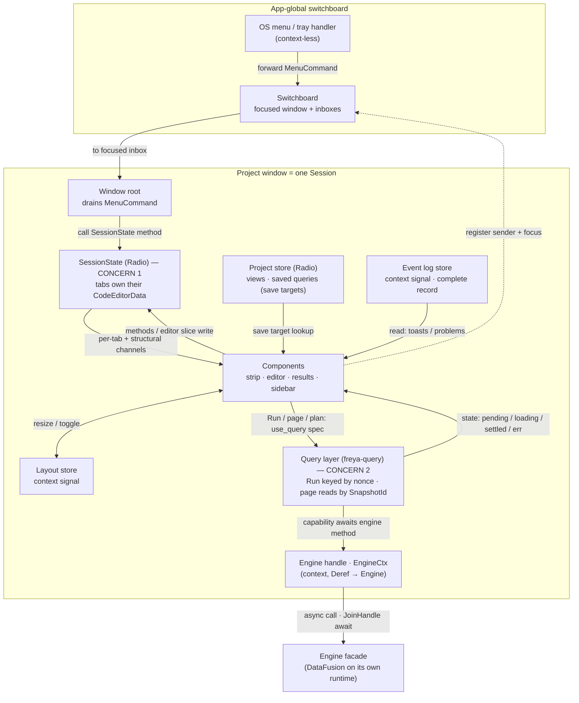

# Strata (Freya) — state architecture

The definitive design for the Freya frontend's per-window state. **Clean-slate and
Valin-shaped**: tabs are *stateful structs that own their editor and live in the store*, not
serde records with state mirrored in from elsewhere. Supersedes `FREYA_PORT_PLAN.md` §4.

Every API below is verified against Freya 0.4 source (`freya-radio`, `freya-query`,
`freya-winit`) and against `marc2332/valin` (the Freya author's own code editor), which is the
reference for the stateful-tab pattern.

---

## 1. Two concerns, split at the root

The design starts by separating **two concerns Dioxus tangled together**:

1. **Tab management** — multiple tabs with independent state: new / duplicate / close /
   drag-reorder / rename / save / is-dirty. Pure client bookkeeping; the engine is never
   involved. → the **`SessionState`** store.
2. **Query of a tab's SQL** — run / plan / explain / page, dispatched to the engine. Owned by
   the **results element itself** via freya-query, keyed by the tab's SQL. → the **query
   layer**.

This is why it is *not* a port of the Dioxus design. There is **no `runs`-by-id store** and
**no query state on the session** — no `submitted`, no `run_id`, no results. Tab management
knows nothing about queries; the results element calls `use_query` off the active tab's SQL,
and freya-query does the caching, dedup, and loading states.



---

## 2. Tiers and stores

Three tiers, use the weakest that works:

- **Component-local** (`use_state`) — throwaway view state (hover, a results-view's local
  sort/scroll, a Run request).
- **Radio (per-window)** — shared reactive state with surgical per-channel updates.
- **Global** (`create_global`) — app-wide singletons.

The Valin lesson: **a stateful thing that must be shared/persisted lives *in* a Radio store as
a real struct that owns its state** — you don't keep it component-local and mirror it. So the
editor buffer lives in the store, inside the tab.

| Store | Tier | Persisted | Holds |
|-------|------|-----------|-------|
| **`SessionState`** | Radio (per-window) | yes (snapshot) | the open tabs (each a `QueryTab` owning its `CodeEditorData`), order, active, closed stack |
| **`Project`** | Radio (per-window) | yes (`project.json`) | view + saved-query definitions — the *save targets* |
| **`LayoutCtx`** | context `State<Layout>` | yes | panel sizes, sidebar/inspector/drawer open |
| **`LogCtx`** | context `State<VecDeque<LogEntry>>` | no | the complete event/error log (§9) |
| **Query layer** | freya-query | no | results / pages / plan / explain — Runs keyed by a per-press nonce, page reads by `(SnapshotId, page, …)` (see `SNAPSHOT_SPEC.md`) |
| **Engine handle** (`EngineCtx`) | context | — | the direct-call engine facade (`Arc<Engine>`, Deref) + the tab-close cleanup hook |
| **Switchboard** | `create_global` | — | focused window + per-window menu inboxes (handles, not state) |

Each is a single responsibility. `SessionState` is *not* a god-object: layout, the log, and
the project artifacts are their own stores; query results are freya-query's.

---

## 3. `SessionState` + `QueryTab` — the stateful tab

One window is one Session. The tab owns its editor exactly like Valin's `EditorTab`.

```rust
// apps/project/state/session.rs

use std::collections::HashMap;
use freya::prelude::AccessibilityId;
use freya::code_editor::CodeEditorData;

pub struct SessionState {
    tabs:   HashMap<TabId, QueryTab>,   // stateful tabs; each owns its buffer
    order:  Vec<TabId>,                 // strip order (drag-reorder)
    active: Option<TabId>,
    closed: Vec<QueryTab>,              // reopen stack — parked tabs, moved not copied (§4)
}

/// The one tab kind (KISS — concrete, no trait/enum until a second kind exists).
pub struct QueryTab {
    id:       TabId,
    focus_id: AccessibilityId,
    name:     String,           // display title (scratch: editable; bound: the artifact's)
    editor:   CodeEditorData,   // Rope + cursor + selection + undo + is_edited()  ← state lives HERE
    origin:   Origin,           // Scratch | View(key) | SavedQuery(key) — the SAVE TARGET only
}

#[derive(Clone)]
pub enum Origin { Scratch, View(ArtifactKey), SavedQuery(ArtifactKey) }
```

`TabId` is a `Uuid` newtype (`Copy, Eq, Hash, Ord`) — real identity, no allocator, no dup-id
repair.

**Channels** (`Chan` = Valin's `follow_tab`, made explicit):

```rust
#[derive(Clone, Copy, PartialEq, Eq, Hash, Debug, PartialOrd, Ord)]
pub enum Chan { Tabs, Tab(TabId) }        // Tabs = structure (order/active); Tab(id) = one tab
impl RadioChannel<SessionState> for Chan {}   // derive_channel defaults to vec![self]
```

`RadioChannel` needs only `Clone + Eq + Hash` (+`Debug + Ord` under the `tracing` feature —
already derived). `Chan::Tab(TabId)` is a first-class data-carrying channel: editing one tab
wakes only that tab's subscribers.

**The editor binds a `Writable` slice into the store** (verbatim Valin shape):

```rust
let editor = radio.slice_mut(Chan::Tab(id), move |s| &mut s.tab_mut(id).editor);
CodeEditor::new(editor.into_writable(), focus_id)
```

`RadioSliceMut<SessionState, CodeEditorData, Chan>` implements `WritableUtils`, so
`.into_writable()` gives the `Writable<CodeEditorData>` the `CodeEditor` mutates in place.
Because the buffer is *in the store keyed by `TabId`*, it survives tab switches with cursor +
undo intact — no all-mounted requirement, no component-local mirror, no `sql: String` copy.

---

## 4. Operations, dirty, save, reopen

**Structural ops are methods on `SessionState`** (Valin-style — no `Action` enum), called
through a write-channel guard by commands / shortcuts / the menu seam:

```rust
impl SessionState {
    pub fn open_blank(&mut self) -> TabId;              // ⌘T
    pub fn open_named(&mut self, name, sql, origin) -> TabId;
    pub fn open_or_focus(&mut self, sql: &str);
    pub fn duplicate(&mut self, id: TabId);            // clone into a scratch tab
    pub fn close(&mut self, ids: &HashSet<TabId>);     // parks the QueryTab(s) in `closed`
    pub fn reopen_last(&mut self);                     // moves a parked tab back
    pub fn switch(&mut self, id: TabId);
    pub fn move_tab(&mut self, id: TabId, insert: usize);
    pub fn rename(&mut self, id: TabId, name: String);
}
// caller: radio.write_channel(Chan::Tabs).open_blank();   // structural → Chan::Tabs
//         radio.write_channel(Chan::Tab(id)).rename(id, n); // per-tab   → Chan::Tab(id)
```

The **editor** is not a method: it writes its `Chan::Tab(id)` slice directly (§3). So the store
mutates through exactly two doors — structural methods, and the editor slice.

**Dirty is owned by the editor**, not stored or derived from a baseline:

```rust
fn is_dirty(tab: &QueryTab) -> bool {
    !matches!(tab.origin, Origin::Scratch) && tab.editor.is_edited()
}
```

`CodeEditorData::is_edited()` tracks edits since load/last-save; save resets it. A tab chip's
dirty dot reads this on `Chan::Tab(id)`. **Scratch tabs never show dirty** (working buffers, as
today); only bound tabs do.

**Save (⌘S) dispatches on `origin`** and writes the *project*, not the tab:

| origin | ⌘S does |
|--------|---------|
| `Scratch` | **Save As** — create a View/SavedQuery in the `Project` store, set the tab's `origin` to it, reset the editor's edited flag |
| `View(k)` / `SavedQuery(k)` | overwrite `project.artifact(k)` with the editor text, reset the editor's edited flag |

So dirty clears itself after a save (the editor is no longer "edited"), and the only session
mutation is on Save As (setting `origin`). Baselines live in the `Project` store; the session
never copies them.

**Close / reopen moves the whole `QueryTab`** — the point of a self-owned tab:

- `close` pops the `QueryTab` out of `tabs`/`order` and pushes it onto `closed`.
- `reopen_last` pops from `closed` and re-inserts it — restoring the **full** editor state
  (undo, cursor, `is_edited`), not a text snapshot.
- `closed` is capped (drop oldest, freeing its `CodeEditorData`) and is ephemeral (never
  persisted). A reopened tab keeps its original `TabId`/`focus_id` (it was fully removed while
  parked, so no collision).

---

## 5. Persistence

`SessionState` holds live `QueryTab`s whose `CodeEditorData` isn't serde, so persistence goes
through a **snapshot**, driven by a side effect — "the editor writes the store, a side effect
saves the store":

```rust
#[derive(Serialize, Deserialize)]
struct SessionSnapshot { tabs: Vec<TabSnapshot>, active: Option<TabId> }
#[derive(Serialize, Deserialize)]
struct TabSnapshot { id: TabId, name: String, origin: Origin, text: String }  // text = rope.to_string()
```

- A **debounced `use_side_effect`** in the window root reads `SessionState` (subscribing to its
  channels), builds `SessionSnapshot`, and writes the `tabs` section of `.strata/session.json`.
  Editor edits mutate the store (on `Chan::Tab(id)`), so this fires and debounces naturally.
- **Load** reads `SessionSnapshot`, rebuilds each `QueryTab` (`CodeEditorData::new(Rope::from(text), lang)`),
  and provides the assembled `SessionState` as the station's initial value. No `normalize()` /
  dup-id repair — `Uuid`s can't collide; `active`/order come straight from the file (validated
  only for "does `active` still exist").
- `LayoutCtx` persists the `layout` section the same way (its own debounced side effect).
  `closed` and the log are never persisted.

---

## 6. Concern 2 — query execution (freya-query over result snapshots)

> The full design is **`docs/SNAPSHOT_SPEC.md`** — this section is its summary and supersedes
> the earlier `QuerySpec { sql, page, epoch }` sketch.

Running a tab's SQL — **run / explain / page** — is owned by the results element via
freya-query. The session is untouched: the results panel reads the active tab's editor text
and drives execution itself.

A **Run executes once** and materializes an immutable on-disk **snapshot** (the `__snap_*`
mechanism), answering with a handle (`SnapshotId` + schema + total, riding in `QueryOutput`)
plus page 1. Every later read — page, sort, filter, export — targets *that snapshot*. Raw-SQL
identity is **never** a cache key (same SQL ≠ same data); the sound keys are a per-press nonce
for the Run and the snapshot id for reads:

```rust
// apps/project/query/run_query.rs — two capabilities, both carrying Captured<EngineCtx>
// (invisible to cache identity: PartialEq always-true, Hash no-op).

QuerySpec  { run: RunId /* fresh per Run press */, sql, mode: Run | Explain{analyze}, page_size }
RunQuery   : QueryCapability<Keys = QuerySpec, Ok = QueryOutcome /* Rows(QueryPage) | Plan */, Err = String>

PageSpec   { snapshot: SnapshotId, page, page_size, sort: Option<(String, bool)> }
FetchSnapshotPage : QueryCapability<Keys = PageSpec, Ok = SnapshotPage, Err = String>
```

**The Run trigger is component-local**, not session state. The workbench holds
`let mut request = use_state(|| None::<QuerySpec>)`:

1. **Run** (⌘↵): snapshot the editor text → `request.set(Some(QuerySpec { run: RunId::new(),
   sql, mode: Run, page_size }))`.
2. Results grid: `use_query(Query::new(request()?, RunQuery(engine.captured())).stale_time(MAX))`
   — `engine` from context. `stale_time(MAX)` on both capabilities: a settled entry never
   re-executes by itself (freya-query re-runs stale entries on resubscribe — for an *action*
   that would be a silent re-execution).
3. **Editing doesn't re-run** — it mutates the editor, never `request`. Only Run rebuilds it
   (new nonce → new execution → new snapshot; the old one is retired, spec §4).
4. **Paging / sort**: the grid drives `use_query(FetchSnapshotPage)` with
   `PageSpec { snapshot: handle, … }` — a new key fetches, a revisited key is cache-served with
   zero engine traffic (sound because the snapshot is immutable). Explain is the same
   `use_query` pattern with `mode: Explain`.
5. **Loading / cancel**: the grid reads `query.read().state()`
   (`Pending | Loading{res} | Settled{res}`); cancel is `engine.cancel(tab.into(), run.into())`
   → the awaiting run settles `Err("cancelled")`.
6. **Invalidation**: none for results — a Run result is point-in-time; DDL / reload does *not*
   retire it (spec §4). Catalog + functions are their own capabilities (`FetchCatalog`,
   `FetchFunctions`) and invalidate on DDL via `on_settled`.

**As built (P2-02).** The `request` slot lives in the **workbench** element (the common parent of
its two consumers) and is threaded as **struct-field props** — `EditorTab` → toolbar (writer),
`Results` (reader) — *not* context, and *not* a per-tab registry (a root-provided
`HashMap<TabId, QuerySpec>` was rejected as a runs-store by another name). Per-tab results on tab
switch come from the cache being keyed by the press's `QuerySpec` (which carries `tab`), plus a
`spec.tab == tab` filter in `Results`; a press in another tab supersedes the slot — one execution
per window. A workbench `use_side_effect` clears the slot when the pressed tab closes (mirror of
the §7 close funnel, so a reopened tab starts fresh). A settled `Err` renders the results pane's
error body (`ResultsState::Error`, `results/error.rs`). Rule of thumb carried forward: props for
small/known/shallow consumer sets; context only for DI handles (`EngineCtx`, theme) and
deep/open-ended trees (`Selection`).

**Run→Cancel (P2-15).** The toolbar's Run control flips to Cancel while the press is in flight —
but it can't derive that from `request` (which stays `Some` after settle, keeping the grid
mounted), and it **must not** subscribe the run's `use_query` itself: freya-query re-runs *stale*
entries when a subscriber mounts, and a `Pending`/`Loading` entry reads as stale, so a second
enabled subscriber would double-execute the run (nor can it share state via `.enable(false)` —
`enabled` is part of `Query`'s cache identity, so that's a different, never-running entry). So
the workbench holds a second component-local slot, `running: State<Option<RunId>>`, threaded as
props beside `request`; `ResultsBody` — the query's sole subscriber — mirrors the lifecycle into
it with a `use_side_effect` (the press's nonce while in flight, `None` on settle) plus a
nonce-guarded `use_drop` (a stale body's unmount can't clobber a newer press's flag). Cancel from
either surface is the same action: `engine.cancel(tab, run)` + `request = None`.

---

## 7. The engine handle (`EngineCtx`) — a direct-call facade

The engine (`strata_core::engine::Engine`) is a **direct-call async facade**, not a protocol:
it owns a private multi-thread Tokio runtime (DataFusion's operators require a Tokio context,
and query CPU must never run on the render thread), spawns each call onto it, and awaits the
`JoinHandle` — executor-agnostic, so Freya's non-Tokio executor awaits engine calls like any
async fn. This is exactly the shape a freya-query capability expects (cf. Freya's
`state_query_sqlite` example: `blocking::unblock(...).await`, no channels). There is **no**
event stream, no request ids, no router — the Dioxus-era `Command`/`Event` protocol is retired
(it survives only in `crates/strata-dioxus`, reference code that no longer builds).

```rust
// strata-core — the facade (lifecycle bookkeeping lives HERE, framework-free, unit-tested):
async fn query(ws: WsId, tag: RunTag, sql, page_size) -> Result<(QueryOutput, RecordBatch), String>
async fn fetch_page(snapshot, page, page_size, sort) -> Result<(Vec<Vec<Cell>>, RecordBatch), String>
async fn explain(ws: WsId, tag: RunTag, sql) -> Result<QueryPlan, String>
fn cancel(ws, tag) -> Option<elapsed_ms>   ·   fn cleanup_ws(ws)   ·   impl Drop  // + register, …

// apps/project/contexts/engine_ctx.rs — the thin per-window wrapper:
#[derive(Clone)]
pub struct EngineCtx { eng: Arc<Engine> }   // Deref → Engine
impl From<TabId> for WsId { … }             // the tab IS the workspace (Uuid → u128)
impl EngineCtx {
    pub fn captured(&self) -> Captured<EngineCtx> { … }   // capability field, cache-invisible
    pub fn cleanup(&self, tab: TabId) { … }               // → engine.cleanup_ws(tab.into())
}
```

Tab-close cleanup is one funnel in the window root — a `use_side_effect` diffs the session's
open tab set (subscribed on `Chan::Tabs`) and calls `cleanup` for tabs that disappeared, so
every close path is covered without touching any of them. Errors reach the UI as each query's
own `Err` state (freya-query `Settled`), not through an event side-channel; genuine engine
*push* (profile progress, later) uses a `watch` channel + `use_track_watcher` when it lands.

---

## 8. Layout & log satellites

Both are small context signals, not Radio stations:

- **`LayoutCtx = State<Layout>`** — `{ sidebar_open, inspector_open, drawer_open, panel_sizes }`.
  A resize handle / toggle writes it directly (`layout.write().panel_sizes = …`); no action, no
  channel. Persisted by its own debounced side effect (§5). Coarse writes are fine — layout is
  tiny and its only readers are the panel container.
- **`LogCtx = State<VecDeque<LogEntry>>`** — the window's complete event/error record, appended
  by whichever layer observes the fact (a settled query's `Err`, a mutation's result, a load
  summary). `LogEntry` carries a level + origin so views filter it (a toast host = recent
  warn+, Problems = a tab's logged query error). Ephemeral.

---

## 9. Errors — logged always, some also shown in context

Almost every engine error originates from **registration** (project load, or the
configure/connections window) or **query execution**. Every one is appended to the log (§8) —
the complete record — and the request-correlated ones are *also* surfaced where they
originated, so the user sees them in place. Both happen; not either/or.

| Origin | In the log | Also shown inline |
|--------|-----------|-------------------|
| Query execution | yes (logged where the query settles `Err`) | that tab's results / Problems, from `RunQuery::Err`; auto-clears on re-run |
| Registration via configure form | yes | the form's submit error (`use_mutation(RegisterSource)::Err`); `on_settled` invalidates `FetchCatalog` |
| Registration at load | yes | a per-source marker on the sidebar catalog item (+ one load-summary notice) |

SQL validation is the exception — client-side language-service analysis, derived per-tab from
the editor text (a memo, not stored, not logged). A tab's Problems view is
`validation(editor.text) ∪ query_error(tab)`.

---

## 10. The menu / tray seam

The one context-less boundary. In `freya-winit`, `MenuEvent::set_event_handler` is app-global
and its handler runs with a `RendererContext`, **not** a component scope — it can't
`consume_context`. Keyboard events, by contrast, route per-window through each window's tree,
so hotkeys are handled in-tree with full context (the Dioxus "webview swallows keys" escape
hatch is gone).

So the menu is a thin typed forward, not a state global:

```rust
// state/switchboard.rs — app-global via create_global
pub struct Switchboard { focused: Option<WindowKey>, inboxes: HashMap<WindowKey, UnboundedSender<MenuCommand>> }
```

- Each window, in-tree, registers its `Sender<MenuCommand>` under its `WindowKey` and writes
  `focused` on `WindowEvent::Focused`.
- The context-less handler maps `MenuId → MenuCommand`, looks up the focused window's inbox,
  forwards. Reads/writes no state.
- The target window's root drains the receiver and calls the matching `SessionState` method (or
  a query invalidation, new-window request, …).

Only a typed `MenuCommand` crosses the boundary; all state stays per-window. The switchboard
holds **handles, not state**.

---

## 11. Module layout

```
apps/project/
  state/
    session.rs      SessionState + QueryTab + TabId + Origin + methods
    channel.rs      Chan + RadioChannel impl
    layout.rs       Layout + LayoutCtx (context signal, side-effect persist)
    log.rs          LogEntry (level + origin) + LogCtx (context signal)
    persist.rs      SessionSnapshot / TabSnapshot + load/save side effects
    mod.rs          use_init_session/layout/log, typed accessors
  query/
    run_query.rs    RunQuery + QuerySpec + QueryPage
    catalog.rs      FetchCatalog / FetchFunctions
  contexts/
    engine_ctx.rs   EngineCtx — Arc<Engine> (Deref) + captured() + cleanup(tab); TabId→WsId
  project/          Project store (views + saved-query defs; save targets) — adjacent task
state/
  switchboard.rs    app-global Switchboard (menu seam), created in main
```

---

## 12. Open decisions

1. ~~**`WindowKey` in `QuerySpec`**~~ — resolved by `SNAPSHOT_SPEC.md`: the Run nonce and
   snapshot ids are process-unique, so a per-window discriminator adds nothing; dropped.
2. **Persisted per-tab extras** — the snapshot stores `{name, origin, text}`. Also persist
   cursor offset / scroll (nice-to-have restore) or keep it minimal? Lean minimal.
3. **`Project` store shape** — the save-target store (views + saved queries) is referenced here
   but designed with its own task; confirm it's a per-window Radio store mirroring the current
   `crate::project`.

---

## 13. Build order (each slice keeper code, no throwaway)

1. **`SessionState` + `QueryTab`** — struct, `Chan`, the structural methods; unit-test them
   headless. Provide via `use_init_radio_station` in the window root.
2. **Tabs strip + editor** — strip on `Chan::Tabs` + per-chip `Chan::Tab(id)` reading
   `is_edited`; the `CodeEditor` bound to the `Writable<CodeEditorData>` slice; language-service
   wiring from the validated spike.
3. **Persistence** — `persist.rs` snapshot + load/save side effects.
4. **Query layer** — the engine facade + `RunQuery`/`FetchSnapshotPage`; results grid on
   `use_query`. Replaces the round-trip's drain-into-`use_state`.
5. **Menu seam** — switchboard + focused-window forwarding, once a second window exists.
