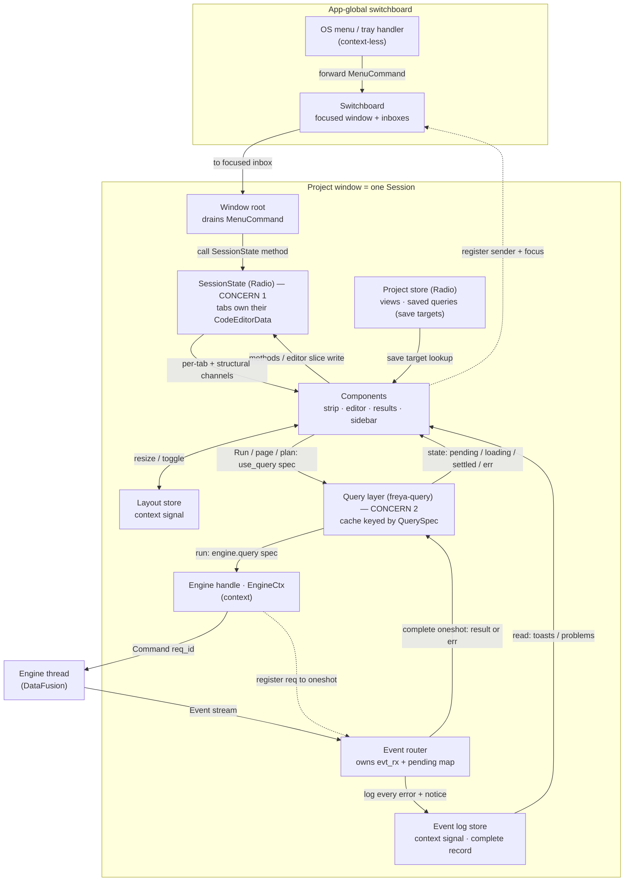

# Strata (Freya) — state architecture

The definitive design for the Freya frontend's per-window state. **Clean-slate and
Valin-shaped**: tabs are *stateful structs that own their editor and live in the store*, not
serde records with state mirrored in from elsewhere. Supersedes `FREYA_PORT_PLAN.md` §4.

Every API below is verified against Freya 0.4 source (`freya-radio`, `freya-query`,
`freya-winit`) and against `marc2332/valin` (the Freya author's own code editor), which is the
reference for the stateful-tab pattern.

---

## 1. Two concerns, split at the root

The design starts by separating **two concerns Dioxus tangled together**:

1. **Tab management** — multiple tabs with independent state: new / duplicate / close /
   drag-reorder / rename / save / is-dirty. Pure client bookkeeping; the engine is never
   involved. → the **`SessionState`** store.
2. **Query of a tab's SQL** — run / plan / explain / page, dispatched to the engine. Owned by
   the **results element itself** via freya-query, keyed by the tab's SQL. → the **query
   layer**.

This is why it is *not* a port of the Dioxus design. There is **no `runs`-by-id store** and
**no query state on the session** — no `submitted`, no `run_id`, no results. Tab management
knows nothing about queries; the results element calls `use_query` off the active tab's SQL,
and freya-query does the caching, dedup, and loading states.



---

## 2. Tiers and stores

Three tiers, use the weakest that works:

- **Component-local** (`use_state`) — throwaway view state (hover, a results-view's local
  sort/scroll, a Run request).
- **Radio (per-window)** — shared reactive state with surgical per-channel updates.
- **Global** (`create_global`) — app-wide singletons.

The Valin lesson: **a stateful thing that must be shared/persisted lives *in* a Radio store as
a real struct that owns its state** — you don't keep it component-local and mirror it. So the
editor buffer lives in the store, inside the tab.

| Store | Tier | Persisted | Holds |
|-------|------|-----------|-------|
| **`SessionState`** | Radio (per-window) | yes (snapshot) | the open tabs (each a `QueryTab` owning its `CodeEditorData`), order, active, closed stack |
| **`Project`** | Radio (per-window) | yes (`project.json`) | view + saved-query definitions — the *save targets* |
| **`LayoutCtx`** | context `State<Layout>` | yes | panel sizes, sidebar/inspector/drawer open |
| **`LogCtx`** | context `State<VecDeque<LogEntry>>` | no | the complete event/error log (§9) |
| **Query layer** | freya-query | no | results / pages / plan / explain, cached by `QuerySpec` |
| **Engine handle** (`EngineCtx`) | context | — | send `Command`, correlate request/response, own `evt_rx` |
| **Switchboard** | `create_global` | — | focused window + per-window menu inboxes (handles, not state) |

Each is a single responsibility. `SessionState` is *not* a god-object: layout, the log, and
the project artifacts are their own stores; query results are freya-query's.

---

## 3. `SessionState` + `QueryTab` — the stateful tab

One window is one Session. The tab owns its editor exactly like Valin's `EditorTab`.

```rust
// apps/project/state/session.rs

use std::collections::HashMap;
use freya::prelude::AccessibilityId;
use freya::code_editor::CodeEditorData;

pub struct SessionState {
    tabs:   HashMap<TabId, QueryTab>,   // stateful tabs; each owns its buffer
    order:  Vec<TabId>,                 // strip order (drag-reorder)
    active: Option<TabId>,
    closed: Vec<QueryTab>,              // reopen stack — parked tabs, moved not copied (§4)
}

/// The one tab kind (KISS — concrete, no trait/enum until a second kind exists).
pub struct QueryTab {
    id:       TabId,
    focus_id: AccessibilityId,
    name:     String,           // display title (scratch: editable; bound: the artifact's)
    editor:   CodeEditorData,   // Rope + cursor + selection + undo + is_edited()  ← state lives HERE
    origin:   Origin,           // Scratch | View(key) | SavedQuery(key) — the SAVE TARGET only
}

#[derive(Clone)]
pub enum Origin { Scratch, View(ArtifactKey), SavedQuery(ArtifactKey) }
```

`TabId` is a `Uuid` newtype (`Copy, Eq, Hash, Ord`) — real identity, no allocator, no dup-id
repair.

**Channels** (`Chan` = Valin's `follow_tab`, made explicit):

```rust
#[derive(Clone, Copy, PartialEq, Eq, Hash, Debug, PartialOrd, Ord)]
pub enum Chan { Tabs, Tab(TabId) }        // Tabs = structure (order/active); Tab(id) = one tab
impl RadioChannel<SessionState> for Chan {}   // derive_channel defaults to vec![self]
```

`RadioChannel` needs only `Clone + Eq + Hash` (+`Debug + Ord` under the `tracing` feature —
already derived). `Chan::Tab(TabId)` is a first-class data-carrying channel: editing one tab
wakes only that tab's subscribers.

**The editor binds a `Writable` slice into the store** (verbatim Valin shape):

```rust
let editor = radio.slice_mut(Chan::Tab(id), move |s| &mut s.tab_mut(id).editor);
CodeEditor::new(editor.into_writable(), focus_id)
```

`RadioSliceMut<SessionState, CodeEditorData, Chan>` implements `WritableUtils`, so
`.into_writable()` gives the `Writable<CodeEditorData>` the `CodeEditor` mutates in place.
Because the buffer is *in the store keyed by `TabId`*, it survives tab switches with cursor +
undo intact — no all-mounted requirement, no component-local mirror, no `sql: String` copy.

---

## 4. Operations, dirty, save, reopen

**Structural ops are methods on `SessionState`** (Valin-style — no `Action` enum), called
through a write-channel guard by commands / shortcuts / the menu seam:

```rust
impl SessionState {
    pub fn open_blank(&mut self) -> TabId;              // ⌘T
    pub fn open_named(&mut self, name, sql, origin) -> TabId;
    pub fn open_or_focus(&mut self, sql: &str);
    pub fn duplicate(&mut self, id: TabId);            // clone into a scratch tab
    pub fn close(&mut self, ids: &HashSet<TabId>);     // parks the QueryTab(s) in `closed`
    pub fn reopen_last(&mut self);                     // moves a parked tab back
    pub fn switch(&mut self, id: TabId);
    pub fn move_tab(&mut self, id: TabId, insert: usize);
    pub fn rename(&mut self, id: TabId, name: String);
}
// caller: radio.write_channel(Chan::Tabs).open_blank();   // structural → Chan::Tabs
//         radio.write_channel(Chan::Tab(id)).rename(id, n); // per-tab   → Chan::Tab(id)
```

The **editor** is not a method: it writes its `Chan::Tab(id)` slice directly (§3). So the store
mutates through exactly two doors — structural methods, and the editor slice.

**Dirty is owned by the editor**, not stored or derived from a baseline:

```rust
fn is_dirty(tab: &QueryTab) -> bool {
    !matches!(tab.origin, Origin::Scratch) && tab.editor.is_edited()
}
```

`CodeEditorData::is_edited()` tracks edits since load/last-save; save resets it. A tab chip's
dirty dot reads this on `Chan::Tab(id)`. **Scratch tabs never show dirty** (working buffers, as
today); only bound tabs do.

**Save (⌘S) dispatches on `origin`** and writes the *project*, not the tab:

| origin | ⌘S does |
|--------|---------|
| `Scratch` | **Save As** — create a View/SavedQuery in the `Project` store, set the tab's `origin` to it, reset the editor's edited flag |
| `View(k)` / `SavedQuery(k)` | overwrite `project.artifact(k)` with the editor text, reset the editor's edited flag |

So dirty clears itself after a save (the editor is no longer "edited"), and the only session
mutation is on Save As (setting `origin`). Baselines live in the `Project` store; the session
never copies them.

**Close / reopen moves the whole `QueryTab`** — the point of a self-owned tab:

- `close` pops the `QueryTab` out of `tabs`/`order` and pushes it onto `closed`.
- `reopen_last` pops from `closed` and re-inserts it — restoring the **full** editor state
  (undo, cursor, `is_edited`), not a text snapshot.
- `closed` is capped (drop oldest, freeing its `CodeEditorData`) and is ephemeral (never
  persisted). A reopened tab keeps its original `TabId`/`focus_id` (it was fully removed while
  parked, so no collision).

---

## 5. Persistence

`SessionState` holds live `QueryTab`s whose `CodeEditorData` isn't serde, so persistence goes
through a **snapshot**, driven by a side effect — "the editor writes the store, a side effect
saves the store":

```rust
#[derive(Serialize, Deserialize)]
struct SessionSnapshot { tabs: Vec<TabSnapshot>, active: Option<TabId> }
#[derive(Serialize, Deserialize)]
struct TabSnapshot { id: TabId, name: String, origin: Origin, text: String }  // text = rope.to_string()
```

- A **debounced `use_side_effect`** in the window root reads `SessionState` (subscribing to its
  channels), builds `SessionSnapshot`, and writes the `tabs` section of `.strata/session.json`.
  Editor edits mutate the store (on `Chan::Tab(id)`), so this fires and debounces naturally.
- **Load** reads `SessionSnapshot`, rebuilds each `QueryTab` (`CodeEditorData::new(Rope::from(text), lang)`),
  and provides the assembled `SessionState` as the station's initial value. No `normalize()` /
  dup-id repair — `Uuid`s can't collide; `active`/order come straight from the file (validated
  only for "does `active` still exist").
- `LayoutCtx` persists the `layout` section the same way (its own debounced side effect).
  `closed` and the log are never persisted.

---

## 6. Concern 2 — query execution (freya-query, UI-driven)

Running a tab's SQL — **run / plan / explain / page** — is owned by the results element via
freya-query. The session is untouched: the results panel reads the active tab's editor text
and drives execution itself.

```rust
// apps/project/query/run_query.rs

#[derive(Clone, PartialEq, Eq, Hash)]
pub struct QuerySpec {
    pub window: WindowKey,   // per-window discriminator (cache is app-global; note below)
    pub sql:    String,      // the sql that was Run (a snapshot), not the live editor text
    pub mode:   QueryMode,   // Run | Plan | Explain
    pub page:   PageReq,
    pub epoch:  u64,         // catalog epoch — bump to invalidate after DDL / reload
}

/// The engine handle rides along via `Captured`, so it does NOT affect cache identity
/// (its PartialEq is always-true, Hash is a no-op).
#[derive(Clone, PartialEq, Eq, Hash)]
pub struct RunQuery(pub Captured<EngineCtx>);

impl QueryCapability for RunQuery {
    type Ok = QueryPage; type Err = String; type Keys = QuerySpec;
    async fn run(&self, spec: &QuerySpec) -> Result<QueryPage, String> {
        self.0.query(spec.clone()).await   // Command + await Event via the router (§7)
    }
}
```

**The Run trigger is component-local**, not session state. The workbench holds
`let mut request = use_state(|| None::<QuerySpec>)`:

1. **Run** (⌘↵): snapshot the editor text → `request.set(Some(QuerySpec { sql, mode: Run, page: first, .. }))`.
2. Results grid: `use_query(Query::new(request()?, RunQuery(gateway.captured())))` — runs +
   caches on the spec; `gateway` from context.
3. **Editing doesn't re-run** — it mutates the editor, never `request`. Only Run rebuilds it.
4. **Page / mode**: `request.set(… page+1 …)` / `… mode: Plan …` → new key → fetch, prior
   served from cache. Plan and Explain are the identical `use_query` pattern with a different
   `QueryMode`.
5. **Dedup**: two tabs Run with the same spec share one cache entry.
6. **Loading / cancel**: the grid reads `query.read().state()`
   (`Pending | Loading{res} | Settled{res}`); cancel sends `Command::Cancel` via the gateway
   and the router settles the future `Err(Cancelled)`.
7. **Invalidation**: reload / DDL bumps `epoch`, or `QueriesStorage::<RunQuery>::invalidate_matching(...)`.
   Catalog + functions are their own capabilities (`FetchCatalog`, `FetchFunctions`).

> **Cache scope note.** `QueriesStorage::<Cap>` is addressed by capability *type* with no
> handle — app-global across the process's windows. `window` in `QuerySpec` partitions it per
> window (each window has its own engine/catalog). If it turns out per-window at build time,
> `window` is redundant but harmless.

---

## 7. The engine handle (`EngineCtx`) + event router

**One** per-window handle in context does everything — send commands, correlate
request/response, and hand `evt_rx` to the router. (There's no separate "gateway": the
`pending` map that `query()` writes and the router reads belongs in the same place, so it's all
`EngineCtx`.) The engine is one thread emitting a single correlated `Event` stream, and
freya-query's `run` awaits a per-request result, so `EngineCtx` demultiplexes:

```rust
// apps/project/engine/ctx.rs

#[derive(Clone)]
pub struct EngineCtx {
    eng:     Arc<Engine>,   // Command tx + req_id alloc + (take-once) evt_rx
    pending: Arc<Mutex<HashMap<ReqId, oneshot::Sender<Result<QueryPage, String>>>>>,
}
impl EngineCtx {
    pub fn new() -> Self { /* spawn the core engine, wrap it */ }

    /// Request/response — this is what freya-query's `RunQuery::run` awaits.
    pub async fn query(&self, spec: QuerySpec) -> Result<QueryPage, String> {
        let req = self.eng.next_req();
        let (tx, rx) = oneshot::channel();
        self.pending.lock().insert(req, tx);
        self.eng.send(Command::Query { req_id: req, sql: spec.sql, page: spec.page.into() });
        CancelOnDrop::new(&self.eng, req).await_result(rx).await   // Cancel if dropped
    }
    pub fn captured(&self) -> Captured<EngineCtx> { Captured::new(self.clone()) }
    pub fn take_evt_rx(&self) -> UnboundedReceiver<Event> { self.eng.take_evt_rx() }
}
```

The **router** is spawned once in the window root. It consumes the *same* `EngineCtx` from
context — using it both to take `evt_rx` and to reach `pending` — and is the single fan-out
point: it logs every error/notice *and* resolves the per-request futures:

```rust
use_hook(move || {
    let engine  = consume_context::<EngineCtx>();
    let mut rx  = engine.take_evt_rx();
    let mut log = use_consume::<LogCtx>();   // State<VecDeque<LogEntry>>, Copy
    spawn(async move {
        while let Some(ev) = rx.recv().await {
            match ev {
                Event::QueryResult { req_id, result, .. } => {
                    if let Err(e) = &result { log.write().push_back(LogEntry::query_err(req_id, e)); }
                    if let Some(tx) = engine.pending.lock().remove(&req_id) { let _ = tx.send(result); }
                }
                Event::Registration { result, .. } => { if let Err(e) = &result { log.write().push_back(LogEntry::reg_err(e)); } }
                Event::Notice(n)   => { log.write().push_back(LogEntry::notice(n)); }
                Event::Functions(_) | Event::Progress { .. } => { /* feed a query / signal */ }
                _ => {}
            }
        }
    });
});
```

Freya's `spawn` runs on the UI executor, so these writes are on-thread and safe. The router
touches no session and no reducer.

---

## 8. Layout & log satellites

Both are small context signals, not Radio stations:

- **`LayoutCtx = State<Layout>`** — `{ sidebar_open, inspector_open, drawer_open, panel_sizes }`.
  A resize handle / toggle writes it directly (`layout.write().panel_sizes = …`); no action, no
  channel. Persisted by its own debounced side effect (§5). Coarse writes are fine — layout is
  tiny and its only readers are the panel container.
- **`LogCtx = State<VecDeque<LogEntry>>`** — the window's complete event/error record, appended
  by the router. `LogEntry` carries a level + origin so views filter it (a toast host = recent
  warn+, Problems = a tab's logged query error). Ephemeral.

---

## 9. Errors — logged always, some also shown in context

Almost every engine error originates from **registration** (project load, or the
configure/connections window) or **query execution**. Every one is appended to the log (§8) —
the complete record — and the request-correlated ones are *also* surfaced where they
originated, so the user sees them in place. Both happen; not either/or.

| Origin | In the log | Also shown inline |
|--------|-----------|-------------------|
| Query execution | yes (router logs the `Err`) | that tab's results / Problems, from `RunQuery::Err`; auto-clears on re-run |
| Registration via configure form | yes | the form's submit error (`use_mutation(RegisterSource)::Err`); `on_settled` invalidates `FetchCatalog` |
| Registration at load | yes | a per-source marker on the sidebar catalog item (+ one load-summary notice) |

SQL validation is the exception — client-side language-service analysis, derived per-tab from
the editor text (a memo, not stored, not logged). A tab's Problems view is
`validation(editor.text) ∪ query_error(tab)`.

---

## 10. The menu / tray seam

The one context-less boundary. In `freya-winit`, `MenuEvent::set_event_handler` is app-global
and its handler runs with a `RendererContext`, **not** a component scope — it can't
`consume_context`. Keyboard events, by contrast, route per-window through each window's tree,
so hotkeys are handled in-tree with full context (the Dioxus "webview swallows keys" escape
hatch is gone).

So the menu is a thin typed forward, not a state global:

```rust
// state/switchboard.rs — app-global via create_global
pub struct Switchboard { focused: Option<WindowKey>, inboxes: HashMap<WindowKey, UnboundedSender<MenuCommand>> }
```

- Each window, in-tree, registers its `Sender<MenuCommand>` under its `WindowKey` and writes
  `focused` on `WindowEvent::Focused`.
- The context-less handler maps `MenuId → MenuCommand`, looks up the focused window's inbox,
  forwards. Reads/writes no state.
- The target window's root drains the receiver and calls the matching `SessionState` method (or
  a query invalidation, new-window request, …).

Only a typed `MenuCommand` crosses the boundary; all state stays per-window. The switchboard
holds **handles, not state**.

---

## 11. Module layout

```
apps/project/
  state/
    session.rs      SessionState + QueryTab + TabId + Origin + methods
    channel.rs      Chan + RadioChannel impl
    layout.rs       Layout + LayoutCtx (context signal, side-effect persist)
    log.rs          LogEntry (level + origin) + LogCtx (context signal)
    persist.rs      SessionSnapshot / TabSnapshot + load/save side effects
    mod.rs          use_init_session/layout/log, typed accessors
  query/
    run_query.rs    RunQuery + QuerySpec + QueryPage
    catalog.rs      FetchCatalog / FetchFunctions
  engine/
    ctx.rs          EngineCtx — the one handle: query() / captured() / take_evt_rx()
    router.rs       the event router loop (consumes EngineCtx from context)
  project/          Project store (views + saved-query defs; save targets) — adjacent task
state/
  switchboard.rs    app-global Switchboard (menu seam), created in main
```

---

## 12. Open decisions

1. **`WindowKey` in `QuerySpec`** — kept for multi-window correctness against a possibly
   app-global query cache (§6 note). Confirm >1 project window matters; else drop it.
2. **Persisted per-tab extras** — the snapshot stores `{name, origin, text}`. Also persist
   cursor offset / scroll (nice-to-have restore) or keep it minimal? Lean minimal.
3. **`Project` store shape** — the save-target store (views + saved queries) is referenced here
   but designed with its own task; confirm it's a per-window Radio store mirroring the current
   `crate::project`.

---

## 13. Build order (each slice keeper code, no throwaway)

1. **`SessionState` + `QueryTab`** — struct, `Chan`, the structural methods; unit-test them
   headless. Provide via `use_init_radio_station` in the window root.
2. **Tabs strip + editor** — strip on `Chan::Tabs` + per-chip `Chan::Tab(id)` reading
   `is_edited`; the `CodeEditor` bound to the `Writable<CodeEditorData>` slice; language-service
   wiring from the validated spike.
3. **Persistence** — `persist.rs` snapshot + load/save side effects.
4. **Query layer** — `EngineGateway` + router + `RunQuery`; results grid on `use_query`. Replaces
   the round-trip's drain-into-`use_state`.
5. **Menu seam** — switchboard + focused-window forwarding, once a second window exists.
