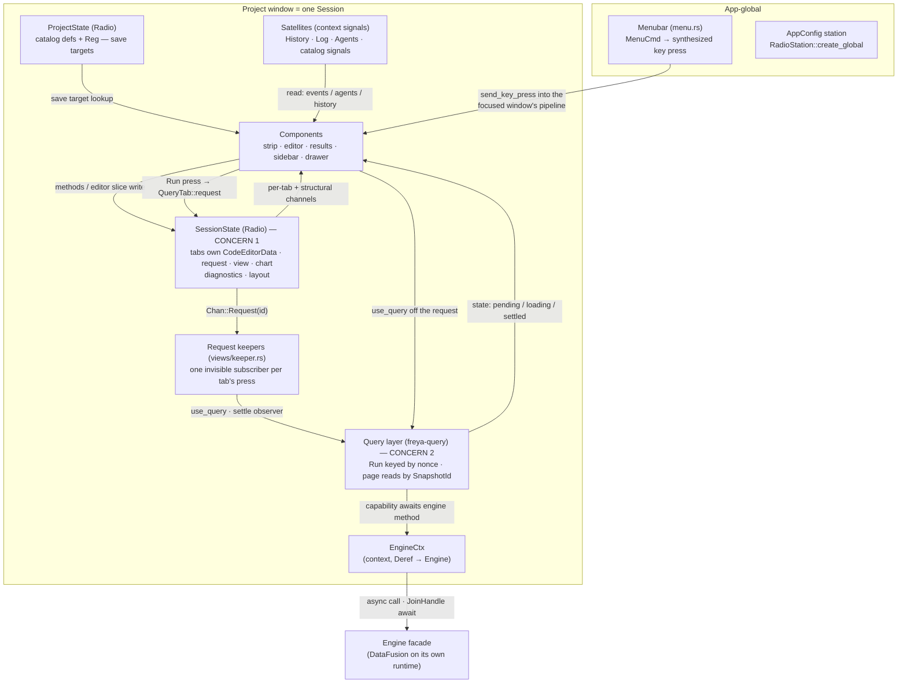

# Strata (Freya) — state architecture

The definitive reference for the Freya frontend's per-window state, as built. **Clean-slate and
Valin-shaped**: tabs are *stateful structs that own their editor and live in the store*, not
serde records with state mirrored in from elsewhere.

Every API below is verified against Freya 0.4 source (`freya-radio`, `freya-query`,
`freya-winit`) and against `marc2332/valin` (the Freya author's own code editor), which is the
reference for the stateful-tab pattern. Code blocks are as-built listings, trimmed for
readability; the named source files are the ground truth.

---

## 1. Two concerns, split at the root

The design separates **two concerns the (since removed) Dioxus app tangled together**:

1. **Tab management** — multiple tabs with independent state: new / duplicate / close /
   drag-reorder / rename / save / is-dirty. Pure client bookkeeping; the engine is never
   involved. → the **`SessionState`** store.
2. **Query of a tab's SQL** — run / plan / explain / page, dispatched to the engine. Owned by
   the **results element and the tab's request keeper** via freya-query, keyed by the press.
   → the **query layer**.

This is why it is *not* a port of the Dioxus design. There is **no `runs`-by-id store** and
**no query results on the session** — no `submitted`, no results field. The session holds each
tab's *request* (the spec of its latest Run press); the results live only in the freya-query
cache, which does the caching, dedup, and loading states.


```mermaid
flowchart TD
    subgraph APP[App-global]
        MENU["Menubar (menu.rs)<br/>MenuCmd → synthesized key press"]
        CFG["AppConfig station<br/>RadioStation::create_global"]
    end

    subgraph WIN[Project window = one Session]
        direction TB
        COMP["Components<br/>strip · editor · results · sidebar · drawer"]
        STATION["SessionState (Radio) — CONCERN 1<br/>tabs own CodeEditorData · request · view · chart<br/>diagnostics · layout"]
        PROJECT["ProjectState (Radio)<br/>catalog defs + Reg — save targets"]
        SAT["Satellites (context signals)<br/>History · Log · Agents · catalog signals"]
        KEEP["Request keepers (views/keeper.rs)<br/>one invisible subscriber per tab's press"]
        QUERY["Query layer (freya-query) — CONCERN 2<br/>Run keyed by nonce · page reads by SnapshotId"]
        GATE["EngineCtx<br/>(context, Deref → Engine)"]
    end

    ENGINE["Engine facade<br/>(DataFusion on its own runtime)"]

    %% concern 1: tab management (stateful tabs in the store)
    COMP -->|methods / editor slice write| STATION
    STATION -->|per-tab + structural channels| COMP
    PROJECT -->|save target lookup| COMP
    SAT -->|read: events / agents / history| COMP

    %% concern 2: a press writes the tab's request; subscribers drive freya-query
    COMP -->|Run press → QueryTab::request| STATION
    STATION -->|"Chan::Request(id)"| KEEP
    KEEP -->|use_query · settle observer| QUERY
    COMP -->|use_query off the request| QUERY
    QUERY -->|state: pending / loading / settled| COMP
    QUERY -->|capability awaits engine method| GATE
    GATE -->|async call · JoinHandle await| ENGINE

    %% menu seam: the same path as typed keys
    MENU -->|"send_key_press into the<br/>focused window's pipeline"| COMP
```

---

## 2. Tiers and stores

Three tiers; use the weakest that works:

- **Component-local** (`use_state`) — throwaway view state (hover, a grid's local scroll, the
  toolbar's `running` mirror).
- **Radio (per-window)** — shared reactive state with surgical per-channel updates.
- **Global** (`create_global`) — app-wide singletons. Today: the `AppConfig` store (a global
  *Radio station*, so the singleton still gets per-audience channels rather than one
  everything-repaints signal) and the menubar's `MenuState` slot (§10).

The Valin lesson: **a stateful thing that must be shared/persisted lives *in* a Radio store as
a real struct that owns its state** — you don't keep it component-local and mirror it. So the
editor buffer lives in the store, inside the tab.

| Store | Tier | Persisted | Holds |
|-------|------|-----------|-------|
| **`AppConfig`** (`state/config.rs`) | Radio (**global**, `RadioStation::create_global`) | yes (`config.prefs.json`) | the machine-global config: user `Settings`, the recent-projects list, and the set of projects with a window open. Channels = audiences (`ConfigChan::{Settings, Recents, Open}`), so opening a project doesn't wake theme readers. Created once in `main`, shared into every window root (`use_share_config`). **One** write path — `write_config` mutates, notifies, and persists; disk is a startup input, never re-read to answer a question. The persisted open-set is *taken* at startup (it is last run's ledger, not live truth) and rebuilt by each window's `use_claim_open`. |
| **`SessionState`** (`apps/project/state/session.rs`) | Radio (per-window) | yes (snapshot, §5) | the open tabs (each a `QueryTab` owning its `CodeEditorData`, request, view mode, chart encoding, diagnostics), strip order, active, the reopen stack, the panel **layout**, and a throwaway `scratch` buffer (§3) |
| **`ProjectState`** (`apps/project/state/project.rs`) | Radio (per-window) | yes (`project.json`) | catalog rows: pure defs (`TableDef`/`ViewDef`/`SavedQuery`/`SourceDef`) each carrying what registration **learned** about it (a table's `TableMeta`, a view's `ViewMeta`, absent until one lands and absent again after a refusal) — the *save targets*, plus each row's profile **request** (§6b). **Whether a def registered is not here**: that outcome is the engine's, retained by it and read as `Registrations`, and a row is the def joined with it (§6c). Identity: views/tables by **name** (their SQL identity, one shared namespace, compared case-insensitively); saved queries by stable **`id: Uuid`**; data sources by **name**, which is their identity and nothing derives it. Only the defs persist. Channels = `ProjChan`, one per catalog section. |
| **`History`** (`state/history.rs`) | context `State<History>` | yes (`.strata/history.jsonl`) | the query-history satellite (§8) |
| **`Log`** (`state/log.rs`) | context `State<Log>` | no | the window's event record (§8) |
| **`Agents`** (`state/agents.rs`) | context `State<Agents>` | no | what each connected agent is doing (§8) |
| **Catalog signals** (`state/catalog.rs`) | context `State<T>` | no | the inspected column (`CatalogSelection` — a `ColRef` whose owner is a workspace entry *or* a remote relation), the scan gate (`Catalog`), the window's view of the engine's registration ledger (`RegistrationsCtx`, §6c), the ↻ re-scan request (`CatalogRescan`), and the profile requests for relations with no catalog row (`RemoteScans`, §6b) |
| **Query layer** | freya-query | no | results / pages / plan / explain / chart / profiles — Runs keyed by a per-press nonce, snapshot reads by `(SnapshotId, …)` (see `SNAPSHOT_SPEC.md`) |
| **Engine handle** (`EngineCtx`, `contexts/engine_ctx.rs`) | context | — | the direct-call engine facade (`Arc<Engine>`, Deref) + the tab-close cleanup hook (§7) |
| **`MenuState`** (`menu.rs`) | `State::create_global` | — | the menubar's `MenuHandles` (handles, not state — §10) |

Each is a single responsibility. `SessionState` is *not* a god-object: the log, history, agents
and the project artifacts are their own stores; query results are freya-query's. Layout *is* a
`SessionState` field — it persists with the session and rides the same autosave — but it writes
on its own channels, so a panel drag never wakes a tab.

---

## 3. `SessionState` + `QueryTab` — the stateful tab

One window is one Session. The tab owns its editor exactly like Valin's `EditorTab`.

```rust
// apps/project/state/session.rs (as built)

pub struct SessionState {
    pub tabs: HashMap<TabId, QueryTab>,     // stateful tabs; each owns its buffer
    pub order: Vec<TabId>,                  // strip order (drag-reorder)
    pub active: Option<TabId>,
    pub closed: Vec<(usize, QueryTab)>,     // reopen stack — parked tab + strip index (§4)
    pub scratch: Option<CodeEditorData>,    // fallback buffer for a slice write that
                                            // lands after its tab closed (see below)
    pub layout: Layout,                     // panel arrangement + sizes (§5)
}

/// The one tab kind (concrete — no trait/enum until a second kind exists).
pub struct QueryTab {
    pub id: TabId,
    pub name: String,                 // display title (scratch: editable; bound: the artifact's)
    pub editor: CodeEditorData,       // Rope + cursor + selection + undo + is_edited()
    pub origin: Origin,               // Scratch | View(name) | SavedQuery(id) — the SAVE TARGET
    pub request: Option<QuerySpec>,   // the tab's Run trigger (§6)
    pub view: ResultsView,            // Table/Chart toggle
    pub chart: ChartConfig,           // chart encoding intent
    pub diagnostics: Vec<Diagnostic>, // the validation driver's verdict (§9)
    pub validated: Option<Stamp>,     // what that verdict describes; None = unchecked
}

/// What a tab's diagnostics describe: the buffer revision they were computed from and the
/// catalog generation they were resolved against — validation's only two inputs (§9).
pub struct Stamp { pub revision: u64, pub generation: CatalogGen }
```

`TabId` is a `Uuid` newtype (`strata_model`, `Copy, Eq, Hash, Ord`) — real identity, no
allocator, no dup-id repair. `Origin` is serde (`strata_model::Origin`): a view's key is its
**name**, a saved query's its **`Uuid`** (the name is only a label, so renames can't dangle a
tab).

**Channels** (`state/channel.rs`) — Valin's `follow_tab`, made explicit and grown one channel
per concern. Channel granularity is the leak-prevention mechanism: a keystroke must never wake
the results pane, a panel drag must never wake the shell.

```rust
pub enum Chan {
    Tabs,            // strip structure: order / active / open / close / rename
    Tab(TabId),      // one tab's fields — the editor slice writes here
    Request(TabId),  // that tab's Run trigger alone (§6)
    View(TabId),     // that tab's Table/Chart view mode
    Chart(TabId),    // that tab's chart encoding
    Diagnostics,     // every tab's verdict, one channel (all consumers are cross-tab)
    Layout,          // panel arrangement: which panels/drawer are open (shell + rail subscribe)
    LayoutSize,      // panel sizes — nobody subscribes; the shell peeks to seed initial_size
    Text,            // synthetic fan-in: any tab's buffer (the validation driver's one sub)
    Persist,         // synthetic fan-in: anything session.json stores (the autosave's one sub)
}

impl RadioChannel<SessionState> for Chan {
    fn derive_channel(self, _: &SessionState) -> Vec<Self> {
        match self {
            Chan::Tab(_) => vec![self, Chan::Persist, Chan::Text],
            Chan::Tabs | Chan::View(_) | Chan::Chart(_) | Chan::Layout | Chan::LayoutSize => {
                vec![self, Chan::Persist]
            }
            Chan::Request(_) | Chan::Diagnostics | Chan::Text | Chan::Persist => vec![self],
        }
    }
}
```

`derive_channel` is a real fan-in here, not the `vec![self]` default: nobody writes `Text` or
`Persist` directly — they are the extra channels other writes derive, so one subscriber can
watch a whole class of change without a variable subscription count. The ephemeral channels
(`Request`, `Diagnostics`) deliberately don't derive `Persist`: their state never reaches disk,
so folding them in would churn `session.json` on a Run press or a squiggle.

**The editor binds a `Writable` slice into the store** (`views/workbench/editor/tab.rs`):

```rust
let radio = use_radio::<SessionState, Chan>(Chan::Tab(id));
let editor = radio.slice_mut(Chan::Tab(id), move |s: &mut SessionState| {
    if s.tabs.contains_key(&id) {
        &mut s.tabs.get_mut(&id).unwrap().editor
    } else {
        // A commit event can fire one frame after the tab closed (nav-dropdown ×):
        // the lens is total, so that write lands in a throwaway buffer instead of panicking.
        s.scratch.get_or_insert_with(|| CodeEditorData::new(Rope::from_str(""), None))
    }
});
let editor = editor.into_writable();
```

`RadioSliceMut<SessionState, CodeEditorData, Chan>` implements `WritableUtils`, so
`.into_writable()` gives the `Writable<CodeEditorData>` the `CodeEditor` mutates in place.
Because the buffer is *in the store keyed by `TabId`*, it survives tab switches with cursor +
undo intact — no all-mounted requirement, no component-local mirror, no `sql: String` copy.
The `scratch` fallback exists because closing the active tab fires the editor's
commit-on-click-outside *after* `close_one` removed the tab; the slice must still yield
`&mut CodeEditorData`, and the moot write is discarded.

---

## 4. Operations, dirty, save, reopen

**Structural ops are methods on `SessionState`** (Valin-style — no `Action` enum), called
through a write-channel guard by commands / shortcuts / the menubar seam:

```rust
impl SessionState {
    pub fn open_blank(&mut self) -> TabId;                    // ⌘T
    pub fn open_named(&mut self, name: &str, sql: String, origin: Origin) -> TabId;
    pub fn open_or_focus(&mut self, name: &str, sql: String, origin: Origin) -> TabId;
    pub fn duplicate(&mut self, id: TabId);                   // clone into a scratch tab
    pub fn switch(&mut self, id: TabId);
    pub fn rename(&mut self, id: TabId, name: String);
    pub fn move_tab(&mut self, id: TabId, insert: usize);
    pub fn close_one(&mut self, id: TabId);                   // parks on the reopen stack
    pub fn close_all(&mut self);
    pub fn close_others(&mut self, id: TabId);
    pub fn close_right(&mut self, id: TabId);
    pub fn reopen_last(&mut self);                            // ⇧⌘T — moves a parked tab back
    pub fn bind_saved(&mut self, id: TabId, name: Option<String>, origin: Origin);
    pub fn unbind_view(&mut self, name: &str);                // a dropped view's tabs go Scratch
    pub fn unbind_saved_query(&mut self, id: Uuid);
}
// caller: radio.write_channel(Chan::Tabs).open_blank();      // structural → Chan::Tabs
//         radio.write_channel(Chan::Tab(id)).rename(id, n);  // per-tab   → Chan::Tab(id)
```

The **editor** is not a method: it writes its `Chan::Tab(id)` slice directly (§3). The
request / view / chart setters (`set_request`, `clear_request`, `set_view`, `set_chart`,
`set_diagnostics`) and the layout toggles each write on their own channel. So the store mutates
through a small set of doors, each on the channel that names its audience.

**Dirty is owned by the editor**, not stored or derived from a baseline:

```rust
pub fn is_dirty(&self) -> bool {
    !matches!(self.origin, Origin::Scratch) && self.editor.is_edited()
}
```

`CodeEditorData::is_edited()` tracks edits since load/last-save; save resets it via
`mark_as_saved()`. A tab chip's dirty dot reads this on `Chan::Tab(id)`. **Scratch tabs never
show dirty** (working buffers); only bound tabs do.

**Save (⌘S) dispatches on `origin`** and writes the *project*, not the tab:

| origin | ⌘S does |
|--------|---------|
| `Scratch` | **Save As** — create a View/SavedQuery in `ProjectState`, then `bind_saved` (set `origin`, optionally rename, reset the edited flag) |
| `View(name)` / `SavedQuery(id)` | overwrite the project artifact with the editor text, `bind_saved` resets the edited flag |

Dirty clears itself after a save (the editor is no longer "edited"), and the only session
mutation is `bind_saved`. Baselines live in the `Project` store; the session never copies them.
The inverse is `unbind_view` / `unbind_saved_query`: when a save target is dropped, the bound
tabs go `Scratch` — the buffer survives (that is what the drop confirm promises) but a ⌘S must
not silently re-create the thing the user just dropped.

**Close / reopen moves the whole `QueryTab`** — the point of a self-owned tab:

- Every close path pops the `QueryTab` out of `tabs`/`order` and pushes `(strip_index, tab)`
  onto `closed`, so `reopen_last` re-inserts at (close to) the original position.
- On the way to the stack the tab is **parked** (`park`): its `request` is cleared (a reopened
  tab starts with no results, matching the engine-side cleanup in §7's close funnel) and its
  diagnostics + stamp are dropped (a reopened tab comes back *unvalidated*, and the §9 driver
  simply picks it up — a verdict about pre-close text against a pre-close catalog must not
  travel).
- `reopen_last` restores the **full** editor state (undo, cursor, `is_edited`), not a text
  snapshot, and keeps the original `TabId` (the tab was fully removed while parked, so no
  collision).
- `closed` is capped (`CLOSED_CAP = 20`; drop oldest, freeing its `CodeEditorData`) and is
  ephemeral (never persisted).
- Auto-naming (`next_query_name` / `unique_name`) counts parked tabs too: otherwise a name
  freed by closing gets handed to a new tab, and reopening resurrects a duplicate.

---

## 5. Persistence

`SessionState` holds live `QueryTab`s whose `CodeEditorData` isn't serde, so persistence goes
through a **snapshot** (`strata_model::session`) — "the editor writes the store, a side effect
saves the store":

```rust
// strata-model/src/session.rs (as built)
#[derive(Serialize, Deserialize, Default, Clone, PartialEq)]
pub struct SessionSnapshot {
    pub tabs: Vec<TabSnapshot>,
    pub active: Option<TabId>,
    pub window: Option<WindowGeom>,   // logical position + size; None until the first save
    pub layout: Layout,               // panels/drawer open + sizes + problems scope
}

#[derive(Serialize, Deserialize, Clone, PartialEq)]
pub struct TabSnapshot {
    pub id: TabId,
    pub name: String,
    pub origin: Origin,
    pub text: String,          // rope.to_string(), rebuilt into a fresh buffer on load
    pub view: ResultsView,     // Table/Chart intent
    pub chart: ChartConfig,    // encoding intent — column references, resolved at read time
}
```

- **Autosave** (`hooks::use_autosave`) is one debounced `use_side_effect` in the window
  root subscribed to **`Chan::Persist`** — the synthetic fan-in every persist-relevant write
  derives (§3). It builds `SessionState::snapshot()` (walking strip order), fills `window` from
  `Platform` (geometry is not session state — the hook reads it at write time), and writes
  `.strata/session.json` through the persist funnel (`persist.rs::persisted_session`), which
  reports a failed write as an event row instead of a terminal-only trace.
- **Load** (`hooks::use_init_session` off what `open_project` restored) rebuilds each tab with
  `QueryTab::restored(snap)` — same `TabId`, buffer re-parsed and marked saved, view + chart
  intent restored, diagnostics **not** restored (the tab comes back unvalidated) — and provides
  the assembled `SessionState` as the station's initial value. `active` is validated only for
  "does it still exist" (fallback: first tab); an empty snapshot restores nothing and the
  caller opens one blank tab.
- `closed`, the log, the agents satellite and every `request` are never persisted.
- The snapshot is deliberately **minimal**: cursor offset / scroll / undo are not persisted —
  a restored tab is a freshly loaded artifact, not a resumed editing session.

---

## 6. Concern 2 — query execution (freya-query over result snapshots)

> The full design is **`docs/SNAPSHOT_SPEC.md`** — this section is its summary and matches it.

Running a tab's SQL — **run / explain / page** — is owned by the query layer
(`apps/project/query/`) via freya-query. A **Run executes once** and materializes an immutable
on-disk **snapshot** (the `__snap_*` mechanism), answering with a handle (`SnapshotId` + schema
+ total, riding in `QueryOutput`) plus page 1. Every later read — page, sort, chart, export —
targets *that snapshot*. Raw-SQL identity is **never** a cache key (same SQL ≠ same data); the
sound keys are a per-press nonce for the Run and the snapshot id for reads:

```rust
// apps/project/query/run_query.rs — both capabilities carry Captured<EngineCtx>
// (invisible to cache identity: PartialEq always-true, Hash no-op).

pub struct QuerySpec {              // one Run press
    pub tab: TabId,
    pub run: RunId,                 // fresh nonce per press — the cache identity
    pub sql: String,                // editor text at press time
    pub mode: QueryMode,            // Run | Explain { analyze }
    pub page_size: usize,
}
pub enum QueryOutcome {
    Rows(RunRows),                  // QueryOutput + the page-1 batch + the stamp it rendered under
    Plan(QueryPlan),                // Explain — no snapshot
    Statement(StatementReport),     // an intercepted statement — no rows, no handle
}
RunQuery : QueryCapability<Keys = QuerySpec, Ok = QueryOutcome, Err = EngineError>
// EngineError is Clone, so the cache retains it and a settled Err is still asked by variant
// (EngineError::Stopped) rather than by its wording
// dispatches Workspace::run — the statement router decides Rows vs Statement

pub struct PageSpec {
    pub snapshot: SnapshotId,
    pub query: PageQuery,           // page, page_size, sort
    pub display: DisplayStamp,      // the datafusion.format.* subset the cells render through
}
FetchSnapshotPage : QueryCapability<Keys = PageSpec, Ok = SnapshotPage, Err = EngineError>
```

**The `Query` is built in one place per capability** — `QuerySpec::query(engine)` and
`PageSpec::query(engine, enabled)`. A `Query`'s settings are part of its cache identity, so a
second call site constructing them by hand risks a silently different entry, i.e. a duplicate
execution. Both set `stale_time(Duration::MAX)`: freya-query re-runs *stale* entries on
resubscribe, and for an *action* that would be a silent re-execution. `clean_time` stays at
the default — a superseded press's entry ages out after its last subscriber unmounts.

**The Run trigger is per-tab session state**: each `QueryTab` owns its latest run request
(`QueryTab::request: Option<QuerySpec>`), read/written on its **own channel**
(`Chan::Request(id)`), so a press wakes only that tab's results pane, toolbar and keeper — and
keystrokes (on `Chan::Tab(id)`) never wake the results. Scoping the trigger to the tab is what
keeps one tab's press or cancel from ever disturbing another tab's results. It is deliberately
not a workbench-local slot (built first — a press or cancel in one tab wiped every other tab's
results) and not a root-provided `HashMap<TabId, QuerySpec>` (rejected twice: a runs-store by
another name, and one shared value leaking every tab's press into every consumer). The store
holds each tab's own spec exactly where the tab's buffer already lives — specs, never rows.

1. **Run** (⌘↵): snapshot the editor text →
   `session.write_channel(Chan::Request(id)).set_request(id, QuerySpec { tab: id, run: RunId::new(), sql, mode, page_size })`.
2. The results body and the tab's **request keeper** both subscribe via `spec.query(engine)`.
   Per-tab results on tab switch come from the cache being keyed by the tab's own spec;
   `Results` for tab *n* reads `session.request(n)` and mounts the body when it's `Some`.
3. **Editing doesn't re-run** — it mutates the editor, never `request`. Only Run rebuilds it
   (new nonce → new execution → new snapshot; the old one is retired, spec §4).
4. **Paging / sort**: the grid drives `use_query(FetchSnapshotPage)` with
   `PageSpec { snapshot: handle, … }` — a new key fetches, a revisited key is cache-served with
   zero engine traffic (sound because the snapshot is immutable). Explain is the same Run
   pattern with `mode: Explain`. The chart read is `FetchChart` (`query/chart.rs`), keyed by
   `ChartSpec { snapshot, query, display }` — the display-config subset is part of the key
   because axis labels render through `datafusion.format.*` (see `CHART_SPEC.md` §5), exactly as
   it is on `PageSpec`. Page 1 rides the Run entry, which is nonce-keyed and so cannot re-key on
   a format change: the pane compares `RunRows::display` against the app's current stamp and
   reads page 1 through `PageSpec` when they differ (`SNAPSHOT_SPEC.md` §6).
5. **Loading / cancel**: the body reads `query.read().state()`
   (`Pending | Loading{res} | Settled{res}`); cancel is `engine.cancel(tab.into(), run.into())`
   plus `clear_request(tab)` on `Chan::Request(tab)`. A settled `Err` renders the results
   pane's error body; a settled `Statement` renders the report's sentence and its
   `StoreEffect` is folded by the keeper (`state/statement.rs`).
6. **Invalidation**: none for results — a Run result is point-in-time; DDL / reload does *not*
   retire it (spec §4). The **catalog is not a query at all** — see the note below.

**Request keepers** (`views/keeper.rs`) are what make cache-entry lifetime track request
*currency* rather than tab visibility. The results pane mounts only for the active tab, so on
its own a backgrounded tab's press would lose its last subscriber and be cleaned — and a
revisit would silently re-execute the press. `RequestKeepers`, mounted once in `ProjectRoot`,
renders one invisible subscriber per open tab's current request (subscribing the tab set on
`Chan::Tabs`; each keeper tracks its own tab on `Chan::Request(id)`). While a press is some
tab's `request`, its entry is held live; superseded / cancelled / tab closed, the pin unmounts
and the entry ages out on freya-query's own clean time. No imperative cache management —
lifetime *is* mount. The keeper's pin is also the app's **settle observer**: history (§8), the
run's log entry (§9) and a statement's `StoreEffect` fold all land there, at the run's real
completion time, even for a backgrounded tab.

**Run→Cancel**: the toolbar's Run control flips to Cancel while the press is in
flight — but it can't derive that from `request` (which stays `Some` after settle, keeping the
grid mounted), and it doesn't subscribe the run's `use_query` either: `enabled` is part of
`Query`'s cache identity, so `.enable(false)` reads a *different*, never-running entry — there
is no "watch without running" subscription to make. So the workbench holds a component-local
`running: State<Option<RunId>>`, threaded as props; the query's subscriber mirrors the
lifecycle into it with a `use_side_effect` (the press's nonce while in flight, `None` on
settle) plus a nonce-guarded `use_drop` (a stale body's unmount can't clobber a newer press's
flag). One resolver beats every consumer knowing about queries. (A second enabled subscriber
would *not* double-execute: our freya-query fork counts in-flight executions behind a
`RunningGuard` and a mounting subscriber attaches instead of dispatching —
`freya-query/tests/query_inflight_dedup.rs` — which is also what keeps a results body that
unmounts and remounts mid-run from re-executing the press. The mirror stays for the
`enabled`-identity reason, not because a second subscriber is dangerous.)

> **The catalog is a store, not server data.** Earlier drafts of this document
> described a `FetchCatalog` freya-query capability invalidated by the DDL mutations. That was
> never built and must not be: the catalog is the project file's **defs** plus what registration
> learned (`ProjectState`, §2), never an introspection query against DataFusion. Asking the engine
> would be wrong three ways — a def whose registration *failed* has no engine presence yet is
> exactly the row the catalog must keep showing (the catalog validity badge);
> `datafusion.catalog.information_schema` is a user-facing Settings key the user may turn off; and
> saved queries aren't a DataFusion concept. `ProjectState` is also the ⌘S save-target store, so a
> cached second copy would be two sources of truth. (Two of the four grounds originally listed
> moved with the provider layer, and neither weakens the rule: result snapshots no longer "would appear" —
> `engine::providers` filters `__snap_*` out of every enumeration — and `information_schema` now
> defaults **on** rather than off. The refused-def ground is the one introspection can never
> answer, and it is the one that settles it — though *whether* a def was refused is the engine's
> own record now (§6c); what introspection could never produce is the **row**, which is the def.)
> DDL mutations therefore call the engine and then the store's own methods
> (`upsert_view` / `remove_table` / …) on the matching `ProjChan`, and subscribers re-render —
> nothing refetches. A typed statement's effect arrives the same way, as a `StoreEffect` the
> keeper folds (`state/statement.rs`). Functions **are** a snapshot the engine hands over
> (`Lang::functions`).

### 6b. Catalog **profiling** — the same shape, one tier down

A profile is a property of the *data*, not of a tab, and it is the most expensive thing the app
does. It follows the Run's division exactly:

```rust
// apps/project/query/profile.rs
ScanId       // a nonce, fresh per request (a first profile, or a ↻ re-scan)
ProfileTarget  Workspace { kind, name } | Remote { kind, relation: RemoteRef }   // where it is
ProfileSpec  { target: ProfileTarget, scan: ScanId }
ProfileEntry : QueryCapability<Keys = ProfileSpec, Ok = CatalogProfile, Err = EngineError>
use_profile(engine, &target, scan) -> UseQuery<ProfileEntry>   // the ONE place the Query is built
```

- **The store holds the request, never the numbers.** `TableRow::profile` / `ViewRow::profile`
  are `Option<ScanId>`; the facts live only in the cache entry that id keys. So invalidation is
  a `None` — `table_registered` / `table_failed` drop the table's and every reader view's,
  `view_registered` / `view_failed` drop the view's own.
- **A relation inside a database source's catalog has no row, so the *window* holds its
  request** (DB-07): `state/catalog.rs`'s `RemoteScans`, a `BTreeMap<RemoteRef, ScanId>` on a
  context `State`. The rule generalizes rather than being excepted — whoever owns the surface
  holds the request — and nothing is minted into the store for it. Invalidation is a
  reconciliation: entries whose source the engine no longer answers `Ready` for are dropped, which covers a
  Forget and a whole-catalog ↻ without either being noticed specially. `ProfileTarget` is what
  says which storage backs a given ask, and every `ProfileActions` method takes one.
- **`stale_time(MAX)` + `clean_time(MAX)`.** A settled scan must never re-execute itself, and
  the five-minute default clean time would silently re-scan on the next mount. "Cached until the
  entry changes" is what the cost confirm promises, so the entry retires only when its request
  does.
- **Both consumers subscribe through `use_profile`** — the inspector's zone and the catalog
  row's spinner — because the whole `Query` (stale/clean times included) is the cache identity:
  two spellings would be two entries, i.e. one table scanned twice. They mount their
  subscription only when a request exists, so nothing dispatches a scan nobody asked for.
- Engine side: `Catalog::profile` / `cancel_profile`, tracked per entry in
  `Lifecycle::profiles`, superseded by dispatch, aborted by `register` / `create_view` /
  `drop_view` / `deregister`, and counted by the **window**-close confirm but not the per-tab
  `is_running` probe.

### 6c. Registration outcomes — the engine's record, rendered here

Whether a def registered is not this window's to decide, so it is not this window's to store. The
engine retains what it answered for each def (`RegStatus::{Ready, Failed { reason }}`, stamped
with the `CatalogGen` it was answered at) and hands it over as one value,
`Catalog::registrations()`. A catalog row is the **join**: the def from `ProjectState`, the
verdict from that read.

- **One read, held once.** `RegistrationsCtx` (`state/catalog.rs`) is a context `State` carrying
  the engine's whole answer, so a walk over the rows costs no engine call and every row on screen
  describes the same instant. It is taken again exactly where the engine has just answered: the
  registration pass's fold, per outcome (`settle_reg`), so rows settle one at a time as they did
  when the status lived on them; the statement fold (`catalog_settled`, beside adopting the
  generation); and the scan claim's release, which covers a pass that was cancelled part-way.
- **Absence is the unanswered state.** A def no pass has reached has no entry — there is no
  engine-side `Pending`, because "not yet" is a fact about the pass rather than about the def.
  What the user sees while waiting is the scan claim's own affordance (the row's held verdict and
  the spinner's hold-back, `sidebar/catalog/row.rs`), never a status the app wrote.
- **A gesture waits on its own answer.** Configure's Save and the data source editor's Save record
  the generation they asked at and wait for an entry stamped past it
  (`Answers::answered_since`). An edited def still carries `Ready` from the pass before, so a
  status read alone would close the window over a registration that had not happened.
- **The same record, two reads.** A data source's verdict also rides the sources snapshot
  (`SourceListing::status`), which is what a reader with no window holds — the engine's own
  `catalog_names`, and the agent's `list_tables`.

---

## 7. The engine handle (`EngineCtx`) — a direct-call facade

The engine (`strata_engine::Engine`) is a **direct-call async facade**, not a protocol:
it owns a private multi-thread Tokio runtime (DataFusion's operators require a Tokio context,
and query CPU must never run on the render thread), spawns each call onto it, and the caller
awaits the `JoinHandle` — executor-agnostic, so Freya's non-Tokio executor awaits engine calls
like any async fn. This is exactly the shape a freya-query capability expects. There is **no**
event stream, no request ids, no router object — the Dioxus-era `Command`/`Event` protocol was
retired and removed with the Dioxus app.

```rust
// strata-engine — the facade, reached through six borrowed GROUP HANDLES naming what the
// call is about (lifecycle bookkeeping lives HERE, framework-free, unit-tested):
engine.ws(ws)          // run(tag, sql, page_size) -> RunOutcome  — the statement router
                       // query(tag, sql, page_size) · explain(tag, sql)
                       // cancel(tag) -> Option<elapsed_ms> · cleanup() · is_running()
engine.snapshot(id)    // page(page, page_size, sort) · chart(q) · trend(x, y)
                       // export(spec) · export_to(path, format) · pin() -> SnapshotPin · live()
engine.catalog()       // register · deregister · table_meta · create_view · drop_view
                       // drop_table · is_internal · profile(name) · cancel_profile
engine.sources()       // connect · disconnect · listing · show_schemas · database_syms · …
engine.lang()          // analyze(sql) -> Vec<Diagnostic> (the §9 dry-plan) · bundle() · …
engine.work()          // flag() -> Arc<AtomicBool> (T2) · background()
// Root: builder() · id() · set_data_dir() · set_config() -> ConfigOutcome · restart_owed()
//       · overrides() · formats() · Drop

// apps/project/contexts/engine_ctx.rs — the thin per-window wrapper:
#[derive(Clone)]
pub struct EngineCtx { eng: Arc<Engine> }   // Deref → Engine
impl From<TabId> for WsId { … }             // the tab IS the workspace (Uuid → u128)
impl EngineCtx {
    pub fn new(overrides: BTreeMap<String, String>) -> Self;  // launch config (W2)
    pub fn captured(&self) -> Captured<EngineCtx>;   // capability field, cache-invisible
    pub fn cleanup(&self, tab: TabId);               // → engine.ws(tab.into()).cleanup()
    pub fn arc(&self) -> Arc<Engine>;                // for off-render-thread holders (agent server)
}
// Nothing else: every engine method takes `&self` and the group handles borrow, so
// `snapshot(id).pin()`, `.export()`, `.chart()` and `.trend()` are reached through `Deref`
// rather than forwarded.
```

Tab-close cleanup is one funnel in the window root — a `use_side_effect` diffs the session's
open tab set (subscribed on `Chan::Tabs`) and calls `cleanup` for tabs that disappeared, so
every close path is covered without touching any of them. Errors reach the UI as each query's
own `Err` state (freya-query `Settled`), not through an event side-channel. Keeping a running
engine in step with Settings ▸ Engine is `state/engine_config.rs` (`use_engine_config` +
`EngineRestart`): a live change is `set_config`; a runtime key is a restart, which is a bump of
`ProjectRoot`'s render key through the one T2 confirm — never a second path that re-points a
live store.

---

## 8. Log, agents & history satellites

All small context signals, not Radio stations: one small value each, one append wakes exactly
one reader. (Panel **layout** is not among them — it is a `SessionState` field on
`Chan::Layout` / `Chan::LayoutSize`, §3.)

- **`LogCtx = State<Log>`** (`state/log.rs`) — the window's event record, behind the
  drawer's Events tab: a capped `VecDeque<LogEvent>`, newest-first, each entry a **level**
  (`Ok` / `Info` / `Warning` / `Error` — the sheet's four semantic slots) + a message + a local
  `HH:MM:SS`. Ephemeral, never persisted. Stood up by `use_init_log()` in `ProjectRoot`
  *before* `use_init_project`, whose open is its first entry.

  **Appended by whichever layer observed the fact**, and there is deliberately **no producer
  hook** — the exact opposite of the diagnostics driver (§9) and for the opposite reason: a
  diagnostic is a pure function of two live inputs, so a reconciliation can re-derive it; an
  event can be re-derived from nothing. So the catalog scan records what the engine answered
  per def (`state/hooks.rs`), Save and the drop confirm record their own mutations, `cancel_run`
  records a cancel (the `Err("cancelled")` settle lands unsubscribed — the trigger is cleared in
  the same pass), a tab's request keeper records a run's outcome (`use_run_logging`), and an
  intercepted statement's entry is recorded by the fold that applies its effect
  (`state/statement.rs` — only the fold knows whether the def was actually written). Adding a
  surface means capturing the `LogCtx` at render time and calling `log_event`.

- **`AgentsCtx = State<Agents>`** (`state/agents.rs`, AA-03b) — which agents are working in this
  project: per connected agent, its query sessions, and per session a capped newest-first trail
  of runs — a sequence number and an outcome each, and **not** the SQL, which the removed pane
  was the only reader of. Ephemeral, never persisted, and capped both ways (runs per session,
  sessions per agent). **Nothing renders it**: it is the window's bookkeeping alone — the
  ownership check, the session cap, the teardown a retraction owes, and the close confirm's
  "whose work is this".

  It is a satellite for the same reason the log is, plus one of its own: an agent owns **no
  tabs**, so there is nothing of it in `SessionSnapshot` to exclude and reopening a project
  cannot restore work the user never asked for. It is also deliberately kept out of
  `history.jsonl`, which is capped and deduped before the cap — exploratory agent queries would
  evict runs the user actually made. History records what *the user* ran, and a promoted agent
  query, run by a press, enters it the ordinary way.

  **Appended by its observer**, like the log: the window's agent driver (`state/agent.rs`,
  `use_agent_bridge`) took the ask that opened the session and the notice that settled the run,
  so the driver is what appends. A settle is matched on the sequence number the dispatch minted
  rather than on "the newest run", because an agent that presses on before a slow query
  finishes would otherwise have the older outcome stamped onto the newer row.

  **No `origin` field on log or agent rows.** The level is real — it is the dot. An origin is
  not: every message already names its subject, so a structured copy is a second copy that can
  disagree with the sentence beside it. Add it with the filter (or toast host) that needs it.
  The log does **not** feed Problems: Problems is the SQL-validation surface (§9), and a log is
  the opposite of a live fact.

- **`HistoryCtx = State<History>`** (`state/history.rs`) — the per-window query-history
  satellite, persisted to `.strata/history.jsonl` (gitignored). Never a store field. A list of
  **queries, not presses**: re-running moves the entry up, keyed by `collapse_sql`, deduped
  before the cap. Only successful runs — rows *or* an intercepted statement; recorded by the
  request keeper (`use_history_recording`), deduped by `RunId`. Clear unwrites the file and
  keeps the `seen` guard.

`state/catalog.rs` holds the remaining context signals: `CatalogSelection` (the inspected
column — a transient "what am I looking at" pointer that must not wake catalog subscribers),
the `Catalog` scan gate (§9), and `CatalogRescan` (the sidebar ↻'s request for the window
root's scan driver).

---

## 9. Errors — logged always, some also shown in context

Almost every engine error originates from **registration** (project load, or the
configure/data-source window) or **query execution**. Every one is appended to the log (§8) —
the complete record — and the request-correlated ones are *also* surfaced where they
originated, so the user sees them in place. Both happen; not either/or.

| Origin | In the log | Also shown inline |
|--------|-----------|-------------------|
| Query execution | yes — recorded by the tab's **request keeper** when the press settles (`use_run_logging`), which is mounted for the press's whole life, so a backgrounded tab's failure is recorded too | that tab's **results pane**, from `RunQuery::Err` — banner, code frame, caret, hint; auto-clears on re-run. **Not Problems**: a failure belongs to a run, not to the text, and the only ways to put it in a cross-tab view are a copy on the store that outlives the run it describes, or one freya-query subscription per tab in the drawer *and* in the rail badge |
| A **cancel** | yes — recorded by `cancel_run`, at the cancel, because clearing the tab's trigger unmounts the keeper in the same pass and the `Err("cancelled")` settle lands unsubscribed. `Workspace::cancel` returns the elapsed time iff it really aborted something, so a cancel that hit nothing records nothing | nothing: the body simply returns to its empty state. A cancel is a `Warning` in the log and is never a problem |
| An intercepted **statement** | yes — by the fold that applied its `StoreEffect` (`state/statement.rs`), because only the fold knows whether the def reached `project.json` | the results pane renders the report's sentence; a failed row says so in its own words |
| Registration via configure form | yes | the form's submit error; the answer lands on the row via `ProjectState::table_registered` / `table_failed` (§6's catalog note — no cache to invalidate) |
| Registration at load, at a ↻ re-scan, or at a row Refresh | yes — one event per def per pass, on either arm (`state/hooks.rs`); no synthesized "N tables re-scanned" summary, which would re-derive facts already in the list | a per-source marker on the sidebar catalog item |

SQL validation is the exception — derived per tab from the editor text and the catalog, and not
logged. It is an **engine dry-plan** (`Lang::analyze`), not a client-side memo:
lexical lints + statement policy + parse/resolve/analyze against the live session, never
executing. Purely advisory — Run is never gated on it.

**One driver, for every tab** (`state/diagnostics.rs::use_diagnostics`, mounted once in the
window root). Each tab carries `validated: Option<Stamp>` — the buffer revision its diagnostics
were computed from and the catalog generation they were resolved against — so
`SessionState::stale_tabs` is the whole work list and there is no set of entry points to keep
true: a tab restored at project open, reopened, opened from a saved query or a view,
duplicated, edited, or left behind by a pass a tab switch cancelled are all "the stamp does not
match". `Some(_)` with an empty vec is the only honest way to say **clean**; `None` means
**unchecked** — reading an empty vec as clean is exactly why Problems could once speak for the
active tab only. A settled pass writes squiggle decorations into the tab's own
`CodeEditorData` (on `Chan::Tab(id)`, silenced when unchanged) and its rows + stamp on
`Chan::Diagnostics`.

Three fixed subscriptions make that one hook rather than a component per tab: `Chan::Text` (the
synthetic fan-in every `Chan::Tab(_)` write derives, so one subscription watches any tab's
buffer), `Chan::Tabs`, and the catalog. The catalog is a **gate**, not just an input: a pass
applies row by row, so while a scan is in flight nothing validates and no verdict about a
half-applied catalog is ever produced. Releasing onto a catalog generation the engine has moved is
what re-derives every tab against the catalog the pass just built — how a problem fixed in Table
Config clears without the user opening the tab. The number is the **engine's**
(`catalog().generation()`), adopted rather than counted here, so a pass that changed nothing
re-derives nothing and a change made by a typed statement stales tabs exactly as a scan does. The drain is serial (the engine has two workers
and the user's own press comes first), debounced on the active tab, and holds a further beat
before *introducing* new problems mid-typing.

Problems is therefore `SessionState::problem_groups()` — every **validated** tab with something
to report, in strip order; the drawer's header tally and the rail badge are both
`SessionState::error_count()`, from one function, so they cannot disagree.

---

## 10. The menubar seam

The one context-less boundary. In `freya-winit`, `MenuEvent::set_event_handler` is app-global
and its handler runs with a `RendererContext`, **not** a component scope — it can't
`consume_context`. Keyboard events, by contrast, route per-window through each window's tree,
so hotkeys are handled in-tree with full context.

The as-built seam (`crates/strata-freya/src/menu.rs`) is therefore **the keyboard pipeline
itself** — there is no switchboard, no per-window inbox, no `MenuCommand` channel:

- **`MenuCmd`** is the typed item vocabulary (Quit, OpenSettings, OpenProject, CloseProject,
  NewQuery, SaveQuery, CycleWindow, and the Edit set), round-tripped through stable muda
  `MenuId` strings so dispatch is an exhaustive `match`, not string comparison.
- **`handle_menu_event`** (registered at launch) routes two items through the window-close
  veto directly — Quit (every window) and Close Project (the focused window) — and, for
  everything else, **synthesizes the command's live effective chord into the focused window's
  keyboard pipeline** (`NativeEventExt::send_key_press`). Menu clicks and accelerator presses
  flow through the exact same path as typed keys; the focused element (SQL editor, find
  input, …) and the window's `keymap::on_command` listeners decide. First-responder semantics,
  without Cocoa — muda's predefined Edit items send Cocoa selectors a Skia view never receives.
  Recent-project items carry a path in their id and open directly from the handler.
- **`MenuState = State<Option<MenuHandles>>`**, created once in `main` by
  `create_global_menu()`; Freya's `resumed` calls `app_menu(chords)` to build the menubar and
  fill the slot. `MenuHandles` keeps every mutable item so the menus can follow the app:
  the recents submenu, the Close Project pair (removed, not greyed, when no project is
  focused), and every accelerator.
- **Scoping is `MenuScope` → `Gate`**: each window root names what it is
  (`Project(OpenCtx)` / `Launcher` / `Panel`) through `use_register_window`, which calls
  **`use_file_menu(app, scope)`** — so a new window kind cannot ship without saying what its
  menubar is. The gate is four independent flags (workspace / project / workbench / cyclable),
  not a rank: an item that reaches its window through the pipeline is live only where that
  window has a listener for it, and where the listener is differs per item. Focus is the gate:
  exactly one window drives the menubar at a time, and a window that isn't focused never
  fights the one that is.
- **Accelerators are state, not decoration**: they derive from the keymap
  (`effective_chord`), are kept in step with settings by `MenuHandles::sync_chords` (a stale
  accelerator means the OS keeps *consuming* the old chord before the window sees it), and are
  taken off entirely during a chord capture (`suspend_accelerators` — the Settings ▸ Keymap
  capture would otherwise trigger the item instead of binding the key; whoever suspends owns
  putting it back, including on losing focus).

Only a synthesized key press crosses the boundary; all state stays per-window.

---

## 11. Module layout

```
crates/strata-freya/src/
  menu.rs             the menubar seam (§10): MenuCmd · MenuHandles · MenuScope · use_file_menu
  state/
    config.rs         app-global AppConfig station (settings · recents · open-project set)
    theme_preview.rs  the uncommitted-theme slot (Settings preview)
  apps/project/
    state/
      mod.rs          typed re-exports
      session.rs      SessionState + QueryTab + Stamp + ProblemGroup (layout is a field here)
      channel.rs      Chan (10 variants) + the derive_channel fan-ins (§3)
      project.rs      ProjectState + ProjChan + the def rows — THE catalog (§6's note)
      catalog.rs      context signals: CatalogSelection · Catalog (scan gate) ·
                      RegistrationsCtx (the engine's ledger, §6c) · CatalogRescan
      diagnostics.rs  use_diagnostics — the one validation driver (§9)
      history.rs      the query-history satellite (.strata/history.jsonl, §8)
      log.rs          the event-log satellite + use_run_logging (§8)
      agents.rs       the agents satellite (AA-03b, §8)
      agent.rs        use_agent_bridge — the window's agent ask/notice driver
      statement.rs    use_statement_settle — folds an intercepted statement's StoreEffect
      persist.rs      the .strata write-failure funnel (persisted / persisted_defs / persisted_session)
      engine_config.rs use_engine_config + EngineRestart — Settings ▸ Engine driver (§7)
      hooks.rs        use_init_session / use_init_project / use_init_history / use_autosave
    query/
      run_query.rs    RunQuery + QuerySpec · FetchSnapshotPage + PageSpec (§6)
      profile.rs      ProfileEntry + ProfileSpec + ProfileTarget + use_profile (§6b)
      relation.rs     RemoteColumns + ColumnsSpec + use_remote_columns — a remote relation's
                      columns, the one read under a database source that is not free
      chart.rs        FetchChart + ChartSpec (§6 step 4)
    contexts/
      engine_ctx.rs   EngineCtx — Arc<Engine> (Deref) + captured() + cleanup(tab); TabId→WsId
    views/
      keeper.rs       RequestKeepers — per-tab run subscribers + the settle observer (§6)
```

> There is no `query/catalog.rs`: the catalog is `state/project.rs`, not a capability (§6).
> `strata_model::session` carries the serde vocabulary (§5): `TabId`, `Origin`, `ResultsView`,
> `SessionSnapshot`, `TabSnapshot`, `Layout`, `WindowGeom`.
