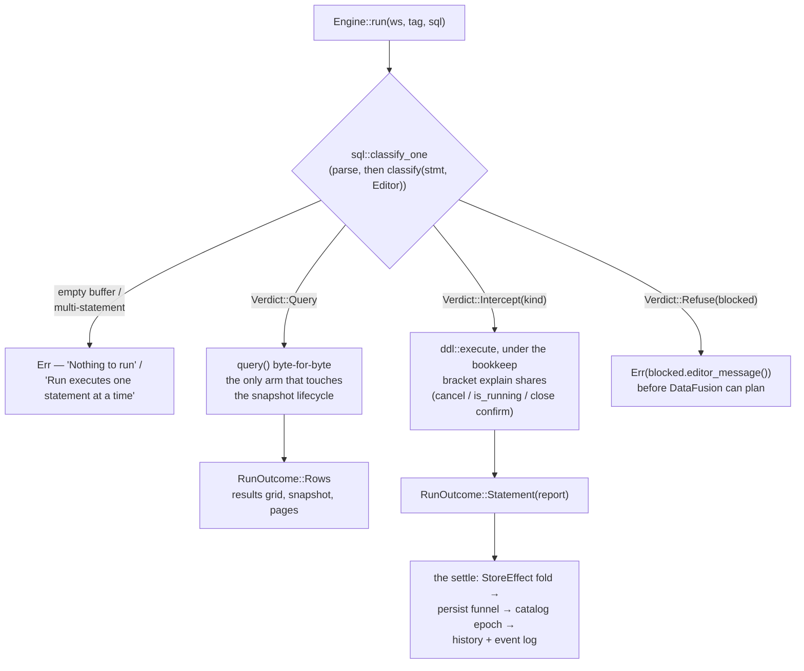

# SQL statements — how the editor runs, intercepts and refuses them

The editor is a **full-statement surface**: one classification in front of dispatch decides, per
parsed statement, whether Run executes a query, performs the statement as an engine method, or
refuses it with the same words the squiggle showed. The agent surface asks the same classifier and
stays read-only. This file documents that surface as built — the router, the dispatch, the
provider layer, and the one statement family implemented so far (internal tables). The remaining
statement lift (INSERT, DROP, typed view DDL, COPY, session statements, functions, typed
`CREATE EXTERNAL TABLE`) is tracked in `.claude/tasks/workstream-editor-statements/`.



## 1. The shape of a Run

`sql::classify_one` (`engine/sql/validate.rs`) parses the buffer with the engine's own dialect and
takes exactly one statement from it — an empty buffer is `Nothing to run`, a multi-statement
buffer is `Run executes one statement at a time`. The statement then classifies
(`classify(stmt, Capability::Editor)`) into one of three verdicts, and `Engine::run` spends the
verdict (§2).

**What classifies `Query`** — the snapshot pipeline, unchanged: `SELECT`, `EXPLAIN` /
`EXPLAIN ANALYZE`, `DESCRIBE`, and every `SHOW` form (`TABLES`, `COLUMNS`, `FUNCTIONS`,
`VARIABLES`, `DATABASES`, `SCHEMAS`). `EXECUTE` also classifies `Query` — it returns rows — but
cannot run yet: the read path pins `with_allow_statements(false)`, so it fails with DataFusion's
wording until the session-statements task lifts it per-dispatch.

Everything else is either **intercepted** (an engine-method implementation whose outcome the store
folds — §6) or **refused** (the short list in §4).

## 2. Dispatch and outcomes

`Engine::run` (`engine/mod.rs`) routes; nothing else does:

- **`Query`** delegates to `query()` **byte-for-byte** — same supersede, same retire-on-dispatch,
  same pins. It is the only arm that touches the snapshot lifecycle, which is what keeps "DDL does
  not retire snapshots" true by construction rather than by care.
- **`Intercept(kind)`** goes to `engine/ddl/`'s `execute`, bracketed by `Engine::bookkeep` — the
  same in-flight lifecycle `explain` uses — so `cancel`, `is_running` and the close-while-running
  confirm see an intercepted statement like any other work. A CTAS is a full scan; a window
  closing over one has to ask.
- **`Refuse(blocked)`** returns `Err(blocked.editor_message())` before DataFusion can plan — the
  run fails in the results pane with the words the squiggle showed.

A statement's outcome is a **value the app folds**, never something to read back out of
DataFusion:

```rust
pub enum RunOutcome {
    Rows(QueryOutput, RecordBatch),   // exactly query()'s result
    Statement(StatementReport),       // no snapshot
}

pub struct StatementReport {
    pub kind: StmtKind,               // labels come off StmtKind::label — one spelling
    pub message: String,              // the sentence the user reads, IDE register
    pub count: Option<u64>,           // rows moved; None is "not applicable", not zero
    pub elapsed_ms: u128,
    pub effect: Option<StoreEffect>,  // what the app folds; None where nothing catalog-held changed
}
```

`StoreEffect` (`engine/ddl/mod.rs`) is the catalog mutation the statement leaves behind:
`TableUpserted { def, meta }`, `TableRemoved { name, dependents }`, `ViewUpserted`, `ViewRemoved`,
`RescanTable`, `FunctionsChanged`. An effect carries the def *and* what registration learned, so
the sidebar row lands `Reg::Ready` directly.

**The settle** (`apps/project/state/statement.rs`) is one fold for every effect, driven from the
tab's request keeper so a statement run in a background tab still lands: store upsert on the
matching `ProjChan` → `persisted_defs` writes `project.json` through the persist funnel →
`catalog_settled` bumps the epoch (every tab's diagnostics re-derive) → the event log. The log
entry is recorded by the fold, not by the run-logging hook, because only the fold knows whether
the def actually reached disk — a success row logged over a failed write would promise a table the
next open loses.

The **results pane** renders a statement as a status row — icon, the kind's label, the engine's
sentence — without disturbing the tab's last result grid. **History** records a successful
statement like any successful run: a typed `CREATE TABLE` is a query the user may want back; its
`count` is the rows it moved, and the dedupe and cap are unchanged.

## 3. Why interception, not providers

DataFusion 54's provider traits are resolution and enumeration interfaces, not lifecycle ones.
`SchemaProvider::register_table` is **sync** and carries **no caller identity**: by the time DF's
own CTAS calls it the whole result is already in RAM as a `MemTable`, so no provider can spool a
result to disk — and routine internals deregister constantly (every re-scan, snapshot retirement,
DF's own `CREATE OR REPLACE VIEW`), so a provider that deleted files on deregister would delete
user data on a sidebar refresh. DDL also executes **eagerly** inside `ctx.sql`, so anything that
must not run has to be refused before planning; and provider-accreted state would have to be read
back out of DataFusion — the `FetchCatalog` refetch the catalog invariant forbids — where an
interception returns the outcome as a value one fold applies. So lifecycle is intercepted in front
of `ctx.sql`, and the providers keep the two jobs the traits can carry: identity and visibility
(§5). Settled — do not re-litigate.

## 4. The router

`classify(stmt: &DFStatement, cap: Capability) -> Verdict` (`engine/sql/validate.rs`) is the whole
statement policy:

```rust
pub enum Capability { Editor, Agent }

pub enum Verdict {
    Query,                  // the snapshot pipeline, unchanged
    Intercept(StmtKind),    // engine-method implementation + store fold
    Refuse(Blocked),        // rendered per surface
}
```

`StmtKind` names the fourteen intercepted forms: `CreateExternalTable`, `CreateTable`, `Ctas`,
`Insert`, `DropTable`, `CreateView`, `DropView`, `Copy`, `Set`, `Reset`, `Prepare`, `Deallocate`,
`CreateFunction`, `DropFunction`. `StmtKind::label` is the one spelling of each statement's name —
stub refusals, reports and the results pane all read it.

- **Both surfaces answer from one match arm.** `classify_form` returns
  `(Verdict, Option<Blocked>)` — the editor's answer and the agent's beside it — so an arm cannot
  answer one surface and forget the other. `Capability::Agent` never intercepts: every non-query
  refuses with the exact `Blocked` variant and wording the agent gate shipped with, and
  `Engine::policy_verdicts` stays the agent-facing wrapper. Parity is a test of a table, not of
  two functions kept in step.
- **Fail closed, default deny.** Parse failure is `Err` ("could not judge"); the sqlparser
  wildcard lands `Refuse(Unsupported)`; the DFParser match is wildcard-free, so a new DataFusion
  statement variant is a compile error rather than a statement that slips through.
- **Classification is a pure function of the parsed statement.** A refusal that needs context the
  statement does not carry (an INSERT target's origin, a SET key's class) is decided at dispatch,
  with the same `Blocked` vocabulary, so every refusal's wording has one home
  (`Blocked::editor_message`).
- **The `SQLOptions` triple is defense in depth behind this, not the gate.** The read path stays
  all-false; intercepted arms set a per-class floor at dispatch. `verify_plan` visits subqueries,
  so smuggled nested DDL still dies at the second gate — but it can only refuse a class of plan,
  not name the surface that owns a capability.

**Reserved names.** An intercepted statement that references a `__snap_`-prefixed table — or names
one as its target — refuses with `Blocked::ReservedName` ("Names starting with '__snap_' are
reserved for query results"). The read half keeps a typed `COPY (SELECT * FROM __snap_3)` from
ever writing `__strata_ord` into a user's file; the write half keeps `CREATE TABLE __snap_2` and
friends off the namespace a Run mints into, where the provider would answer "already exists" for a
name the same prefix hides from every catalog reader. `register_external` backstops the same rule
at the funnel, because a def also arrives from Table Config, a hand-edited `project.json`, or an
older build.

**What the editor refuses**, with the squiggle and the run failure sharing one string:

| Statement | Wording |
|---|---|
| `CREATE DATABASE` / `CREATE SCHEMA` | "CREATE DATABASE and CREATE SCHEMA are not supported" |
| `UPDATE`, `DELETE`, transactions, unknown kinds | "This statement is not supported in the editor. Only SELECT, EXPLAIN, SHOW and DESCRIBE can run here" |
| `DROP` of a non-table, non-view object | "DROP is not supported in the editor. Deregister tables from the catalog" |
| `INSERT OVERWRITE` | "INSERT OVERWRITE is not supported. Drop the table and recreate it with CREATE TABLE AS" |
| `PREPARE` of a non-query body | "PREPARE supports queries only" |
| A `__snap_` name in an intercepted statement | "Names starting with '__snap_' are reserved for query results" |
| A multi-statement buffer | "Run executes one statement at a time" |
| An empty buffer | "Nothing to run" |

Known wording drift: the `Unsupported` message still says "Only SELECT, EXPLAIN, SHOW and DESCRIBE
can run here", which is stale now that `CREATE TABLE` / CTAS run. The older `Blocked` variants
(`CreateTable`, `Insert`, `CopyTo`, `Set`, …) stay defined as **the agent path's error messages** —
`strata-agent` names them directly, so deleting one is a compile break — and are unreachable from
the editor, which intercepts every one of those statements.

## 5. The provider layer — identity and visibility, never lifecycle

`engine/providers.rs`, installed in `build_context` before anything registers. Two jobs and no
third:

- **Identity.** One catalog (`strata`) with exactly one schema (`public`), tables keyed by
  `fold_ident` on both write and read — so the single namespace is genuinely case-insensitive
  rather than case-insensitive-if-you-came-in-through-a-`&str`. `register_schema` and
  `deregister_schema` refuse, so `CREATE SCHEMA` is impossible **by construction**, not by policy.
  `CREATE DATABASE` cannot be stopped here: DataFusion registers it into the
  `CatalogProviderList`, whose `register_catalog` returns an `Option` with no way to fail — a
  refusing list could only lie or silently no-op — so the router's `Blocked::CreateDatabase` is
  its only gate, and the first line for `CREATE SCHEMA` too.
- **Visibility.** `table_names()` filters the `__snap_` result snapshots while `table()` still
  resolves them. Every `information_schema` view and every `SHOW` form enumerates through
  `table_names()` and nothing else, so one filter hides the spool from all of them and keeps
  `__strata_ord` out of `information_schema.columns` — while paging, chart, export and snapshot
  retirement, which address a snapshot by name, notice nothing. That filter is what makes
  `datafusion.catalog.information_schema` safe to default **on** (set before the override loop, so
  a user's `false` still wins; `ENGINE_KEYS` names `true` so a removed override lands back on it) —
  which is why `SHOW TABLES` works on a fresh project. The prefix predicate is `is_snapshot_name`,
  defined next to the function that mints the names, so the hiding rule and the naming rule cannot
  drift.

Everything else is `MemorySchemaProvider`'s behaviour verbatim, duplicate-name error included, so
every existing reader, `find_and_deregister`, validation's `table_exist` and snapshot retirement
work with no call-site changes.

One engine default rides with this: `datafusion.runtime.list_files_cache_limit` is `0`. DataFusion
54 turns a list-files cache on by default with an **infinite TTL**, which silently serves the
previous file set to every re-listing — the catalog's ↻, Configure's re-inference, and
`CREATE OR REPLACE TABLE`. `ENGINE_KEYS` names `0` as Strata's default and `build_runtime` applies
it before any override. A re-scan means "list the sources again".

## 6. Intercepted statements

### 6.1 Internal tables — `CREATE TABLE` and CTAS

The one implemented interception (`engine/ddl/tables.rs`). An internal table is an **ordinary def
whose data Strata owns** — `TableOrigin::Internal` is a flag on `TableDef`, never a second kind of
thing.

The parsed statement goes to `SessionState::statement_to_plan`, which executes nothing and buys
two things outright: DataFusion's planner already refuses every clause it does not implement
(`TEMPORARY`, `LOCATION`, `PARTITION BY` and fifty more, each in its own words), and it already
resolves a declared column list against the query, casting and renaming to it. What Strata refuses
on top is what DataFusion plans without enforcing — constraints and column defaults — plus
duplicate result column names (an IPC file would store both, and every later read would resolve
the second onto the first), and running with no project open ("… needs a project folder to store
the table's data").

The spool is a `LogicalPlan::Copy` node built over the plan's `input` directly, `STORED AS ARROW`
into `.strata/tables/.tmp-…/`, then renamed into `.strata/tables/<slug>/` (atomic; a crash leaves
only a tmp dir the tidy sweeps). **No SQL text is re-rendered and no span is sliced** — the query
that runs is the query the user wrote, by construction rather than by fidelity of a round trip.
`IF NOT EXISTS` / `OR REPLACE` / plain-exists resolve against the one namespace tables and views
share. A bare `CREATE TABLE (cols…)` plans as an `EmptyRelation` and writes one empty,
schema-carrying IPC file — IPC self-describes, so replay infers without a schema in the def.

Registration goes through the funnel every table uses: `register_external` with
`TableSpec { format: Arrow, internal: true }` → `TableMeta` →
`StoreEffect::TableUpserted { def, meta }`. The def is a `TableDef` with `origin: Internal` and a
project-relative source, so the store, the persist funnel, replay and the headless host need no
new code. The def travels and the data does not: `tables/` is gitignored, and a clone without the
data gets an honest `Reg::Failed` row in its own words.

Around it, as built:

- `StrataArrowFormat` (`engine/arrow_stats.rs`) wraps DataFusion's `ArrowFormat` to answer
  `infer_stats` from the IPC file footer — exact row counts from metadata-only reads — so the one
  table Strata itself wrote can say how many rows it holds. Row counts only; null counts stay
  profile territory.
- The catalog row wears an `INTERNAL` badge ("Strata stores this table's data in the project"),
  because origin is what stands between the user and a drop that means two different things.
- `Engine::is_internal` is an engine-side set of folded names, rebuilt by the same registration
  pass that builds everything else (`note_origin` from every path that registers) — never a second
  catalog. It answers one question: may a write statement target this provider.
- **Configure is absent** from an internal row's menu — it edits sources, format and partition
  columns, and an internal table has none to edit, ever — so the window is structurally unable to
  receive an internal def.
- A drop of an internal table **will delete its data**; that funnel is the open INSERT/DROP task's.

### 6.2 Not yet implemented

`INSERT`, `DROP TABLE`, `CREATE VIEW`, `DROP VIEW`, `COPY`, `SET`, `RESET`, `PREPARE`,
`DEALLOCATE`, `CREATE FUNCTION`, `DROP FUNCTION` and `CREATE EXTERNAL TABLE` all classify
`Intercept` — the editor draws no squiggle — and answer at Run with `ddl::execute`'s stub refusal:
"*KIND* is not implemented yet". `EXECUTE` classifies `Query` and fails in the read path (§1).
Each kind's implementation, and the design it follows, lives in its task file under
`.claude/tasks/workstream-editor-statements/`; the dispatch's `match` is exhaustive on `StmtKind`
with no wildcard, so a kind the router learns to intercept is a compile error until an arm owns
it.

## 7. A statement, end to end

CTAS, the implemented case. At Run: `Engine::run` classifies → `Intercept(Ctas)` → spool the inner
query to `.strata/tables/<slug>/` → register via `register_external`
(`TableSpec { format: Arrow, internal: true }`) → return `RunOutcome::Statement` carrying
`StoreEffect::TableUpserted { def, meta }`.

At settle: store upsert on `ProjChan::Tables` (the sidebar shows the row immediately,
`Reg::Ready(meta)`) → `persisted_defs` rewrites `.strata/project.json` atomically through the
persist funnel → `catalog_settled` epoch bump (diagnostics revalidate; other tabs resolve the new
name) → history + event log → the results pane renders a statement row ("Table 't' created, 1,204
rows") — no grid, no snapshot.

At next open — zero new code: `load_defs` → the scan driver → `register_pass` → `table_spec`
resolves the project-relative source against the root → `register_external` re-registers over the
same files. The headless host replays identically.

## 8. Lifetimes

| Thing | Lives | Survives restart | Persisted |
|---|---|---|---|
| Internal table data | `.strata/tables/<slug>/` | yes | yes (gitignored) |
| Internal table def | `project.json` + store row | yes | yes (shareable) |
| Views (either gesture) | `project.json` + store row | yes | yes |
| Snapshots | temp dir, retire-on-dispatch | no (by design) | no |

Session-scoped outcomes — the SET overlay, prepared statements, created functions — die with the
engine when their statements land, and the `StatementReport` contract already encodes it: a
session-scoped outcome's message says "for this session", because the report is the one place the
user learns the scope.
