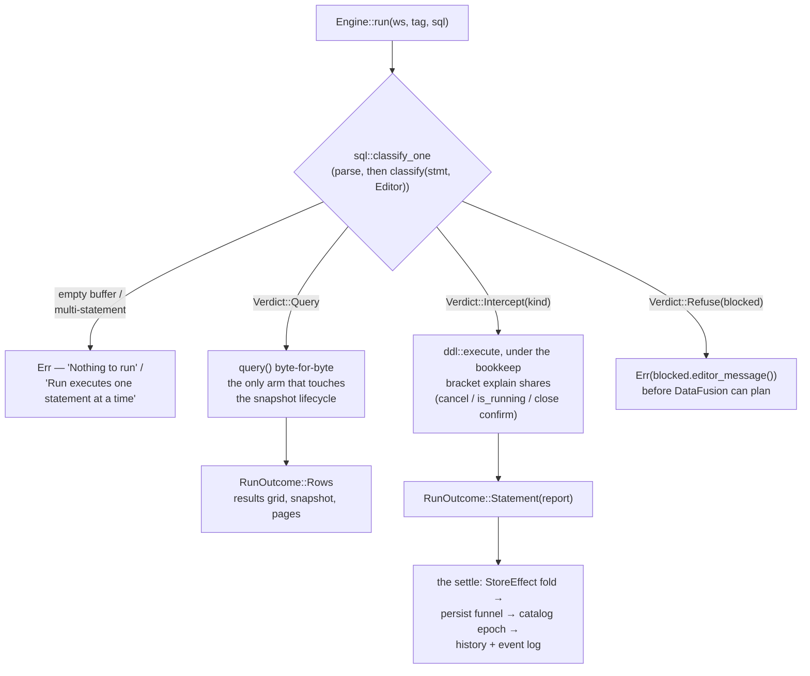

# SQL statements — how the editor runs, intercepts and refuses them

The editor is a **full-statement surface**: one classification in front of dispatch decides, per
parsed statement, whether Run executes a query, performs the statement as an engine method, or
refuses it with the same words the squiggle showed. The agent surface asks the same classifier and
stays read-only. This file documents that surface as built — the router, the dispatch, the
provider layer, and the statement family implemented so far (internal tables, the two writes over
them, typed view DDL, typed `COPY`, the session statements and SQL functions). The one statement
still to lift — typed `CREATE EXTERNAL TABLE` — is tracked in
`.claude/tasks/workstream-editor-statements/`.



## 1. The shape of a Run

`sql::classify_one` (`engine/sql/validate.rs`) parses the buffer with the engine's own dialect and
takes exactly one statement from it — an empty buffer is `Nothing to run`, a multi-statement
buffer is `Run executes one statement at a time`. The statement then classifies
(`classify(stmt, Capability::Editor)`) into one of three verdicts, and `Engine::run` spends the
verdict (§2).

**What classifies `Query`** — the snapshot pipeline, unchanged: `SELECT`, `EXPLAIN` /
`EXPLAIN ANALYZE`, `DESCRIBE`, and every `SHOW` form (`TABLES`, `COLUMNS`, `FUNCTIONS`,
`VARIABLES`, `DATABASES`, `SCHEMAS`), and `EXECUTE` of a prepared query. `EXECUTE` is the one
query form whose plan is a `LogicalPlan::Statement`, which the read path's all-false `SQLOptions`
triple refuses — so the router answers a second thing about it, `sql::read_policy`, and the
widening rides that **dispatch** rather than the path (§6.5).

Everything else is either **intercepted** (an engine-method implementation whose outcome the store
folds — §6) or **refused** (the short list in §4).

## 2. Dispatch and outcomes

`Engine::run` (`engine/mod.rs`) routes; nothing else does:

- **`Query`** delegates to `query()`'s body **byte-for-byte** — same supersede, same
  retire-on-dispatch, same pins — carrying only the `ReadPolicy` the router answered (§1). It is
  the only arm that touches the snapshot lifecycle, which is what keeps "DDL does not retire
  snapshots" true by construction rather than by care.
- **`Intercept(kind)`** goes to `engine/ddl/`'s `execute`, bracketed by `Engine::bookkeep` — the
  same in-flight lifecycle `explain` uses — so `cancel`, `is_running` and the close-while-running
  confirm see an intercepted statement like any other work. A CTAS is a full scan; a window
  closing over one has to ask.
- **`Refuse(blocked)`** returns `Err(blocked.editor_message())` before DataFusion can plan — the
  run fails in the results pane with the words the squiggle showed.

A statement's outcome is a **value the app folds**, never something to read back out of
DataFusion:

```rust
pub enum RunOutcome {
    Rows(QueryOutput, RecordBatch),   // exactly query()'s result
    Statement(StatementReport),       // no snapshot
}

pub struct StatementReport {
    pub kind: StmtKind,               // labels come off StmtKind::label — one spelling
    pub message: String,              // the sentence the user reads, IDE register
    pub count: Option<u64>,           // rows moved; None is "not applicable", not zero
    pub elapsed_ms: u128,
    pub effect: Option<StoreEffect>,  // what the app folds; None where nothing catalog-held changed
}
```

`StoreEffect` (`engine/ddl/mod.rs`) is the catalog mutation the statement leaves behind:
`TableUpserted { def, meta }`, `TableRemoved { name, dependents }`, `ViewUpserted`, `ViewRemoved`,
`RescanTable`, `FunctionsChanged`, `PreparedChanged`. An effect carries the def *and* what
registration learned, so the sidebar row lands `Reg::Ready` directly. The last two persist nothing
— functions and prepared statements are session-scoped (§8) — and are still effects for the reason
an effect exists: a name that did not resolve a moment ago now does, so the catalog epoch has to
move with it.

**The settle** (`apps/project/state/statement.rs`) is one fold for every effect, driven from the
tab's request keeper so a statement run in a background tab still lands: store upsert on the
matching `ProjChan` → `persisted_defs` writes `project.json` through the persist funnel →
`catalog_settled` bumps the epoch (every tab's diagnostics re-derive) → the event log. The log
entry is recorded by the fold, not by the run-logging hook, because only the fold knows whether
the def actually reached disk — a success row logged over a failed write would promise a table the
next open loses.

The **results pane** renders a statement as a status row — icon, the kind's label, the engine's
sentence — without disturbing the tab's last result grid. **History** records a successful
statement like any successful run: a typed `CREATE TABLE` is a query the user may want back; its
`count` is the rows it moved, and the dedupe and cap are unchanged.

## 3. Why interception, not providers

DataFusion 54's provider traits are resolution and enumeration interfaces, not lifecycle ones.
`SchemaProvider::register_table` is **sync** and carries **no caller identity**: by the time DF's
own CTAS calls it the whole result is already in RAM as a `MemTable`, so no provider can spool a
result to disk — and routine internals deregister constantly (every re-scan, snapshot retirement,
DF's own `CREATE OR REPLACE VIEW`), so a provider that deleted files on deregister would delete
user data on a sidebar refresh. DDL also executes **eagerly** inside `ctx.sql`, so anything that
must not run has to be refused before planning; and provider-accreted state would have to be read
back out of DataFusion — the `FetchCatalog` refetch the catalog invariant forbids — where an
interception returns the outcome as a value one fold applies. So lifecycle is intercepted in front
of `ctx.sql`, and the providers keep the two jobs the traits can carry: identity and visibility
(§5). Settled — do not re-litigate.

## 4. The router

`classify(stmt: &DFStatement, cap: Capability) -> Verdict` (`engine/sql/validate.rs`) is the whole
statement policy:

```rust
pub enum Capability { Editor, Agent }

pub enum Verdict {
    Query,                  // the snapshot pipeline, unchanged
    Intercept(StmtKind),    // engine-method implementation + store fold
    Refuse(Blocked),        // rendered per surface
}
```

`StmtKind` names the fourteen intercepted forms: `CreateExternalTable`, `CreateTable`, `Ctas`,
`Insert`, `DropTable`, `CreateView`, `DropView`, `Copy`, `Set`, `Reset`, `Prepare`, `Deallocate`,
`CreateFunction`, `DropFunction`. `StmtKind::label` is the one spelling of each statement's name —
stub refusals, reports and the results pane all read it.

- **Both surfaces answer from one match arm.** `classify_form` returns
  `(Verdict, Option<Blocked>)` — the editor's answer and the agent's beside it — so an arm cannot
  answer one surface and forget the other. `Capability::Agent` never intercepts: every non-query
  refuses with the exact `Blocked` variant and wording the agent gate shipped with, and
  `Engine::policy_verdicts` stays the agent-facing wrapper. Parity is a test of a table, not of
  two functions kept in step.
- **Fail closed, default deny.** Parse failure is `Err` ("could not judge"); the sqlparser
  wildcard lands `Refuse(Unsupported)`; the DFParser match is wildcard-free, so a new DataFusion
  statement variant is a compile error rather than a statement that slips through.
- **Classification is a pure function of the parsed statement.** A refusal that needs context the
  statement does not carry (an INSERT target's origin, a SET key's class) is decided at dispatch,
  with the same `Blocked` vocabulary, so every refusal's wording has one home
  (`Blocked::editor_message`).
- **The `SQLOptions` triple is defense in depth behind this, not the gate.** The read path stays
  all-false; intercepted arms set a per-class floor at dispatch. `verify_plan` visits subqueries,
  so smuggled nested DDL still dies at the second gate — but it can only refuse a class of plan,
  not name the surface that owns a capability.

**Reserved names.** An intercepted statement that references a `__snap_`-prefixed table — or names
one as its target — refuses with `Blocked::ReservedName` ("Names starting with '__snap_' are
reserved for query results"). The read half keeps a typed `COPY (SELECT * FROM __snap_3)` from
ever writing `__strata_ord` into a user's file; the write half keeps `CREATE TABLE __snap_2` and
friends off the namespace a Run mints into, where the provider would answer "already exists" for a
name the same prefix hides from every catalog reader. `register_external` backstops the same rule
at the funnel, because a def also arrives from Table Config, a hand-edited `project.json`, or an
older build.

**What the editor refuses**, with the squiggle and the run failure sharing one string:

| Statement | Wording |
|---|---|
| `CREATE DATABASE` / `CREATE SCHEMA` | "CREATE DATABASE and CREATE SCHEMA are not supported" |
| `UPDATE`, `DELETE`, transactions, unknown kinds | "This statement is not supported in the editor. Only SELECT, EXPLAIN, SHOW and DESCRIBE can run here" |
| `DROP` of a non-table, non-view object | "DROP is not supported in the editor. Deregister tables from the catalog" |
| `INSERT OVERWRITE` | "INSERT OVERWRITE is not supported. Drop the table and recreate it with CREATE TABLE AS" |
| `PREPARE` of a non-query body | "PREPARE supports queries only" |
| A `__snap_` name in an intercepted statement | "Names starting with '__snap_' are reserved for query results" |
| A multi-statement buffer | "Run executes one statement at a time" |
| An empty buffer | "Nothing to run" |

**The dispatch-time refusals are deliberately not in that table**, because they draw no squiggle:
they need context the parsed statement does not carry, so the editor cannot know them while the
user is typing and the refusal arrives at Run. They share the `Blocked` vocabulary and nothing
else. Today they are an `INSERT`'s target origin and write op (§6.2, `Blocked::InsertExternal` /
`InsertOverwrite`) and a `SET` / `RESET` key's class (§6.5, four of them).

Known wording drift: the `Unsupported` message still says "Only SELECT, EXPLAIN, SHOW and DESCRIBE
can run here", which is stale now that `CREATE TABLE` / CTAS run. The older `Blocked` variants
(`CreateTable`, `Insert`, `CopyTo`, `Set`, …) stay defined as **the agent path's error messages** —
`strata-agent` names them directly, so deleting one is a compile break — and are unreachable from
the editor, which intercepts every one of those statements.

## 5. The provider layer — identity and visibility, never lifecycle

`engine/providers.rs`, installed in `build_context` before anything registers. Two jobs and no
third:

- **Identity.** One catalog (`strata`) with exactly one schema (`public`), tables keyed by
  `fold_ident` on both write and read — so the single namespace is genuinely case-insensitive
  rather than case-insensitive-if-you-came-in-through-a-`&str`. `register_schema` and
  `deregister_schema` refuse, so `CREATE SCHEMA` is impossible **by construction**, not by policy.
  `CREATE DATABASE` cannot be stopped here: DataFusion registers it into the
  `CatalogProviderList`, whose `register_catalog` returns an `Option` with no way to fail — a
  refusing list could only lie or silently no-op — so the router's `Blocked::CreateDatabase` is
  its only gate, and the first line for `CREATE SCHEMA` too.
- **Visibility.** `table_names()` filters the `__snap_` result snapshots while `table()` still
  resolves them. Every `information_schema` view and every `SHOW` form enumerates through
  `table_names()` and nothing else, so one filter hides the spool from all of them and keeps
  `__strata_ord` out of `information_schema.columns` — while paging, chart, export and snapshot
  retirement, which address a snapshot by name, notice nothing. That filter is what makes
  `datafusion.catalog.information_schema` safe to default **on** (set before the override loop, so
  a user's `false` still wins; `ENGINE_KEYS` names `true` so a removed override lands back on it) —
  which is why `SHOW TABLES` works on a fresh project. The prefix predicate is `is_snapshot_name`,
  defined next to the function that mints the names, so the hiding rule and the naming rule cannot
  drift.

Everything else is `MemorySchemaProvider`'s behaviour verbatim, duplicate-name error included, so
every existing reader, `find_and_deregister`, validation's `table_exist` and snapshot retirement
work with no call-site changes.

One engine default rides with this: `datafusion.runtime.list_files_cache_limit` is `0`. DataFusion
54 turns a list-files cache on by default with an **infinite TTL**, which silently serves the
previous file set to every re-listing — the catalog's ↻, Configure's re-inference, and
`CREATE OR REPLACE TABLE`. `ENGINE_KEYS` names `0` as Strata's default and `build_runtime` applies
it before any override. A re-scan means "list the sources again".

## 6. Intercepted statements

### 6.1 Internal tables — `CREATE TABLE` and CTAS

The one implemented interception (`engine/ddl/tables.rs`). An internal table is an **ordinary def
whose data Strata owns** — `TableOrigin::Internal` is a flag on `TableDef`, never a second kind of
thing.

The parsed statement goes to `SessionState::statement_to_plan`, which executes nothing and buys
two things outright: DataFusion's planner already refuses every clause it does not implement
(`TEMPORARY`, `LOCATION`, `PARTITION BY` and fifty more, each in its own words), and it already
resolves a declared column list against the query, casting and renaming to it. What Strata refuses
on top is what DataFusion plans without enforcing — constraints and column defaults — plus
duplicate result column names (an IPC file would store both, and every later read would resolve
the second onto the first), and running with no project open ("… needs a project folder to store
the table's data").

The spool is a `LogicalPlan::Copy` node built over the plan's `input` directly, `STORED AS ARROW`
into `.strata/tables/.tmp-…/`, then renamed into `.strata/tables/<slug>/` (atomic; a crash leaves
only a tmp dir the tidy sweeps). **No SQL text is re-rendered and no span is sliced** — the query
that runs is the query the user wrote, by construction rather than by fidelity of a round trip.
`IF NOT EXISTS` / `OR REPLACE` / plain-exists resolve against the one namespace tables and views
share. A bare `CREATE TABLE (cols…)` plans as an `EmptyRelation` and writes one empty,
schema-carrying IPC file — IPC self-describes, so replay infers without a schema in the def.

Registration goes through the funnel every table uses: `register_external` with
`TableSpec { format: Arrow, internal: true }` → `TableMeta` →
`StoreEffect::TableUpserted { def, meta }`. The def is a `TableDef` with `origin: Internal` and a
project-relative source, so the store, the persist funnel, replay and the headless host need no
new code. The def travels and the data does not: `tables/` is gitignored, and a clone without the
data gets an honest `Reg::Failed` row in its own words.

Around it, as built:

- `StrataArrowFormat` (`engine/arrow_stats.rs`) wraps DataFusion's `ArrowFormat` to answer
  `infer_stats` from the IPC file footer — exact row counts from metadata-only reads — so the one
  table Strata itself wrote can say how many rows it holds. Row counts only; null counts stay
  profile territory.
- The catalog row wears an `INTERNAL` badge ("Strata stores this table's data in the project"),
  because origin is what stands between the user and a drop that means two different things.
- `Engine::is_internal` is an engine-side set of folded names, rebuilt by the same registration
  pass that builds everything else (`note_origin` from every path that registers) — never a second
  catalog. It answers one question: may a write statement target this provider.
- **Configure is absent** from an internal row's menu — it edits sources, format and partition
  columns, and an internal table has none to edit, ever — so the window is structurally unable to
  receive an internal def.
- A drop of an internal table **deletes its data** — see the next section.
- `register_external` hands the table the runtime's per-file **statistics cache**
  (`ListingTable::with_cache`). `SessionContext::register_listing_table` does this for itself, so
  snapshots always had it and only the hand-built config did not; without it statistics are
  re-read on every scan *and* every registration. **Not** the list-files cache, which
  `ENGINE_KEYS` zeroes on purpose: that one answers "which files are there", and a re-scan means
  asking again. This one answers "what is in *this* file", invalidated on size and mtime.

### 6.2 Writes over an internal table — `INSERT` and `DROP TABLE`

**`INSERT` is DataFusion's own write behind a target gate.** The statement is planned (side-effect
free) and the gate reads what the plan names: a target outside `Engine::is_internal` is refused
(`Blocked::InsertExternal` — a view is the same refusal, neither being a directory a
`CREATE TABLE` wrote), and any write op that is not `Append` is refused
(`Blocked::InsertOverwrite`; the router already catches `INSERT OVERWRITE` off the bare statement,
while `REPLACE INTO` reaches the arm because only the plan names it). Everything after the gate is
DataFusion's INSERT path unchanged — the column list, the source query, the schema check, and the
single LZ4-frame IPC file the Arrow sink appends. **The plan that was gated is the plan that
runs**: driving it *is* `execute_logical_plan`'s own arm for a DML node, so re-dispatching the
text would gate one value and execute another.

One file per statement and **no compaction** — `DROP TABLE` plus `CREATE TABLE AS SELECT * FROM t`
is the compaction story until a task owns one.

The effect is `StoreEffect::RescanTable`, and its fold **re-reads the table's facts without
re-registering it**. Re-registering replaces the provider, and that is what strands the `Arc` a
view captured (D10/D11) — the only reason a table Refresh re-creates the views above it. An append
cannot change the shape a view captured (the sink schema-checks first) and the provider re-LISTs
per scan anyway, so the fold is `refresh_table_rows` → `Engine::table_meta` →
`ProjectState::table_reread`: no re-inference, no view churn, no epoch bump, no `Loading` flash.
The count is still read from the footers, never added up from what the statement claimed.

**`DROP TABLE` works on both origins, and is the one place a table is dropped.** The catalog
pane's confirm reaches `ddl::tables::drop_table` through `Engine::drop_table` after its store-first
write; a typed statement reaches it through the router. That sharing is the point: a pane that
merely deregistered would orphan an internal table's data forever, since no def would point at it
and `tidy_strata_dir` sweeps only `.tmp-…`.

The target resolves against the engine's namespace first — an unknown name errors, `IF EXISTS`
reports a no-op with nothing to fold, a view says which statement drops it. Then **deregister
first**, so no plan built afterwards can resolve the name while a scan already running finishes
against its own provider. Only then is the data destroyed, and only where the def is internal.
Dependent views are **named, never cascaded**: read from the providers before the deregister,
because a `ViewTable`'s plan was inlined at creation and goes on executing until reload.

The data is discarded **by rename** — the directory moves into a `.tmp-…` sibling and is only then
walked, the mirror of the spool's publish-by-rename, so an interrupted delete leaves what the
`.strata` sweep collects rather than a half-emptied directory under a live table name. The rename
is the operation and the removal is housekeeping (logged, not returned); a failure of the *rename*
puts the provider back, so a drop that reports a failure has not half-happened. And because an
`INSERT` is one file with no compaction, a heavily written table's delete is not instant, so it
holds a `BackgroundGuard` and the close-while-running confirm asks before a window takes the
runtime away.

Both wordings are the engine's — `ddl::drop_intent` before the fact, the report's after — so the
confirm cannot promise what the report then contradicts: an internal drop names the data, an
external one keeps "the source files on disk are not deleted".

### 6.3 Typed view DDL — `CREATE VIEW` and `DROP VIEW`

**A second gesture into the funnel ⌘S already uses** (`engine/ddl/views.rs`). `views::create` is
the body `Engine::create_view` spawns for Save-as-view, so a view is indistinguishable by origin:
one store row, one `project.json` entry, one set of deps, and either gesture edits the row the
other made. The effect is `StoreEffect::ViewUpserted { def, meta }` — the same pair Save folds.

The statement is **never run natively**, for two reasons. DataFusion's own
`CREATE OR REPLACE VIEW` over a **table** name silently replaces the table (`context/mod.rs`, the
`(true, Ok(_))` arm deregisters whatever is there without asking `table_type`), so a typo would
turn a registered parquet table into a view while its def went on naming files nothing reads. And
the store write-back needs a `ViewMeta`, which introspecting for afterwards is the refetch the
catalog invariant forbids — `views::create` reads it off the freshly-registered view's own
`DataFrame`, where the planner has already resolved everything.

`ViewDef` is `{ name, sql }` and nothing else, so a typed statement has to arrive at exactly that
pair: the folded target name (`TableReference::parse_str`, DataFusion's own identifier
normalization) and the **definition query's canonical rendering** — the query node alone, not the
statement around it. That is what makes the row round-trip, because it is the same string ⌘S
would have saved from a tab holding that query. It is also why the clauses `CREATE VIEW` can
carry are refused **by name**, from a destructure with no `..`: the statement is rebuilt around
the query, so a clause nobody read is a clause silently dropped, and `CREATE TEMPORARY VIEW`
would create a permanent one. A clause sqlparser learns later is a compile error rather than a
promise Strata quietly breaks.

The fences, all resolved before anything runs:

| Case | Answer |
|---|---|
| The name is a base table | "'sales' is a table" — `OR REPLACE` does not soften it |
| Plain `CREATE VIEW` over an existing view | "View 'v' already exists. Use CREATE OR REPLACE VIEW" |
| `IF NOT EXISTS` | "CREATE VIEW IF NOT EXISTS is not supported. Use CREATE OR REPLACE VIEW" |
| A column list | "A view's column list is not supported. Alias the columns in the query" |
| `TEMPORARY`, `MATERIALIZED`, `SECURE`, `OR ALTER`, `TO`, `COMMENT`, `CLUSTER BY`, `COPY GRANTS`, `WITH NO SCHEMA BINDING`, view options, MySQL's `ALGORITHM`/`DEFINER`/`SQL SECURITY` | "CREATE VIEW does not support *CLAUSE*" |
| A `__snap_` view name or a `__snap_` read in its body | `Blocked::ReservedName`, at the router (§4) |

`DROP VIEW` resolves the target the same way — an unknown name errors, `IF EXISTS` reports a
no-op with nothing to fold, a table name says which statement drops it ("'t' is a table. Use DROP
TABLE") — and then names what it leaves behind, **never cascading**, in the wording a table drop
already uses (`ddl::left_invalid`, shared so the two cannot describe one consequence two ways).
Its dependents come from `catalog::dependents_of_view`, the sibling of the table drop's
`dependent_views`: the inliner leaves a view's *name* behind as a `SubqueryAlias` and its base
tables at the leaves, so a reader of `orders` and a reader of the view over `orders` are told
apart by which half of `PlanDeps` the name is in — exactly the split the store keeps
(`ViewInfo::deps` vs `view_deps`), which is what makes the typed drop's report and the catalog
pane's warning the same fact.

That half is **raw**, so the report **over-reports on purpose**: a `SubqueryAlias` is what the
inliner leaves and also what `FROM t AS v` and a CTE named `v` leave, and the plan cannot tell them
apart — so dropping the view `v` also names a view that merely aliased something else `v`. Kept in
the safe direction, because a *missed* reader is a destructive action reported as consequence-free
where a spare one is a name the user can look at. It is not a divergence from the pane either: the
store's filter keeps an alias only where a view row of that name exists, which is always true of
the name being dropped, so it cannot subtract this case. Telling the two apart would mean comparing
the aliased subtree against the view's own registered plan — a change to what `PlanDeps` is, and
one that would have to move both surfaces at once.

Profiles are cancelled by `Engine::settle_effect` off the returned effect rather than inside the
arm, for the reason `TableRemoved` gives: the statement runs in a task that cannot reach the
lifecycle. The direct gestures (⌘S, the pane's drop confirm) cancel in `Engine::create_view` /
`drop_view`, which never produce an effect.

Replay needs no code of its own: a typed view is a `ViewDef`, and `register_pass`'s fixed-point
rounds order a chain from cold exactly as they do a saved one.

### 6.4 Typed `COPY … TO`

**DataFusion's own write, behind the two checks the Export window used to stand in for**
(`engine/ddl/copy.rs`). Nothing about the write is Strata's: `COPY` is DataFusion's statement, its
`OPTIONS` are DataFusion's, and every format Strata reads it can write. The statement is planned
once — planning a `COPY` executes nothing — and that one value is what the gate counts over and
what is then driven, so **the plan that was judged is the plan that runs**, the rule the `INSERT`
arm already keeps. Driving it is `ctx.sql` minus the re-parse: `execute_logical_plan` special-cases
`Ddl` and `Statement` and hands everything else, `LogicalPlan::Copy` included, to exactly that.

The Export window is **unchanged** and remains the snapshot-backed, race-free path: it writes the
immutable table the grid is paging, so the file matches what was on screen. A typed COPY reads live
tables — twice when it is partitioned — so its gate is a pre-flight, not a lock.

What the editor adds, both of them about a statement that would otherwise *succeed* and produce
something wrong:

| Check | Why | Where |
|---|---|---|
| A partition identifier is one bare word | DF 54's COPY parser renders each with `Ident::to_string()` and the planner looks it up by that string, so `PARTITIONED BY ("order date")` reaches `field_with_name` with its quotes attached and fails about a column nobody named | `export::partition_columns_are_bare_words` — **shared**, not copied, and asked before planning so the refusal is ours |
| No NULL in a partition column | DF 54 has no `__HIVE_DEFAULT_PARTITION__`: it files the row under a *neighbouring* value's directory, so the output reads back claiming a value it never had | `ddl::copy::no_null_partition_values`, in `export::partition_null_refusal`'s wording |
| No `__snap_` source | a snapshot carries `__strata_ord`, which must never reach a user's file | the router (§4), `Blocked::ReservedName` |

The NULL gate's *mechanism* differs from the window's because the sources do. The window reads
exact per-column counts the snapshot's write pass already produced, for free; a typed COPY's source
is any query at all, so it counts — `count_all()` plus one `count(col)` per partition column over
the **planned input**, positionally decoded, the shape `profile::aggregates` uses. One extra scan
per partitioned typed COPY, the honest price of the same guarantee over an arbitrary source. The
rule is identical: **proceed only on an exact zero**, a count that could not be read being a reason
to decline just as a positive one is.

The report is "Exported N rows to '<path>'" off the sink's own `count` column, and the effect is
`None` — a COPY changes nothing the catalog holds, while history and the event log record it like
any successful run. `Blocked::CopyTo` and its message stay defined as the **agent** path's refusal;
the editor path simply no longer reaches them.

One thing moved on the window's side with this: `keep_partition_by_columns` is now stated in the
`COPY`'s own `OPTIONS` rather than by a session `SET`. DataFusion's physical planner reads that key
out of the statement's options and only falls back to the session config when it is absent, and the
`SET` was never restored — invisible for as long as nothing could read it back, and now that `SET`
and `SHOW` are statements a user can type (§6.5) one partitioned export would otherwise be deciding
the answer for every later one, window or typed. It keeps its `execution.` namespace because
`TableOptions::set` skips that namespace entirely, which is what lets the key reach the planner
without a format refusing it as unknown.

### 6.5 Session statements — `SET` / `RESET` and `PREPARE` / `EXECUTE` / `DEALLOCATE`

`engine/ddl/session.rs`. Everything here dies with the engine, and every report says so, because
the report is the one place the user learns a statement's scope (§8).

**`SET` and `RESET` never run natively**, and the two reasons are opposite halves of one rule —
Settings stays the durable config authority. Native `SET` applies `datafusion.runtime.*` *live*,
rebuilding the `RuntimeEnv` under the session, which is exactly the discipline `restart_owed`
exists to hold; native `RESET` puts a key back to **DataFusion's** default rather than the value
Settings names, so a user who set `batch_size` in Settings, typed `SET`, then typed `RESET` would
land on 8192 with their own setting silently gone.

So a `SET` is applied through the same `ConfigOptions::set` call `Engine::set_config` uses and
recorded in a **session overlay** (`SessionScope`); a `RESET` drops the overlay entry and
re-applies the Settings baseline (`config::effective` — the override when the user named one, else
the `ENGINE_KEYS` default), falling back to DataFusion's own `reset` for a hand-typed key the
catalogue names no default for. The statement is **planned**, not read off the AST: the planner is
what refuses scope modifiers and `HIVEVAR`, folds `SET TIMEZONE` onto
`datafusion.execution.time_zone`, lower-cases the key and renders the value.

**Writing the option is only half of applying it**, and the other half is silent if you skip it.
`NowFunc` captures `execution.time_zone` when it is *registered* and bakes it into the literal its
`simplify` returns; the `to_timestamp` family does the same. So every path that moves an option
also calls `engine::refresh_config_dependent_udfs` — DataFusion's own `set_variable` and
`reset_variable` do exactly this after the same `options.set`, and the `SessionStateBuilder` does
it at construction, which is why a launch override always worked. Without it a `SET` reports
success, moves `SHOW`, and leaves `now()` answering in the zone the engine was *built* with until a
restart. Both typed statements and the Settings Apply share the one call.

The overlay is **engine-wide** — every tab and every agent read plans against the one
`SessionState` — and it **wins for its keys until `RESET` or restart**: a Settings Apply over an
overlaid key records the new baseline and leaves the live value alone (`Engine::set_config` skips
it), which makes "the last thing you typed is what is in force" true without a precedence table. A
restart drops the overlay silently, which is the same sentence read the other way round.
`restart_owed` is unchanged, because a runtime key can never enter the overlay:

| Key class | Answer | Why |
|---|---|---|
| `is_owned_key` | "This option is managed by Strata and cannot be set" | Strata names its own catalog, schema and `collect_spans` |
| `datafusion.runtime.*` | "Engine runtime options require a restart. Set them in Settings" | they configure the `RuntimeEnv`, fixed at engine start |
| `datafusion.format.*` | "Display options are set in Settings" | the grid formatter and the chart read's cache identity both come from the Settings store, so a session value would split-brain them |
| `datafusion.sql_parser.dialect` | "The SQL dialect is set in Settings" | the same rule, one surface over: completion carries the dialect on its own `Catalog` snapshot, built from Settings, while the validator and the planner read it live — so a session value leaves the editor lexing the buffer by rules the planner has stopped using (WJ-04) |

The last two are **one rule with two surfaces**: a key some part of the app reads from the Settings
store rather than from the session cannot have a session value, or the two answer differently about
the same buffer. All four refuse `RESET` as well as `SET`: a native `RESET` of a runtime key
rebuilds the `RuntimeEnv` exactly as a native `SET` does, and a key Strata owns is not the user's
to put back either.

**`PREPARE` and `DEALLOCATE` do run natively** — DataFusion owns the prepared plan, and `EXECUTE`
then rides the ordinary snapshot pipeline (pages, sorts, exports, the lot). What is Strata's is the
fence and the mirror:

- **The fence is `PREPARE`'s, and it can be nowhere else.** `SQLOptions::verify_plan` descends into
  a `Prepare` node's input but an `Execute` node has no inputs, so a DML/DDL body has to be refused
  at `PREPARE` or it never is. The router refuses a non-query body off the parsed statement
  (`Blocked::PrepareNonQuery`, "PREPARE supports queries only"); the dispatch verifies the *plan*
  under `dml=false, ddl=false, statements=true`, the same defense-in-depth the `INSERT` and `COPY`
  arms keep. Storing the plan is `execute_logical_plan`'s own arm, so the optimizer pass, the arity
  check against declared types and the duplicate-name error are all DataFusion's.
- **The mirror exists because `SessionState::prepared_plans` is `pub(crate)`** — DataFusion has no
  public enumeration — and completion has to offer the names. It is written *after* the dispatch, so
  a duplicate name keeps DataFusion's error and the mirror cannot claim a plan the session does not
  hold; `DEALLOCATE` removes from it the same way, and its "Prepared statement 'p' does not exist"
  is DataFusion's too.

`EXECUTE`'s widening is `sql::read_policy` (§1) — a `ReadPolicy` carried on the dispatch, never a
mode the read path offers: `Engine::query` stays the read-only entry, and the widened body is
private. It unwraps `EXPLAIN`, because `verify_plan` visits the whole tree and would otherwise
refuse `Explain { Statement(Execute) }` at its child, so a typed `EXPLAIN EXECUTE p` runs and comes
back as DataFusion's own textual explain rows.

**The Explain *gesture* cannot serve that form, and is left refusing it.** It unwraps to the
explained plan and asks for a **physical** one, and a `Statement(Execute)` has none — the bound
plan exists only inside DataFusion's `execute_prepared`. Widening `run_explain`'s options would
move the failure one step rather than remove it, so the widening is not there and `engine::explain`
says why where it keeps its own all-false triple.

Completion offers prepared names at an `EXECUTE` / `DEALLOCATE` operand (`Clause::Execute`) and
nowhere else — and only where that word **leads the statement**, because sqlparser classes every
word in its dictionary as a keyword, so a table with an `execute` column would otherwise have that
column govern the rest of its SELECT list and empty the offer there
(`context::leads_statement_only`). The rest of the session statements' completion is ED-11.

### 6.6 SQL functions — `CREATE FUNCTION` and `DROP FUNCTION`

`engine/ddl/functions.rs`. Both run **natively**, and DataFusion's seam for `CREATE FUNCTION` is a
`FunctionFactory` — without one installed the statement fails with "Function factory has not been
configured", and with one it is `execute_logical_plan` that calls it and registers what it returns.
So `StrataFunctionFactory` is installed on every engine at `build_context` (the headless host runs
the statement identically), and it is a pure builder: a `CreateFunction` in, a scalar `ScalarUDF`
out. What the created function *is* is a **SQL macro** — the body, with the call's arguments
substituted in by the UDF's `simplify` hook, so it is inlined once per plan and never invoked per
batch.

**A body is an expression over the arguments and nothing else.** DataFusion plans it against an
empty schema with the argument list supplied as *placeholder* types, so what its planner accepts is
`RETURN $1 + 1` or `RETURN $x + 1` — and the standard SQL `RETURN x + 1`, which is what a user
writes, fails name resolution outright. `bind_parameters` says that bare form in the planner's own
vocabulary **on the parsed statement, before planning**, so all three spellings land on one planned
body of positional placeholders and there is one substitution to make. Anything the body reaches
that is not an argument is refused: a bare `Column`, a subquery, a `$n` past the arity. A body
reading a table would be a hidden dependency that nothing persists and no `DROP TABLE` could name.

**A built-in is fenced off from both statements.** DataFusion's registry cannot tell a built-in
from a function a session created, and its `DROP FUNCTION` deregisters across *all five* registries
at once (scalar, aggregate, window, table, higher-order) — so `DROP FUNCTION abs` would take the
built-in away for the rest of the session with nothing able to put it back, and
`CREATE OR REPLACE FUNCTION count(…)` would shadow the aggregate the same way. `Functions`
(`engine/functions.rs`) holds the names this session created beside the catalog, and that set is
what makes the difference nameable: a name it holds is the user's to redefine under the same
`OR REPLACE` rule a view keeps; any other registered name is refused, in one sentence for both
statements. It is `CREATE OR REPLACE VIEW` over a table name (§6.3) read from the other side.
`engine::registered_function` asks **all five**, deliberately rather than the three that are one
method call away: `array_filter`, `array_transform` and `array_any_match` are registered *only* as
higher-order, so a three-registry fence read them as free names.

The other refusals, each leaving nothing behind:

| Form | Answer |
|---|---|
| `LANGUAGE python` (anything but SQL) | "LANGUAGE 'python' is not supported. Functions are SQL expressions" — off the **parsed** statement, because a body in another language is not SQL and would fail planning first, answering about the body instead of the language |
| no body | "CREATE FUNCTION requires a body. Add RETURN \<expression\>" |
| no `RETURNS` | "CREATE FUNCTION requires a return type. Add RETURNS \<type\>" |
| `AS '<string>'` | "A function body given with AS is not supported. Use RETURN \<expression\>" — `AS` takes a *string literal* in this dialect family, so `AS 'x + 1'` would create a function returning the text `x + 1` |
| a body containing a subquery, an aggregate or a window function | refused by name — the first is a hidden table dependency, the last two plan happily and can then never be called |
| `IF NOT EXISTS` | points at `CREATE OR REPLACE FUNCTION` |
| `STRICT`, `PARALLEL`, `SECURITY`, `SET`, `USING`, `OPTIONS`, `REMOTE WITH CONNECTION`, `OR ALTER`, `DETERMINISTIC` | "CREATE FUNCTION does not support *clause*" |
| `DROP FUNCTION a, b` · `CASCADE`/`RESTRICT` · an argument list | "DROP FUNCTION takes one function name", and the other two by name |

The last two rows are read off the **parsed statement**, because DataFusion's planner drops them
silently — the same reason `views::definition` is exhaustive over `CreateView` with no `..`, and a
clause sqlparser learns later is a compile error rather than a promise quietly broken. Most of the
`CREATE` ones are unreachable under the `generic` dialect, whose parser hard-codes them absent, but
the dialect is a Settings key and `mssql`/`bigquery` set several. **The `DROP` row is reachable
everywhere**: sqlparser parses the comma-separated list in every dialect and DataFusion's planner
takes `func_desc.first()` with no length check, binds `drop_behavior: _` and never reads
`FunctionDesc::args` — so `DROP FUNCTION a, b` planned as a drop of `a` alone and reported success
for a statement half of which never happened. `TEMPORARY` is *accepted*,
because it is accurate: every created function is session-scoped whether or not the word is
written. `RETURNS SETOF` and a qualified name are DataFusion's own refusals.

The name is folded (`fold_ident`) on both statements, because DataFusion's planner takes the
identifier verbatim on each: without it `CREATE FUNCTION AddOne` would register under a name
`SELECT addone(…)` could never resolve. The declared return type is the call's type — the body is
wrapped in a `Cast`, so `RETURNS INT` over an `Int64` body answers `Int32` rather than failing deep
in the optimizer.

**The catalog is swappable, and that is the whole app-side change.** `functions::snapshot` used to
run exactly once at `Engine::new` into an immutable field — true of the registry until this
statement could move it. `Functions` holds it as an `Arc<FunctionCatalog>` re-walked by the arm
that changed the registry **and by nothing else**, so the built-in set still costs one walk;
`Engine::functions()` hands out the `Arc`. The report carries `StoreEffect::FunctionsChanged`,
whose settle bumps the catalog epoch, which is what every tab's `Catalog` snapshot is memoized on —
so a created function reaches autocomplete, signature help and the docs panel on the next
derivation, with its argument names as the signature.

### 6.7 Not yet implemented

`CREATE EXTERNAL TABLE` classifies `Intercept` — the editor draws no squiggle — and answers at Run
with `ddl::execute`'s stub refusal: "CREATE EXTERNAL TABLE is not implemented yet". Its
implementation, and the design it follows, lives in its task file under
`.claude/tasks/workstream-editor-statements/`; the dispatch's `match` is exhaustive on `StmtKind`
with no wildcard, so a kind the router learns to intercept is a compile error until an arm owns it.

## 7. A statement, end to end

CTAS, the implemented case. At Run: `Engine::run` classifies → `Intercept(Ctas)` → spool the inner
query to `.strata/tables/<slug>/` → register via `register_external`
(`TableSpec { format: Arrow, internal: true }`) → return `RunOutcome::Statement` carrying
`StoreEffect::TableUpserted { def, meta }`.

At settle: store upsert on `ProjChan::Tables` (the sidebar shows the row immediately,
`Reg::Ready(meta)`) → `persisted_defs` rewrites `.strata/project.json` atomically through the
persist funnel → `catalog_settled` epoch bump (diagnostics revalidate; other tabs resolve the new
name) → history + event log → the results pane renders a statement row ("Table 't' created, 1,204
rows") — no grid, no snapshot.

At next open — zero new code: `load_defs` → the scan driver → `register_pass` → `table_spec`
resolves the project-relative source against the root → `register_external` re-registers over the
same files. The headless host replays identically.

## 8. Lifetimes

| Thing | Lives | Survives restart | Persisted |
|---|---|---|---|
| Internal table data | `.strata/tables/<slug>/` | yes | yes (gitignored) |
| Internal table def | `project.json` + store row | yes | yes (shareable) |
| Views (either gesture) | `project.json` + store row | yes | yes |
| Snapshots | temp dir, retire-on-dispatch | no (by design) | no |
| The `SET` overlay | `SessionScope`, engine-wide | no (by design) | no |
| Prepared statements | DataFusion's `prepared_plans` + the `SessionScope` mirror | no (by design) | no |
| Created functions | DataFusion's UDF registry + the `Functions` catalog | no (by design) | no |

Session-scoped outcomes — the SET overlay, prepared statements, created functions — die with the
engine when their statements land, and the `StatementReport` contract already encodes it: a
session-scoped outcome's message says "for this session", because the report is the one place the
user learns the scope. It is true **by construction** rather than by a teardown step: a restart is
a new `Engine`, whose `SessionScope` is a fresh `Default`, whose `SessionContext` holds no prepared
plans, and whose `Functions` is a fresh walk of the built-in registry. Nothing has to remember to
clear anything.

A persisted `FunctionDef` list in `project.json`, replayed by the registration pass exactly as a
view is, is the noted extension for created functions. It is deliberately not scaffolded — the
statement is session-scoped today and says so.
