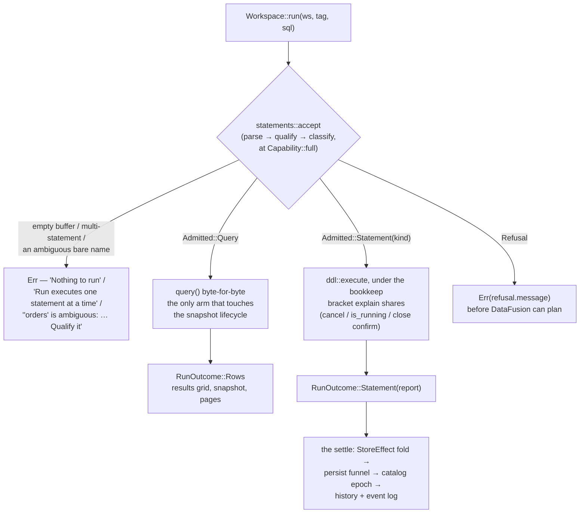

# SQL statements — how the editor runs, intercepts and refuses them

The editor is a **full-statement surface**: one pipeline in front of dispatch decides, per
parsed statement, whether Run executes a query, performs the statement as an engine method, or
refuses it with the same words the squiggle showed. The agent surface enters the same pipeline and
stays read-only. This file documents that surface as built — the pipeline, the dispatch, the
provider layer, and the whole statement family: internal tables and the two writes over them,
typed view DDL, typed `COPY`, the session statements, SQL functions, and typed
`CREATE EXTERNAL TABLE`. Every intercepted kind now has a real arm, and the completion offer
covers every statement the classifier intercepts.



## 1. The shape of a Run

`statements::accept` (`engine/statements/pipeline.rs`) composes the three stages for one
statement: it parses the buffer with the engine's own dialect and takes exactly one statement from
it — an empty buffer is `Nothing to run`, a multi-statement buffer is `Run executes one statement
at a time` — resolves its bare reads, and classifies the result for the caller asking.
`Workspace::run` spends the answer (§2).

**The three stages are typed, and the order is unforgeable.** `parse` mints a `Parsed`, `qualify`
mints a `Qualified` from one, and `classify` takes only a `Qualified`; both have private fields and
no constructor, so qualify-before-classify is a property of the types rather than a call discipline
(a `compile_fail` doctest on `accept` pins it). That matters because the resolution can *change* a
classification.

**`accept` is not the only composition, and the claim that matters is narrower.** The agent's gate
runs the stages over a whole buffer, the diagnostics pass runs them per statement *range* so it can
span each, and `resolved_one` runs the first two for a caller already inside an admitted arm. What
there is exactly one of is the **classifier** — every surface asks `classify_stmt` what a statement
is, and a source-reading test pins that it has one definition site. The parse stage has two mints
(`parse` over a buffer, `parse_range` over one range keeping DataFusion's own error for the span);
they cannot disagree about what parses, because `SessionState::sql_to_statement` builds the parser
with the same dialect resolution and the same `recursion_limit`.

**Between the parse and the classification, the statement's bare reads resolve** (`sql::qualify`,
DB-09): a name the workspace does not hold and exactly one connected database does is rewritten to
its three-part form, so a `SELECT * FROM orders` over a connection is judged, planned and recorded
as the `pg.public.orders` it reaches. It sits inside the pipeline — in front of the classification
— because a bare `__snap_3` the workspace does not hold is not a reserved name once it resolves
into a database connection, where the prefix reserves nothing, and a gate that judged the
unresolved statement would refuse a read the run then performs. Create and drop targets are never
rewritten; the full rule, and why it is a statement pass rather than a current-database setting, is
`docs/CONNECTIONS_SPEC.md` § *Unqualified names*.

**The diagnostics pass enters the same stages** (`engine/sql/validate.rs`, tier 2), one statement
at a time so it can span each — never a second reading of the same rules. That is the property the
whole module family exists for: a statement the editor did not underline is a statement Run is
prepared to perform. A structural test asserts the classifier has one definition site and that
`validate.rs` reaches it rather than growing its own.

That is also why the read path takes the **statement** rather than the buffer: `query::materialize`
and `explain::run_explain` are handed what the pipeline judged and plan it
(`query::plan_statement` — `SessionContext::sql_with_options` with the parse taken out), because
rendering a resolved statement back to text to keep the old signature is exactly the round trip
`COPY`'s arm avoids for the same reason (§6.4).

**What reads** — the snapshot pipeline, unchanged: `SELECT`, `EXPLAIN` / `EXPLAIN ANALYZE`,
`DESCRIBE`, and every `SHOW` form (`TABLES`, `COLUMNS`, `FUNCTIONS`, `VARIABLES`, `DATABASES`,
`SCHEMAS`), and `EXECUTE` of a prepared query. `EXECUTE` is the one query form whose plan is a
`LogicalPlan::Statement`, which the read path's all-false `SQLOptions` triple refuses — so the
classifier answers a second thing about it, `read_policy`, and the widening rides that **dispatch**
rather than the path (§6.5). `EXECUTE` is also its own `Form`, because it is the one read that
reaches session state: it belongs to the `Session` grant family, so a caller that may not `PREPARE`
may not `EXECUTE` either.

Everything else is either **intercepted** (an engine-method implementation whose outcome the store
folds — §6) or **refused** (§4).

## 2. Dispatch and outcomes

`Workspace::run` (`engine/mod.rs`) routes; nothing else does:

- **`Admitted::Query`** delegates to `query()`'s body **byte-for-byte** — same supersede, same
  retire-on-dispatch, same pins — carrying only the `ReadPolicy` the classifier answered (§1). It is
  the only arm that touches the snapshot lifecycle, which is what keeps "DDL does not retire
  snapshots" true by construction rather than by care.
- **`Admitted::Statement { kind, .. }`** goes to `engine/ddl/`'s `execute`, bracketed by `Engine::bookkeep` — the
  same in-flight lifecycle `explain` uses — so `cancel`, `is_running` and the close-while-running
  confirm see an intercepted statement like any other work. A CTAS is a full scan; a window
  closing over one has to ask.
- **A `Refusal`** returns `Err(refusal.message)` before DataFusion can plan — the run fails in the
  results pane with the words the squiggle showed.

A statement's outcome is a **value the app folds**, never something to read back out of
DataFusion:

```rust
pub enum RunOutcome {
    Rows(QueryOutput, RecordBatch),   // exactly query()'s result
    Statement(StatementReport),       // no snapshot
}

pub struct StatementReport {
    pub kind: StmtKind,               // labels come off StmtKind::label — one spelling
    pub message: String,              // the sentence the user reads, IDE register
    pub count: Option<u64>,           // rows moved; None is "not applicable", not zero
    pub elapsed_ms: u128,
    pub effect: Option<StoreEffect>,  // what the app folds; None where nothing catalog-held changed
}
```

`StoreEffect` (`engine/ddl/mod.rs`) is the catalog mutation the statement leaves behind:
`TableUpserted { def, meta }`, `TableRemoved { name, dependents }`, `ViewUpserted`, `ViewRemoved`,
`RescanTable`, `FunctionsChanged`, `PreparedChanged`, `RemoteRelationsChanged`. An effect carries
the def *and* what registration learned, so the sidebar row lands `Reg::Ready` directly. The last
three persist nothing — functions and prepared statements are session-scoped (§8), and a remote
relation has no store row at all — and are still effects for the reason an effect exists: a name
that did not resolve a moment ago now does, so the catalog epoch has to move with it.

**The settle** (`apps/project/state/statement.rs`) is one fold for every effect, driven from the
tab's request keeper so a statement run in a background tab still lands: store upsert on the
matching `ProjChan` → `persisted_defs` writes `project.json` through the persist funnel →
`catalog_settled` bumps the epoch (every tab's diagnostics re-derive) → the event log. The log
entry is recorded by the fold, not by the run-logging hook, because only the fold knows whether
the def actually reached disk — a success row logged over a failed write would promise a table the
next open loses.

The **results pane** renders a statement as a status row — icon, the kind's label, the engine's
sentence — without disturbing the tab's last result grid. **History** records a successful
statement like any successful run: a typed `CREATE TABLE` is a query the user may want back; its
`count` is the rows it moved, and the dedupe and cap are unchanged.

## 3. Why interception, not providers

DataFusion 54's provider traits are resolution and enumeration interfaces, not lifecycle ones.
`SchemaProvider::register_table` is **sync** and carries **no caller identity**: by the time DF's
own CTAS calls it the whole result is already in RAM as a `MemTable`, so no provider can spool a
result to disk — and routine internals deregister constantly (every re-scan, snapshot retirement,
DF's own `CREATE OR REPLACE VIEW`), so a provider that deleted files on deregister would delete
user data on a sidebar refresh. DDL also executes **eagerly** inside `ctx.sql`, so anything that
must not run has to be refused before planning; and provider-accreted state would have to be read
back out of DataFusion — the `FetchCatalog` refetch the catalog invariant forbids — where an
interception returns the outcome as a value one fold applies. So lifecycle is intercepted in front
of `ctx.sql`, and the providers keep the two jobs the traits can carry: identity and visibility
(§5). Settled — do not re-litigate.

## 4. The classifier and the policy seam

The statement layer is `engine/statements/`: `pipeline.rs` (the typed stages and `accept`) and
`classify.rs` (the grammar). **Who may perform what is `engine/policy/`, a peer** — nothing in it
knows what a statement is, which is why an embedder wiring up a decision service does not have to
reach through the statement layer to find it. The dependency points one way: `classify.rs` maps
its own forms onto `GrantFamily` and words every refusal; `policy/` answers about callers and
targets.

**The grammar** — `classify_stmt(stmt: &DFStatement) -> Result<Classified, Fault>`, a pure function
of the parsed statement:

```rust
pub enum Form {
    Read,                   // the snapshot pipeline, unchanged
    Execute,                // a read that reaches session state (ED-08)
    Statement(StmtKind),    // engine-method implementation + store fold
}

pub struct Classified { pub form: Form, pub fault: Option<Fault> }

pub enum Fault {            // refusals no capability makes well-formed
    CreateDatabase, Drop, Unsupported, InsertOverwrite, PrepareNonQuery, ReservedName,
}
```

**The policy** — an injected `PolicyProvider`, asked once per statement:

```rust
pub trait PolicyProvider: Send + Sync + 'static {
    async fn admit(&self, who: &Principal, family: GrantFamily) -> Result<Admit, String>;
    async fn permit(&self, who: &Principal, f: GrantFamily, t: &TargetFacts) -> Result<Admit, String>;
}
pub enum Admit { Allow, Deny(DenyCode) }   // codes, never prose
```

`admit` is **coarse** and runs at classification (may this principal ever perform this family, at
any locality?); `permit` is **fine** and runs at the arm, once the target is resolved — its call
sites land with the Target axis in EA-14, and until then the coarse phase carries the whole refusal
set, which the presets make equivalent. The engine **fails closed** under a provider that answers
the two inconsistently: the arm asks last and its answer stands, so an inconsistency can delay a
refusal and never grant one. A provider that cannot answer at all is a **fault**, not a decision:
the statement is refused, and the agent gate reports it as input it could not judge rather than as
a policy answer.

**Which entries ask.** `Workspace::run`, `Lang::validate` and `Lang::policy_verdicts` — the three
that classify a statement. `Workspace::query` and `Workspace::explain` are handed a statement to
read and
are limited to reading by the read path's own `SQLOptions`; they do not consult the provider, and
neither do `export`, `chart` or `profile`, which read a settled snapshot. Both agent hosts read
through `Workspace::query`, so a read-only ceiling binds their `policy_verdicts` gate rather than
their dispatch. Widening the ask is EA-09's, with the group handles that give a call somewhere to
carry a caller.

**Deny codes, never prose.** The provider says *why* in a `DenyCode`; the engine mints every
sentence from one table keyed on the `Form`, which is what keeps the agent surface's wording pinned
whoever is deciding.

**The shipped provider is data.** `CapabilityPolicyProvider` answers from a `Capability`: a bitset
of `Grant::{Read, Write(Locality), Ddl(Locality), ViewDdl, CopyOut, Session, Functions}` plus a
`RemoteScope::{All, Only([Kind|Connection])}` refining the remote half — so "this MCP may write the
sqlite connections, never the RDS postgres" is one expression. `Locality::{Local, Remote}` is shared
with the Target axis, so the fine check is derived from the resolved target and an arm never names
a scope.

Two presets carry the app: `Capability::full()` is the editor and `Capability::read_only()` is the
agent. **A caller's capability narrows the provider's and never widens it**, which is what lets one
engine serve a full editor and a read-only agent while an engine built read-only — the headless
host's — stays read-only whatever a caller asks for. The ceiling and the caller are asked
*separately* rather than merged into one capability: a `RemoteScope` has no lossless intersection,
since `Kind("postgres")` and `Connection("postgres://acme/orders")` can denote the same connection
while being different selectors, so merging the selector sets would refuse a connection both
operands reach. `EngineBuilder::with_policy` is the one slot;
unset it is `CapabilityPolicyProvider::new(Capability::full())`, so an engine nobody restricted
refuses nothing and restriction is explicit data.

**Order: grammar, then policy, then the statement's own fault.** A caller the policy phase refuses
the form to outright is owed *that* sentence — a read-only agent asking for `INSERT OVERWRITE`
hears "INSERT is not supported", not a note about `OVERWRITE` on a statement it may not write at
all. This is why `classify_stmt` *holds* a fault on `Classified` rather than raising it.

`StmtKind` names the sixteen intercepted forms: `CreateExternalTable`, `CreateTable`, `Ctas`,
`Insert`, `DropTable`, `CreateView`, `DropView`, `Copy`, `Set`, `Reset`, `Prepare`, `Deallocate`,
`CreateFunction`, `DropFunction`, `Update`, `Delete`. `StmtKind::label` is the one spelling of each
statement's name — stub refusals, reports and the results pane all read it. The last two are
**remote-only**: they are intercepted rather than refused because whose catalog the target is in is
not something the parsed statement says, and the arm refuses a workspace target in its own words
(§6.9).

- **One classification, two capabilities.** The grammar answers once and the capability is a
  parameter of the policy phase, so there is no second traversal to keep in step. A read-only
  capability never reaches an arm: every non-query refuses with the wording the agent gate shipped
  with, and `Lang::policy_verdicts` stays the agent-facing wrapper. Parity is a test of a table
  (`statements::pipeline`'s matrix, over the two presets), not of two functions kept in step.
- **Fail closed, default deny.** Parse failure is `Err` ("could not judge"); a policy provider that
  cannot decide is `Reason::Undecided`, refused with its own words rather than read as a pass; the
  sqlparser wildcard lands `Fault::Unsupported`; the DFParser match is wildcard-free, so a new
  DataFusion statement variant is a compile error rather than a statement that slips through, and
  so is `kind_family`, so a new kind cannot silently inherit somebody else's policy.
- **Classification is a pure function of the parsed statement.** A refusal that needs context the
  statement does not carry (an INSERT target's origin, a SET key's class) is the **arm's**, worded
  where it is decided.
- **The `SQLOptions` triple is defense in depth behind this, not the gate.** The read path stays
  all-false; intercepted arms set a per-class floor at dispatch. `verify_plan` visits subqueries,
  so smuggled nested DDL still dies at the second gate — but it can only refuse a class of plan,
  not name the surface that owns a capability.

**Names inside a database connection's catalog** (DB-03, relaxed by DB-10 and DB-11). Since the DB
workstream the session holds more than one catalog: the workspace's `strata`, plus one per live
database connection. A statement may now **change** a name qualified into one of those, on a
connection whose `read_only` is off (`docs/CONNECTIONS_SPEC.md`), and the split is by **mechanism**:
`INSERT` and CTAS are what DataFusion can plan, so they are planned and driven (§6.8); the rest are
what only the server can run, so they are dispatched as text (§6.9). The choke point in front of
every arm is two answers rather than one: `ddl::bare_name` for a workspace name,
`ddl::remote_target` for a remote one.

> `The database connection 'pg' is read-only, so 'pg.public.loaded' cannot be written. Turn off
> 'Read only' in the connection's settings`

> `'pg.public.orders' is in the database connection 'pg', which describes its own relations.
> Tables cannot be registered inside one`

The first names the setting, because the user is one toggle away and a sentence that does not say
which is no use; it is minted once and every arm reads it. The second is now about one statement
rather than about the catalog — once every other statement gained a remote branch, registering a
table externally is the only thing left that a database connection cannot take, and it says so. A
qualifier that resolves to **no** catalog keeps the older wording ("Strata has one schema,
'public'. Tables cannot be created elsewhere"), because that is a different fact and there is no
connection to name. All of it comes off the session's own catalog list, which holds a database's
catalog exactly while its connection is live — the same window in which the user can address it at
all.

The sixteen kinds, and what each answers for a remote-qualified name:

| Kind | Remote-qualified target |
|---|---|
| `Ctas` | **runs** on a writable connection: the server table is created from the input's schema and filled, and a failed fill — or a cancel — drops it again. Read-only refuses by name; `OR REPLACE` is refused where the relation exists, since it would drop a server table, and creates where it does not |
| `Insert` | **runs** on a writable connection, appending in one transaction — reached **before** `Catalog::is_internal`, which is not a question to ask about a relation whose data Strata could never own. Read-only refuses by name; `INSERT OVERWRITE` is refused as it is locally |
| `CreateTable` (column list) | **runs** on the server, dispatched as text, so its types are the server's own vocabulary (`jsonb`, `serial`) and the server judges them |
| `CreateView` | **runs** on the server, `MATERIALIZED` included — the one place that clause is accepted, the workspace having no such concept |
| `DropTable`, `DropView` | **run** on the server. Existence is the server's question (`IF EXISTS` travels in the statement), and the workspace views left reading the relation are named without cascading |
| `Update`, `Delete` | **run** on the server and report its own affected-row count. A **workspace** target is refused in its own words, since a project table is files that cannot be changed in place |
| `CreateExternalTable` | refused, naming the connection. A `postgres://…` `LOCATION` is a separate rule: it splits like any remote location and lands on the membership refusal, naming a connection the project does not have |
| `Copy` | **runs.** Its target is a path, and a remote relation in its *source* is an ordinary read |
| `Prepare`, `Execute`, `Deallocate` | **run.** A prepared body over a remote relation is a query |
| `Set`, `Reset` | unaffected — they name no relation |
| `CreateFunction`, `DropFunction` | refused by **DataFusion**, while planning: `Qualified functions are not supported` (`datafusion-sql`'s `statement.rs`). One refusal in one place; Strata adds no second fence, since that one already names what is wrong |

Reading is never refused, and that is the point of the connection: a plain `SELECT`, a
cross-source join, an `EXPLAIN` and a `PREPARE`d body all resolve `pg.public.orders` normally.
`Capability::read_only()` is untouched by any of it — the agent surface refuses every one of these
statements exactly as it did, `UPDATE` and `DELETE` with the `Unsupported` wording they already
had.

**A bare name reaches the same arm** (DB-09, DB-10, DB-11). A target that addresses a relation
which already exists resolves exactly as a read does, so `INSERT INTO orders`,
`DROP TABLE orders`, `UPDATE orders` and `DELETE FROM orders` all dispatch to `pg.public.orders`
the way `SELECT * FROM orders` reads it, and whatever refuses one is the arm's — one funnel,
whether or not the qualifier was typed.
Three things make that safe with no second gate in the resolution pass: the connection is
read-only by default and someone opted this one in, an ambiguous name still refuses by name so a
write never picks between two servers, and the arm is reached with a qualified name either way.
Until DB-10 the pass refused a bare remote write target itself, because "not found" is the wrong
answer about a relation the same session will happily read; that was what the rule looked like
while writing to a database was impossible at all. A **create** target is the permanent exception —
it names something that does not exist yet, so `CREATE TABLE orders` goes on making a workspace
table while a connection has an `orders`.

**Reserved names.** **Any** statement typed into the editor that references a `__snap_`-prefixed
table **in the workspace catalog** — or names one as its target — refuses with
`Fault::ReservedName` ("Names starting with '__snap_' are reserved for query results"). The read
half keeps a typed
`COPY (SELECT * FROM __snap_3)` from ever writing `__strata_ord` into a user's file; the write half
keeps `CREATE TABLE __snap_2` and friends off the namespace a Run mints into, where the provider
would answer "already exists" for a name the same prefix hides from every catalog reader.
`register_external` backstops the write rule at the table funnel and `ddl::views::create` at the
view funnel, because a def also arrives from Table Config, ⌘S, a hand-edited `project.json`, or an
older build.

*Queries included, and this is a correction.* The fence was once scoped to the **intercepted**
forms, on the grounds that snapshots are how results are addressed at all. They are — but that
addressing is `SnapshotReads::page`'s, the chart's and the export's, all of which reach a snapshot
through
`ctx.sql` and never pass the pipeline. What a typed `SELECT * FROM __snap_3` bought instead was a
way to read another tab's retained result with `__strata_ord` showing as an ordinary column, and
then to send it through the **Export window** — the ordinal reaching a user's file down a route
the COPY fence never sees, which is the single thing that fence exists to prevent. `EXPLAIN`
descends to its inner statement for the same reason: otherwise it is the one spelling left that
still resolves the name. No Strata surface composes SQL naming a snapshot, so nothing in the app
is refused by this.

*Scoped to the workspace catalog, and this is the DB workstream's correction.* The rule was once
the prefix alone, on any part of any name — which was exactly right while `strata` was the only
catalog there was. A database connection can perfectly well hold a relation somebody called
`__snap_3`, and there the name reserves nothing, hides nothing and collides with nothing: it is
not the namespace a Run mints into, the workspace schema provider is not what enumerates it, and
reading it hands back that server's rows rather than another tab's result. So the predicate is
`is_snapshot_ref`, which is `is_snapshot_name` scoped by `providers::in_workspace` — one
definition, beside `snapshot_name`, asked by the refusal, by the hiding rule and by the same
`in_workspace` that decides what an intercepted statement may target. Writing to a remote
`__snap_3` is still refused; it is refused for being remote, which is the true reason. The scoping
is deliberately **syntactic** — the three workspace spellings (`__snap_3`, `public.__snap_3`,
`strata.public.__snap_3`) are in, everything else is out — because `classify` is a pure function
of the parsed statement, and asking the session which catalogs exist would make it a question
about now. A qualifier naming no catalog resolves nowhere anyway: `ddl::bare_name` refuses it by
name, and a query naming it does not plan.

**What the editor refuses**, with the squiggle and the run failure sharing one string:

| Statement | Wording |
|---|---|
| `CREATE DATABASE` / `CREATE SCHEMA` | "CREATE DATABASE and CREATE SCHEMA are not supported" |
| `TRUNCATE`, `MERGE`, `ALTER`, transactions, unknown kinds | "This statement is not supported in the editor. Only SELECT, EXPLAIN, SHOW and DESCRIBE can run here" |
| `DROP` of a non-table, non-view object | "DROP is not supported in the editor. Deregister tables from the catalog" |
| `INSERT OVERWRITE` | "An INSERT that replaces rows is not supported. Drop the table and recreate it with CREATE TABLE AS" |
| `PREPARE` of a non-query body | "PREPARE supports queries only" |
| A `__snap_` name in any statement, read or written | "Names starting with '__snap_' are reserved for query results" |
| A multi-statement buffer | "Run executes one statement at a time" |
| An empty buffer | "Nothing to run" |

**The dispatch-time refusals are deliberately not in that table**, because they draw no squiggle:
they need context the parsed statement does not carry, so the editor cannot know them while the
user is typing and the refusal arrives at Run. Each is worded **by the arm that decides it** —
an `INSERT` into a relation Strata does not own (§6.2), the four `SET` / `RESET` key classes
(§6.5), a `REPLACE INTO` only the plan names — for the same reason every intercepted arm words its
own clause and option refusals: the buffer alone cannot answer them, and each is a sentence about
one statement rather than about a class of them.

Known wording drift: the `Unsupported` message still says "Only SELECT, EXPLAIN, SHOW and DESCRIBE
can run here", which is stale now that `CREATE TABLE` / CTAS run. The policy message table
(`grants::denied`) carries the agent path's wording for every `StmtKind`, unreachable from a full
capability — `strata-agent` names `Form`, `StmtKind` and `DenyCode` directly, so deleting a code is
a compile break, and `classify`'s own test pins those literals verbatim.

## 5. The provider layer — identity and visibility, never lifecycle

`engine/providers.rs`, installed in `build_context` before anything registers. Two jobs and no
third:

- **Identity.** One catalog (`strata`) with exactly one schema (`public`), tables keyed by
  `fold_ident` on both write and read — so the single namespace is genuinely case-insensitive
  rather than case-insensitive-if-you-came-in-through-a-`&str`. `register_schema` and
  `deregister_schema` refuse, so `CREATE SCHEMA` is impossible **by construction**, not by policy.
  `CREATE DATABASE` cannot be stopped here: DataFusion registers it into the
  `CatalogProviderList`, whose `register_catalog` returns an `Option` with no way to fail — a
  refusing list could only lie or silently no-op — so the classifier's `Fault::CreateDatabase` is
  its only gate, and the first line for `CREATE SCHEMA` too.
- **Visibility.** `table_names()` filters the `__snap_` result snapshots while `table()` still
  resolves them. Every `information_schema` view and every `SHOW` form enumerates through
  `table_names()` and nothing else, so one filter hides the spool from all of them and keeps
  `__strata_ord` out of `information_schema.columns` — while paging, chart, export and snapshot
  retirement, which address a snapshot by name, notice nothing. That filter is what makes
  `datafusion.catalog.information_schema` safe to default **on** (set before the override loop, so
  a user's `false` still wins; `ENGINE_KEYS` names `true` so a removed override lands back on it) —
  which is why `SHOW TABLES` works on a fresh project. The prefix predicate is `is_snapshot_name`,
  defined next to the function that mints the names, so the hiding rule and the naming rule cannot
  drift. A **database connection's** schema provider deliberately has no such filter: the
  namespace is this catalog's, so a remote relation named `__snap_x` is an ordinary table — the
  same scoping the refusal applies through `is_snapshot_ref`.

Since the DB workstream this is the **workspace** catalog, and the session holds N of them: one
per live database connection, each with as many schemas as its server has. The catalog *list* is
`StrataCatalogList` — DataFusion's, plus the `deregister` its `CatalogProviderList` has no method
for, without which a forgotten connection would answer for the life of the window. One-catalog-
one-schema is a statement about the workspace, whose flat bare-name namespace is the deepest
assumption in the app, and never about the session.

Everything else is `MemorySchemaProvider`'s behaviour verbatim, duplicate-name error included, so
every existing reader, `find_and_deregister`, validation's `table_exist` and snapshot retirement
work with no call-site changes.

One engine default rides with this: `datafusion.runtime.list_files_cache_limit` is `0`. DataFusion
54 turns a list-files cache on by default with an **infinite TTL**, which silently serves the
previous file set to every re-listing — the catalog's ↻, Configure's re-inference, and
`CREATE OR REPLACE TABLE`. `ENGINE_KEYS` names `0` as Strata's default and `build_runtime` applies
it before any override. A re-scan means "list the sources again".

## 6. Intercepted statements

### 6.1 Internal tables — `CREATE TABLE` and CTAS

The one implemented interception (`engine/ddl/tables.rs`). An internal table is an **ordinary def
whose data Strata owns** — `TableOrigin::Internal` is a flag on `TableDef`, never a second kind of
thing.

The target is resolved **before** the project folder is looked at, because since DB-10 a CTAS whose
target is qualified into a writable database connection needs no project folder: it branches to
`db::create_table_as` and everything below is the workspace's path
(`docs/CONNECTIONS_SPEC.md` for the remote half). The duplicate-column check is in front of both.
A workspace CTAS whose *query* reads a connection spools through the same `CopyTo` as any other,
and what makes that work is §6.8.

The parsed statement goes to `SessionState::statement_to_plan`, which executes nothing and buys
two things outright: DataFusion's planner already refuses every clause it does not implement
(`TEMPORARY`, `LOCATION`, `PARTITION BY` and fifty more, each in its own words), and it already
resolves a declared column list against the query, casting and renaming to it. What Strata refuses
on top is what DataFusion plans without enforcing — constraints and column defaults — plus
duplicate result column names (an IPC file would store both, and every later read would resolve
the second onto the first), and running with no project open ("… needs a project folder to store
the table's data").

The spool is a `LogicalPlan::Copy` node built over the plan's `input` directly, `STORED AS ARROW`
into `.strata/tables/.tmp-…/`, then renamed into `.strata/tables/<slug>/` (atomic; a crash leaves
only a tmp dir the tidy sweeps). **No SQL text is re-rendered and no span is sliced** — the query
that runs is the query the user wrote, by construction rather than by fidelity of a round trip.
`IF NOT EXISTS` / `OR REPLACE` / plain-exists resolve against the one namespace tables and views
share. A bare `CREATE TABLE (cols…)` plans as an `EmptyRelation` and writes one empty,
schema-carrying IPC file — IPC self-describes, so replay infers without a schema in the def.

Registration goes through the funnel every table uses: `register_external` with
`TableSpec { format: Arrow, internal: true }` → `TableMeta` →
`StoreEffect::TableUpserted { def, meta }`. The def is a `TableDef` with `origin: Internal` and a
project-relative source, so the store, the persist funnel, replay and the headless host need no
new code. The def travels and the data does not: `tables/` is gitignored, and a clone without the
data gets an honest `Reg::Failed` row in its own words.

Around it, as built:

- `StrataArrowFormat` (`engine/arrow_stats.rs`) wraps DataFusion's `ArrowFormat` to answer
  `infer_stats` from the IPC file footer — exact row counts from metadata-only reads — so the one
  table Strata itself wrote can say how many rows it holds. Row counts only; null counts stay
  profile territory.
- The catalog row wears an `INTERNAL` badge ("Strata stores this table's data in the project"),
  because origin is what stands between the user and a drop that means two different things.
- `Catalog::is_internal` is an engine-side set of folded names, rebuilt by the same registration
  pass that builds everything else (`note_origin` from every path that registers) — never a second
  catalog. It answers one question: may a write statement target this provider.
- **Configure is absent** from an internal row's menu — it edits sources, format and partition
  columns, and an internal table has none to edit, ever — so the window is structurally unable to
  receive an internal def.
- A drop of an internal table **deletes its data** — see the next section.
- `register_external` hands the table the runtime's per-file **statistics cache**
  (`ListingTable::with_cache`). `SessionContext::register_listing_table` does this for itself, so
  snapshots always had it and only the hand-built config did not; without it statistics are
  re-read on every scan *and* every registration. **Not** the list-files cache, which
  `ENGINE_KEYS` zeroes on purpose: that one answers "which files are there", and a re-scan means
  asking again. This one answers "what is in *this* file", invalidated on size and mtime.

Completion (ED-11): `CREATE TABLE` is a statement lead; the name position is a Binding (an
invented name offers nothing) and the `AS |` of a CTAS restarts the query ladder
(`Clause::Restart` — query leads only), so the spooled query completes exactly as a typed one.

**A second gesture, no second implementation (IT-01).** The Configure window's LOCATION offers
a third answer, **Internal**, whose COLUMNS list composes a bare `CREATE TABLE "t" ("a" INT, …)`
and dispatches it through `Workspace::run` on a minted `WsId` — the same classification, the same
arm, the same `StoreEffect` folded by the same `settle`. Two things in this file are reached rather than
copied by it: the constraint / default refusals (`unenforced_clause`) and the duplicate-column
wording (`duplicate_column`). Its type field is free text, validated per row by
`Lang::column_type`, which plans `CREATE TABLE __strata_probe (c <typed>)` and executes
nothing — there is no Arrow → SQL inverse to author an offer from, and the same spelling reaches
different Arrow types under different `execution.time_zone` / `map_string_types_to_utf8view`
settings, so the panel asks the planner rather than declaring anything.

### 6.2 Writes over an internal table — `INSERT` and `DROP TABLE`

**`INSERT` is DataFusion's own write behind a target gate.** The statement is planned (side-effect
free) and the gate reads what the plan names — first whether it is remote, since DB-10, which
branches to `db::insert_into` and reports without a store effect; then, for a workspace name, the
rest of this section. A target outside `Catalog::is_internal` is refused
(`ddl::tables::INSERT_EXTERNAL` — a view is the same refusal, neither being a directory a
`CREATE TABLE` wrote), and any write op that is not `Append` is refused
(`Fault::InsertOverwrite`; the classifier already catches `INSERT OVERWRITE` off the bare statement,
while `REPLACE INTO` reaches the arm because only the plan names it). Everything after the gate is
DataFusion's INSERT path unchanged — the column list, the source query, the schema check, and the
single LZ4-frame IPC file the Arrow sink appends.

**The plan that was gated is the plan that runs, and what runs it is the sink.** Both branches go
through `sink::append_rows`: the `Dml`'s input is physical-planned, coalesced to one partition and
handed to `insert_into` on the provider the plan already resolved — DataFusion's own DML arm minus
the node it would have consumed. Re-dispatching the text would gate one value and execute another.
Handing the **node** to a planner breaks it the other way — see §6.8.

One file per statement and **no compaction** — `DROP TABLE` plus `CREATE TABLE AS SELECT * FROM t`
is the compaction story until a task owns one.

The effect is `StoreEffect::RescanTable`, and its fold **re-reads the table's facts without
re-registering it**. Re-registering replaces the provider, and that is what strands the `Arc` a
view captured (D10/D11) — the only reason a table Refresh re-creates the views above it. An append
cannot change the shape a view captured (the sink schema-checks first) and the provider re-LISTs
per scan anyway, so the fold is `refresh_table_rows` → `Catalog::table_meta` →
`ProjectState::table_reread`: no re-inference, no view churn, no epoch bump, no `Loading` flash.
The count is still read from the footers, never added up from what the statement claimed.

**`DROP TABLE` works on both origins, and is the one place a table is dropped.** The catalog
pane's confirm reaches `ddl::tables::drop_table` through `Catalog::drop_table` after its store-first
write; a typed statement reaches it through the pipeline. That sharing is the point: a pane that
merely deregistered would orphan an internal table's data forever, since no def would point at it
and `tidy_strata_dir` sweeps only `.tmp-…`.

The target resolves against the engine's namespace first — an unknown name errors, `IF EXISTS`
reports a no-op with nothing to fold, a view says which statement drops it. Then **deregister
first**, so no plan built afterwards can resolve the name while a scan already running finishes
against its own provider. Only then is the data destroyed, and only where the def is internal.
Dependent views are **named, never cascaded**: read from the providers before the deregister,
because a `ViewTable`'s plan was inlined at creation and goes on executing until reload.

The data is discarded **by rename** — the directory moves into a `.tmp-…` sibling and is only then
walked, the mirror of the spool's publish-by-rename, so an interrupted delete leaves what the
`.strata` sweep collects rather than a half-emptied directory under a live table name. The rename
is the operation and the removal is housekeeping (logged, not returned); a failure of the *rename*
puts the provider back, so a drop that reports a failure has not half-happened. And because an
`INSERT` is one file with no compaction, a heavily written table's delete is not instant, so it
holds a `BackgroundGuard` and the close-while-running confirm asks before a window takes the
runtime away.

Both wordings are the engine's — `ddl::drop_intent` before the fact, the report's after — so the
confirm cannot promise what the report then contradicts: an internal drop names the data, an
external one keeps "the source files on disk are not deleted".

Completion (ED-11): `INSERT INTO |` offers only tables built with `internal: true` on the
`Catalog` snapshot — the store's `TableOrigin` is the internal-set authority for the offer,
`Catalog::is_internal` stays the dispatch gate, one fact read from the store because the store
built the snapshot. The **column list** offers the target's own columns, and only for a target
an INSERT may reach — offering columns of a statement dispatch refuses would be dishonest.
`DROP TABLE |` offers tables and not views, `DROP VIEW |` the reverse (`ddl::tables` names the
split in its own refusal). VALUES tuples stay silent (the content is the user's own data); the
`INSERT`'s query tail keeps full query completion.

### 6.3 Typed view DDL — `CREATE VIEW` and `DROP VIEW`

**A second gesture into the funnel ⌘S already uses** (`engine/ddl/views.rs`). `views::create` is
the body `Catalog::create_view` spawns for Save-as-view, so a view is indistinguishable by origin:
one store row, one `project.json` entry, one set of deps, and either gesture edits the row the
other made. The effect is `StoreEffect::ViewUpserted { def, meta }` — the same pair Save folds.

The statement is **never run natively**, for two reasons. DataFusion's own
`CREATE OR REPLACE VIEW` over a **table** name silently replaces the table (`context/mod.rs`, the
`(true, Ok(_))` arm deregisters whatever is there without asking `table_type`), so a typo would
turn a registered parquet table into a view while its def went on naming files nothing reads. And
the store write-back needs a `ViewMeta`, which introspecting for afterwards is the refetch the
catalog invariant forbids — `views::create` reads it off the freshly-registered view's own
`DataFrame`, where the planner has already resolved everything.

`ViewDef` is `{ name, sql }` and nothing else, so a typed statement has to arrive at exactly that
pair: the folded target name (`TableReference::parse_str`, DataFusion's own identifier
normalization) and the **definition query's canonical rendering** — the query node alone, not the
statement around it. That is what makes the row round-trip, because it is the same string ⌘S
would have saved from a tab holding that query. It is also why the clauses `CREATE VIEW` can
carry are refused **by name**, from a destructure with no `..`: the statement is rebuilt around
the query, so a clause nobody read is a clause silently dropped, and `CREATE TEMPORARY VIEW`
would create a permanent one. A clause sqlparser learns later is a compile error rather than a
promise Strata quietly breaks.

The fences, all resolved before anything runs:

| Case | Answer |
|---|---|
| The name is a base table | "'sales' is a table" — `OR REPLACE` does not soften it |
| Plain `CREATE VIEW` over an existing view | "View 'v' already exists. Use CREATE OR REPLACE VIEW" |
| `IF NOT EXISTS` | "CREATE VIEW IF NOT EXISTS is not supported. Use CREATE OR REPLACE VIEW" |
| A column list | "A view's column list is not supported. Alias the columns in the query" |
| `TEMPORARY`, `MATERIALIZED`, `SECURE`, `OR ALTER`, `TO`, `COMMENT`, `CLUSTER BY`, `COPY GRANTS`, `WITH NO SCHEMA BINDING`, view options, MySQL's `ALGORITHM`/`DEFINER`/`SQL SECURITY` | "CREATE VIEW does not support *CLAUSE*" |
| A `__snap_` view name or a `__snap_` read in its body | `Fault::ReservedName`, at the classifier (§4), with `ddl::views::create` backstopping |

`DROP VIEW` resolves the target the same way — an unknown name errors, `IF EXISTS` reports a
no-op with nothing to fold, a table name says which statement drops it ("'t' is a table. Use DROP
TABLE") — and then names what it leaves behind, **never cascading**, in the wording a table drop
already uses (`ddl::left_invalid`, shared so the two cannot describe one consequence two ways).
Its dependents come from `catalog::dependents_of_view`, the sibling of the table drop's
`dependent_views`: the inliner leaves a view's *name* behind as a `SubqueryAlias` and its base
tables at the leaves, so a reader of `orders` and a reader of the view over `orders` are told
apart by which half of `PlanDeps` the name is in — exactly the split the store keeps
(`ViewInfo::deps` vs `view_deps`), which is what makes the typed drop's report and the catalog
pane's warning the same fact.

That half is **raw**, so the report **over-reports on purpose**: a `SubqueryAlias` is what the
inliner leaves and also what `FROM t AS v` and a CTE named `v` leave, and the plan cannot tell them
apart — so dropping the view `v` also names a view that merely aliased something else `v`. Kept in
the safe direction, because a *missed* reader is a destructive action reported as consequence-free
where a spare one is a name the user can look at. It is not a divergence from the pane either: the
store's filter keeps an alias only where a view row of that name exists, which is always true of
the name being dropped, so it cannot subtract this case. Telling the two apart would mean comparing
the aliased subtree against the view's own registered plan — a change to what `PlanDeps` is, and
one that would have to move both surfaces at once.

Profiles are cancelled by `Engine::settle_effect` off the returned effect rather than inside the
arm, for the reason `TableRemoved` gives: the statement runs in a task that cannot reach the
lifecycle. The direct gestures (⌘S, the pane's drop confirm) cancel in `Catalog::create_view` /
`drop_view`, which never produce an effect.

Replay needs no code of its own: a typed view is a `ViewDef`, and `register_pass`'s fixed-point
rounds order a chain from cold exactly as they do a saved one.

**A cross-source view** — one over a file table joined to `pg.public.orders` — is an ordinary view
def, and the only thing the DB workstream had to change is how its dependencies are *recorded*
(DB-03). `plan_deps` used to insert `scan.table_name.table()`, the bare component with catalog and
schema discarded, which made `pg.public.orders` indistinguishable from a workspace table called
`orders`: dropping that table named a view which never read it, the view's own missing-dependency
check cried wolf over a relation the store has no row for, and a forget of the connection matched
nothing anywhere. So `PlanDeps` has **two** lists — `tables`, workspace scans by bare name, and
`remote`, non-workspace scans qualified whole — split by the same `providers::in_workspace` the
statement gate uses. `ViewMeta` and the store's `ViewInfo` carry the split through
(`deps` / `remote_deps`), because every question `deps` answers is asked of the project's own
rows and a remote relation has none. An agent asking what a view *reads* gets both halves, since
that question is not about rows.

That is also why a vanished remote relation is a **reconciliation** and not an event: nothing on
our side can observe a server-side rename, the view goes on answering from the plan it inlined,
and the first Strata hears of it is the next registration pass failing to re-plan. DataFusion's
own answer there (`table 'pg.public.orders' not found`) reads like a bug in the SQL, so
`catalog::view_error` — the view funnel's counterpart to `register_error`, one diagnosis in front
of `readable`'s unwrapping — rewrites it to *"'pg.public.orders' is not in the database connection
'pg'. Refresh the catalog to re-read the database"*. The staleness that sentence reports is
bounded by the last connect, which is why the fix it names is a refresh: a connection's relation
list is its connect-time enumeration, and a ↻ re-runs the pass, which re-connects.

Completion (ED-11): `CREATE VIEW` and `CREATE OR REPLACE VIEW` are statement leads; the view's
name is a Binding and its `AS |` restarts the query ladder, so the definition query completes
like any other. `DROP VIEW |` offers the views alone.

### 6.4 Typed `COPY … TO`

**DataFusion's own write, behind the two checks the Export window used to stand in for**
(`engine/ddl/copy.rs`). Nothing about the write is Strata's: `COPY` is DataFusion's statement, its
`OPTIONS` are DataFusion's, and every format Strata reads it can write. The statement is planned
once — planning a `COPY` executes nothing — and that one value is what the gate counts over and
what is then driven, so **the plan that was judged is the plan that runs**, the rule the `INSERT`
arm already keeps. Driving it is `ctx.sql` minus the re-parse: `execute_logical_plan` special-cases
`Ddl` and `Statement` and hands everything else, `LogicalPlan::Copy` included, to exactly that.
A source inside a database connection needs one more thing of that plan — §6.8.

The Export window is **unchanged** and remains the snapshot-backed, race-free path: it writes the
immutable table the grid is paging, so the file matches what was on screen. A typed COPY reads live
tables — twice when it is partitioned — so its gate is a pre-flight, not a lock.

What the editor adds, both of them about a statement that would otherwise *succeed* and produce
something wrong:

| Check | Why | Where |
|---|---|---|
| A partition identifier is one bare word | DF 54's COPY parser renders each with `Ident::to_string()` and the planner looks it up by that string, so `PARTITIONED BY ("order date")` reaches `field_with_name` with its quotes attached and fails about a column nobody named | `export::partition_columns_are_bare_words` — **shared**, not copied, and asked before planning so the refusal is ours |
| No NULL in a partition column | DF 54 has no `__HIVE_DEFAULT_PARTITION__`: it files the row under a *neighbouring* value's directory, so the output reads back claiming a value it never had | `ddl::copy::no_null_partition_values`, in `export::partition_null_refusal`'s wording |
| No `__snap_` source | a snapshot carries `__strata_ord`, which must never reach a user's file | the classifier (§4), `Fault::ReservedName` |
| The target is not storage Strata owns | a file dropped under `.strata/tables/<slug>/` is listed by that table's next scan — phantom rows if the schema matches, a table that has started failing if it does not — and silent corruption is refused rather than warned about | `ddl::copy::refuse_owned_target`, off the *resolved* path |

The target check is the one that looks at where the write **lands** rather than what it reads, and
it fences exactly two roots: the project's `.strata/` and the snapshot spool, because those are the
two places a stray file changes what Strata later reads back. Everywhere else on the disk is the
user's own, and a `COPY` that overwrites their file is the statement doing what it says. It compares
resolved paths and never text — a relative `output_url` is the process's cwd away from an absolute
one, and `.strata/../.strata/tables` names the directory without sharing its prefix. Since the
target need not exist yet, the path is made absolute, its `.` and `..` folded, and both sides
anchored on the deepest ancestor that *does* exist, which is what makes a symlinked project folder
compare equal rather than slipping past. A target carrying a non-`file:` scheme is an object
store's and not a path into this machine at all.

The NULL gate's *mechanism* differs from the window's because the sources do. The window reads
exact per-column counts the snapshot's write pass already produced, for free; a typed COPY's source
is any query at all, so it counts — `count_all()` plus one `count(col)` per partition column over
the **planned input**, positionally decoded, the shape `profile::aggregates` uses. One extra scan
per partitioned typed COPY, the honest price of the same guarantee over an arbitrary source. The
rule is identical: **proceed only on an exact zero**, a count that could not be read being a reason
to decline just as a positive one is.

The report is "Exported N rows to '<path>'" off the sink's own `count` column, and the effect is
`None` — a COPY changes nothing the catalog holds, while history and the event log record it like
any successful run. `COPY`'s policy message stays defined as the **agent** path's refusal;
the editor path simply no longer reaches them.

One thing moved on the window's side with this: `keep_partition_by_columns` is now stated in the
`COPY`'s own `OPTIONS` rather than by a session `SET`. DataFusion's physical planner reads that key
out of the statement's options and only falls back to the session config when it is absent, and the
`SET` was never restored — invisible for as long as nothing could read it back, and now that `SET`
and `SHOW` are statements a user can type (§6.5) one partitioned export would otherwise be deciding
the answer for every later one, window or typed. It keeps its `execution.` namespace because
`TableOptions::set` skips that namespace entirely, which is what lets the key reach the planner
without a format refusing it as unknown.

Completion (ED-11): `COPY |` reads a relation like a FROM target; `COPY (|` — the source paren
and only that one — restarts the query ladder; after the source, `TO` leads the continuation
list. `PARTITIONED BY (…)` offers the **source's** columns (the catalog's for a named table,
the scraped projection for a query source), because a partition column has to be one of them.
The `TO '…'` path and `COPY`'s own `OPTIONS` are deliberately silent — the path is the user's
filesystem and the option namespace is DataFusion's open one, not ours (COMPLETION_SPEC §10).

### 6.5 Session statements — `SET` / `RESET` and `PREPARE` / `EXECUTE` / `DEALLOCATE`

`engine/ddl/session.rs`. Everything here dies with the engine, and every report says so, because
the report is the one place the user learns a statement's scope (§8).

**`SET` and `RESET` never run natively**, and the two reasons are opposite halves of one rule —
Settings stays the durable config authority. Native `SET` applies `datafusion.runtime.*` *live*,
rebuilding the `RuntimeEnv` under the session, which is exactly the discipline `restart_owed`
exists to hold; native `RESET` puts a key back to **DataFusion's** default rather than the value
Settings names, so a user who set `batch_size` in Settings, typed `SET`, then typed `RESET` would
land on 8192 with their own setting silently gone.

So a `SET` is applied through the same `ConfigOptions::set` call `Engine::set_config` uses and
recorded in a **session overlay** (`SessionScope`); a `RESET` drops the overlay entry and
re-applies the Settings baseline (`config::effective` — the override when the user named one, else
the `ENGINE_KEYS` default), falling back to DataFusion's own `reset` for a hand-typed key the
catalogue names no default for. The statement is **planned**, not read off the AST: the planner is
what refuses scope modifiers and `HIVEVAR`, folds `SET TIMEZONE` onto
`datafusion.execution.time_zone`, lower-cases the key and renders the value.

**Writing the option is only half of applying it**, and the other half is silent if you skip it.
`NowFunc` captures `execution.time_zone` when it is *registered* and bakes it into the literal its
`simplify` returns; the `to_timestamp` family does the same. So every path that moves an option
also calls `engine::refresh_config_dependent_udfs` — DataFusion's own `set_variable` and
`reset_variable` do exactly this after the same `options.set`, and the `SessionStateBuilder` does
it at construction, which is why a launch override always worked. Without it a `SET` reports
success, moves `SHOW`, and leaves `now()` answering in the zone the engine was *built* with until a
restart. Both typed statements and the Settings Apply share the one call.

The overlay is **engine-wide** — every tab and every agent read plans against the one
`SessionState` — and it **wins for its keys until `RESET` or restart**: a Settings Apply over an
overlaid key records the new baseline and leaves the live value alone (`Engine::set_config` skips
it), which makes "the last thing you typed is what is in force" true without a precedence table. A
restart drops the overlay silently, which is the same sentence read the other way round.
`restart_owed` is unchanged, because a runtime key can never enter the overlay:

| Key class | Answer | Why |
|---|---|---|
| `is_owned_key` | "This option is managed by Strata and cannot be set" | Strata names its own catalog, schema and `collect_spans` |
| `datafusion.runtime.*` | "Engine runtime options require a restart. Set them in Settings" | they configure the `RuntimeEnv`, fixed at engine start |
| `datafusion.format.*` | "Display options are set in Settings" | the grid formatter and the chart read's cache identity both come from the Settings store, so a session value would split-brain them |
| `datafusion.sql_parser.dialect` | "The SQL dialect is set in Settings" | the same rule, one surface over: completion carries the dialect on its own `Catalog` snapshot, built from Settings, while the validator and the planner read it live — so a session value leaves the editor lexing the buffer by rules the planner has stopped using (WJ-04) |

The last two are **one rule with two surfaces**: a key some part of the app reads from the Settings
store rather than from the session cannot have a session value, or the two answer differently about
the same buffer. All four refuse `RESET` as well as `SET`: a native `RESET` of a runtime key
rebuilds the `RuntimeEnv` exactly as a native `SET` does, and a key Strata owns is not the user's
to put back either.

**`PREPARE` and `DEALLOCATE` do run natively** — DataFusion owns the prepared plan, and `EXECUTE`
then rides the ordinary snapshot pipeline (pages, sorts, exports, the lot). What is Strata's is the
fence and the mirror:

- **The fence is `PREPARE`'s, and it can be nowhere else.** `SQLOptions::verify_plan` descends into
  a `Prepare` node's input but an `Execute` node has no inputs, so a DML/DDL body has to be refused
  at `PREPARE` or it never is. The router refuses a non-query body off the parsed statement
  (`Fault::PrepareNonQuery`, "PREPARE supports queries only"); the dispatch verifies the *plan*
  under `dml=false, ddl=false, statements=true`, the same defense-in-depth the `INSERT` and `COPY`
  arms keep. Storing the plan is `execute_logical_plan`'s own arm, so the optimizer pass, the arity
  check against declared types and the duplicate-name error are all DataFusion's.
- **The mirror exists because `SessionState::prepared_plans` is `pub(crate)`** — DataFusion has no
  public enumeration — and completion has to offer the names. It is written *after* the dispatch, so
  a duplicate name keeps DataFusion's error and the mirror cannot claim a plan the session does not
  hold; `DEALLOCATE` removes from it the same way, and its "Prepared statement 'p' does not exist"
  is DataFusion's too.

`EXECUTE`'s widening is `sql::read_policy` (§1) — a `ReadPolicy` carried on the dispatch, never a
mode the read path offers: `Workspace::query` stays the read-only entry, and the widened body is
private. It unwraps `EXPLAIN`, because `verify_plan` visits the whole tree and would otherwise
refuse `Explain { Statement(Execute) }` at its child, so a typed `EXPLAIN EXECUTE p` runs and comes
back as DataFusion's own textual explain rows.

**The Explain *gesture* cannot serve that form, and is left refusing it.** It unwraps to the
explained plan and asks for a **physical** one, and a `Statement(Execute)` has none — the bound
plan exists only inside DataFusion's `execute_prepared`. Widening `run_explain`'s options would
move the failure one step rather than remove it, so the widening is not there and `engine::explain`
says why where it keeps its own all-false triple.

Completion offers prepared names at an `EXECUTE` / `DEALLOCATE` operand (`Clause::Execute`) and
nowhere else — and only where that word **leads the statement**, because sqlparser classes every
word in its dictionary as a keyword, so a table with an `execute` column would otherwise have that
column govern the rest of its SELECT list and empty the offer there
(`context::leads_statement_only` — since ED-11 the guard covers every statement lead, `SET`,
`PREPARE`, `CREATE`, `DROP`, `INSERT` and `COPY` included). `SET |` / `RESET |` offer
`config::ENGINE_KEYS` filtered through `refuse_reserved_key` **itself** — the dispatch's own
fence, `pub(crate)` for exactly this, so the offer and the refusal cannot drift and the dialect
key (a plain `sql_parser.*` key no predicate names) is excluded with the other three classes.
The dotted key completes as **one** chain (accepting a key at `SET datafusion.|` replaces the
whole chain), the detail column is the key's default, and `SET k = |` offers the key's own kind
vocabulary (`Bool` ⇒ `true`/`false`, `Enum` ⇒ its options, anything else nothing). `RESET`
shares the key pool — the settable superset is the honest offer. `PREPARE |` invents a name;
`PREPARE p AS |` restarts the query ladder, so the prepared body completes like any query.

### 6.6 SQL functions — `CREATE FUNCTION` and `DROP FUNCTION`

`engine/ddl/functions.rs`. Both run **natively**, and DataFusion's seam for `CREATE FUNCTION` is a
`FunctionFactory` — without one installed the statement fails with "Function factory has not been
configured", and with one it is `execute_logical_plan` that calls it and registers what it returns.
So `StrataFunctionFactory` is installed on every engine at `build_context` (the headless host runs
the statement identically), and it is a pure builder: a `CreateFunction` in, a scalar `ScalarUDF`
out. What the created function *is* is a **SQL macro** — the body, with the call's arguments
substituted in by the UDF's `simplify` hook, so it is inlined once per plan and never invoked per
batch.

**A body is an expression over the arguments and nothing else.** DataFusion plans it against an
empty schema with the argument list supplied as *placeholder* types, so what its planner accepts is
`RETURN $1 + 1` or `RETURN $x + 1` — and the standard SQL `RETURN x + 1`, which is what a user
writes, fails name resolution outright. `bind_parameters` says that bare form in the planner's own
vocabulary **on the parsed statement, before planning**, so all three spellings land on one planned
body of positional placeholders and there is one substitution to make. Anything the body reaches
that is not an argument is refused: a bare `Column`, a subquery, a `$n` past the arity. A body
reading a table would be a hidden dependency that nothing persists and no `DROP TABLE` could name.

**A built-in is fenced off from both statements.** DataFusion's registry cannot tell a built-in
from a function a session created, and its `DROP FUNCTION` deregisters across *all five* registries
at once (scalar, aggregate, window, table, higher-order) — so `DROP FUNCTION abs` would take the
built-in away for the rest of the session with nothing able to put it back, and
`CREATE OR REPLACE FUNCTION count(…)` would shadow the aggregate the same way. `Functions`
(`engine/functions.rs`) holds the names this session created beside the catalog, and that set is
what makes the difference nameable: a name it holds is the user's to redefine under the same
`OR REPLACE` rule a view keeps; any other registered name is refused, in one sentence for both
statements. It is `CREATE OR REPLACE VIEW` over a table name (§6.3) read from the other side.
`engine::registered_function` asks **all five**, deliberately rather than the three that are one
method call away: `array_filter`, `array_transform` and `array_any_match` are registered *only* as
higher-order, so a three-registry fence read them as free names.

The other refusals, each leaving nothing behind:

| Form | Answer |
|---|---|
| `LANGUAGE python` (anything but SQL) | "LANGUAGE 'python' is not supported. Functions are SQL expressions" — off the **parsed** statement, because a body in another language is not SQL and would fail planning first, answering about the body instead of the language |
| no body | "CREATE FUNCTION requires a body. Add RETURN \<expression\>" |
| no `RETURNS` | "CREATE FUNCTION requires a return type. Add RETURNS \<type\>" |
| `AS '<string>'` | "A function body given with AS is not supported. Use RETURN \<expression\>" — `AS` takes a *string literal* in this dialect family, so `AS 'x + 1'` would create a function returning the text `x + 1` |
| a body containing a subquery, an aggregate or a window function | refused by name — the first is a hidden table dependency, the last two plan happily and can then never be called |
| `IF NOT EXISTS` | points at `CREATE OR REPLACE FUNCTION` |
| `STRICT`, `PARALLEL`, `SECURITY`, `SET`, `USING`, `OPTIONS`, `REMOTE WITH CONNECTION`, `OR ALTER`, `DETERMINISTIC` | "CREATE FUNCTION does not support *clause*" |
| `DROP FUNCTION a, b` · `CASCADE`/`RESTRICT` · an argument list | "DROP FUNCTION takes one function name", and the other two by name |

The last two rows are read off the **parsed statement**, because DataFusion's planner drops them
silently — the same reason `views::definition` is exhaustive over `CreateView` with no `..`, and a
clause sqlparser learns later is a compile error rather than a promise quietly broken. Most of the
`CREATE` ones are unreachable under the `generic` dialect, whose parser hard-codes them absent, but
the dialect is a Settings key and `mssql`/`bigquery` set several. **The `DROP` row is reachable
everywhere**: sqlparser parses the comma-separated list in every dialect and DataFusion's planner
takes `func_desc.first()` with no length check, binds `drop_behavior: _` and never reads
`FunctionDesc::args` — so `DROP FUNCTION a, b` planned as a drop of `a` alone and reported success
for a statement half of which never happened. `TEMPORARY` is *accepted*,
because it is accurate: every created function is session-scoped whether or not the word is
written. `RETURNS SETOF` and a qualified name are DataFusion's own refusals.

The name is folded (`fold_ident`) on both statements, because DataFusion's planner takes the
identifier verbatim on each: without it `CREATE FUNCTION AddOne` would register under a name
`SELECT addone(…)` could never resolve. The declared return type is the call's type — the body is
wrapped in a `Cast`, so `RETURNS INT` over an `Int64` body answers `Int32` rather than failing deep
in the optimizer.

**The catalog is swappable, and that is the whole app-side change.** `functions::snapshot` used to
run exactly once at engine construction into an immutable field — true of the registry until this
statement could move it. `Functions` holds it as an `Arc<FunctionCatalog>` re-walked by the arm
that changed the registry **and by nothing else**, so the built-in set still costs one walk;
`Lang::functions()` hands out the `Arc`. The report carries `StoreEffect::FunctionsChanged`,
whose settle bumps the catalog epoch, which is what every tab's `Catalog` snapshot is memoized on.

**Which surfaces that actually reaches** — three, and it is worth naming them rather than saying
"the language service", because they read the swap by two different routes:

| Surface | Reads | Shows |
|---|---|---|
| the autocomplete row | the memoized `Catalog` snapshot, rebuilt on the epoch | the name, and `FunctionSym::detail()` — the argument list, by name (`add_one(x)`) — as the row's dim right-hand annotation, which is where this codebase puts signature help |
| diagnostics | `Lang::validate`, which dry-plans against the **live** `SessionContext` and takes the catalog by handle for its lexical lints | a call that squiggled a moment ago stops squiggling, and starts again after the drop |
| `SHOW FUNCTIONS` / `information_schema.routines` | DataFusion's own enumeration | the name, the return type, and the `Documentation` the factory built — description and call form |

There is **no docs panel**: `FunctionSym::doc()` has no caller outside its own unit tests, and
neither `Completion` nor the editor's `CompletionItem` carries a docs field. That predates ED-09
(it is F5-era API) and is not something this statement needs; the description the factory sets is
reached through `SHOW FUNCTIONS` and nowhere else.

Completion (ED-11): `DROP FUNCTION |` offers only syms marked `created` — the flag rides
`FunctionSym` from the registry snapshot (`functions::snapshot` takes the created-name set), so
the one authority (`Functions`) answers the offer as it answers the drop's own fence, and a
built-in is never offered to a statement that would refuse it. A `CREATE FUNCTION` body (after
`RETURN`) offers the **declared argument names** plus functions, and never catalog columns or
relations — the body may reference only its arguments, so scope columns would offer exactly
what `Definition::check` refuses.

### 6.7 Typed `CREATE EXTERNAL TABLE`

**A second gesture into the funnel Table Config already uses** (`engine/ddl/external.rs`). The
parsed statement becomes a `TableDef { origin: External }` and goes through `register_external`, so
the store fold, the persist funnel, replay and the headless host need no code of their own and the
settle is CTAS's exactly: `StoreEffect::TableUpserted { def, meta }` → `ProjChan::Tables` →
`persisted_defs` → `catalog_settled`. Either gesture edits the row the other made, and Configure
opens on a typed def like any other.

DataFusion *does* implement this statement, through `ListingTableFactory`, and that path stays
unused for the reason §3 gives once more: it registers a provider behind the store's back, where
the **def** is the durable artifact. A table that existed only in a `SessionContext` would appear
in no catalog row, no `project.json` and no clone of the project, and would vanish on restart.

The statement is **read, not planned**, and read exhaustively — the destructure has no `..`, so a
clause sqlparser learns later is a compile error rather than a promise quietly broken:

| Clause | Answer |
|---|---|
| `STORED AS` | `PARQUET` / `CSV` / `JSON` / `NDJSON` / `ARROW`; anything else — `AVRO` included — is refused **by name**, never falling through onto a reader (P4-11) and never minting a `SourceFormat::Unknown`, which exists to keep a legacy *def* loading |
| `LOCATION` | a path takes the local rule (`project::relativize`, stored portable inside the project folder); a URL is a **connection** (below) |
| `PARTITIONED BY` | the def's partition columns, typed. Bare names are `Utf8` — what DataFusion infers and what Configure defaults to, with the same cast warning behind it. A name repeated in the list is refused, because Arrow's `Schema` permits duplicate fields: the table would register carrying the column twice and every read would resolve the second onto the first |
| a column list | refused: "Schemas are inferred. Remove the column list" — unless every entry is a partition column's *definition*, which is how a partition states its type (`VARCHAR`, `INT`, `BIGINT`, `DATE`, the four Configure offers, so a def cannot carry a type its picker can't show) |
| `TEMPORARY` · `UNBOUNDED` · `WITH ORDER` · constraints | refused by name — a `TableDef` has no field for any of them, and a constraint is refused for `CREATE TABLE`'s reason (DataFusion does not enforce one) |
| `IF NOT EXISTS` / `OR REPLACE` / plain | resolved against the one namespace tables and views share, before anything registers. An **internal** table's name is fenced off from a *replacement* ("'t' is a table Strata stores in this project. Drop it first"), because pointing it at the user's own directory would strand `.strata/tables/<slug>/` with no def naming it and nothing left that could ever delete it. Only from a replacement: `IF NOT EXISTS` and a plain create never perform one, so they get the answers every other taken name gets rather than advice to drop a table the statement asked not to touch |
| a `__snap_` name | `Fault::ReservedName`, at the classifier (§4), with `register_external` backstopping |

`PARTITIONED BY` shares `export::partition_columns_are_bare_words` with the typed `COPY` (§6.4) —
one clause, one rule, so the wording names `PARTITIONED BY` rather than either statement. Both
receive `Ident::to_string()`'s output, so a quoted `("order date")` arrives *with its quotes*,
which for a COPY matches no field and for a registration is a stored column name that can never
equal a `key=` folder segment.

**`OPTIONS` is two vocabularies wearing one syntax, and that is where this statement collides with
connections.** In `datafusion-cli` the same list carries the reader's settings
(`format.has_header`) *and* the object store's (`aws.access_key_id`, `aws.region`, `aws.endpoint`,
client timeouts). Strata keeps those in two different files on purpose — the reader's are the table
def's, and the store's belong to a `ConnectionDef`, which holds a *reference* to credentials and
never a credential — so the list is split by namespace:

| Key | Answer |
|---|---|
| a `format.` key the def has a field for | read onto it. The key set **is** the def: every `CsvRead` / `JsonRead` field has a DataFusion name and nothing else does (`docs/IMPORT_OPTIONS.md` is the same table from the other side) |
| a store namespace (`aws.`, `s3.`, `gcp.`, `google.`, `azure.`) or a client option (`strata_arrow::client::CLIENT_KEYS`, shared rather than re-listed) | refused toward Connections, **on the key alone** — the value is never read and never echoed, because it may be a secret and a refusal is a sentence the user then reads and copies. (A refused statement is also never recorded: history keeps successful runs only, so a pasted key does not outlive the buffer) |
| anything else | refused **by name**, which is what keeps the mechanism total rather than a list of the keys we thought of — a CSV option on a parquet table lands here, naming the format, which is the state `SourceFormat` exists to make unwritable |

The three CSV options DataFusion has and the def deliberately lacks (`format.null_regex`,
`format.terminator`, `format.double_quote`) reach the by-name refusal like any other key;
`CsvRead`'s doc comment is why they are absent. `STORED AS NDJSON` **states** a shape, so
`format.newline_delimited` is refused on it and belongs to `STORED AS JSON` — two statements of one
fact that could otherwise disagree. A single-character option resolves through
`util::one_char` — the rule the export and Configure windows already publish, moved into the engine
for this third surface — rather than through DataFusion's `u8` config parse, which reads a numeric
string as the byte *value* (so `'format.delimiter' '9'` would silently mean tab) and has no escape
for one at all.

**A `LOCATION` with a scheme names a connection, and the split is `resolve_source` read backwards**
(`project::split_remote`, asserted round-trip). `s3://acme-lake/events/2024/` becomes
`connection: Some("s3://acme-lake")` plus the bucket-relative source `events/2024/`, which is the
pair every other path already holds. The URL has to be a connection **this project has**, refused
otherwise on the terms Configure's Save is blocked on:

> 's3://acme-lake' is not a connection in this project. Add it in Connections

A statement cannot mint one: a connection carries a provider, a region and where its credentials
come from, none of which a `CREATE EXTERNAL TABLE` says and one of which it must never carry. And
refusing here is what keeps DataFusion's "No suitable object store found" — the message the
connections-first phase exists to prevent — off a table row. Membership is
the engine's `Connections` set, a set of URLs noted by `connect` **whatever the outcome** and
removed by
`disconnect`: the same shape as the internal-name set, and for the same reason it holds names and
nothing else. Whether a connection resolved a credential today is not whether the project has it,
and asking DataFusion's object-store registry instead would have answered *no* for exactly the
connections whose row the user is about to go and fix.

It is a `resolve`, not a `contains`, in both halves of that word. The match falls back to
**case-insensitive**, because the registry is: a URL reaches DataFusion through `Url::parse`, which
lower-cases the scheme and the host, so `S3://acme-lake/events/` names a store that is registered
and a byte-for-byte test would refuse it. And the answer is the **connection's own spelling**,
which is what the def then stores — that string is what the Configure picker, `resolve_source` and
the Forget confirm all address the connection by, so the def cannot end up holding the user's
casing of a URL nothing else matches.

This is *not* the Configure window's LOCATION toggle read differently. That toggle is an explicit
choice precisely so a typed **path** is never re-read as remote; here the scheme is the only thing
the statement says about where the files are. A `file://` URL is refused naming the plain-path
form — decoding one back into a path is percent-encoding and platform traps for nothing, since
nothing in Strata ever writes one.

The def reaches `register_external` through **`register::table_spec`** — the same def-to-spec
mapping the registration pass and the app's catalog passes use, not a second copy of it — so the
def this statement writes composes exactly as it will when the next open replays it.

The report is "Table 't' created, 4 columns" (or `replaced`), and `count` is `None`: a registration
reads a schema, it does not move rows. The catalog row's count is the free statistic
`register_external` already answered with.

Completion (ED-11): `STORED AS |` offers exactly `ddl::external::STORED_AS_FORMATS` — the
module's own arms as data, held against `read_format` by test. The `OPTIONS ('…')` keys complete
**inside their quotes** (the one exception to the string guard, terminated and unterminated
literals both), from the same `CSV_OPTION_KEYS` / `JSON_OPTION_KEYS` tables `apply` consumes —
format-aware, NDJSON minus the shape key, empty for Parquet/Arrow/unwritten — with `Bool` and
`Enum` value offers. Store-namespace and client keys are never offered: the arm refuses them
toward Connections, and absence from the offer is the same policy. `LOCATION '…'` stays silent —
a path, the user's filesystem.

### 6.8 Writing over a federated read

Three of the statements above put a node that **writes** at the root of a plan that may read
nothing but a database connection: a CTAS spooling a remote query (§6.1), an `INSERT` from one
(§6.2), and a typed `COPY … TO` (§6.4). `datafusion-federation` federates any plan whose every scan
belongs to one source, root node included; the federated node then writes itself down as SQL to
execute, and `plan_to_sql` has no arm for a write. What the user got was several hundred characters
of `LogicalPlan` debug where the rows should be — for every one of the three, though only the
`INSERT` had been noticed (DB-12).

Two answers, one per node, each for its own reason.

A **`Dml` is driven, not planned**: `sink::append_rows` physical-plans the DML's input, coalesces
it to one partition and calls `insert_into` on the provider the plan already resolved, which is
what DataFusion's own physical planner does for that node. The node therefore reaches no planner
at all, and the fidelity §6.2 asks for is kept exactly — same plan, same resolved target, one node
fewer.

A **`CopyTo` cannot be driven** that way: its sink is the file format's, built by DataFusion's
physical planner from the node itself. So it is kept out of the rule's reach instead —
`db::federate::optimizer_rules` wraps the crate's federation rule so a write root federates its
**input** and is rebuilt around the result. The crate already draws this line two nodes short: it
exempts `LogicalPlan::Analyze` in the same recursion, with "cannot be converted to SQL by the
Unparser" written beside it.

The wrapper's predicate is `Copy | Dml`, so it names `Dml` too even though the arm above means none
reaches the optimizer. The predicate is "a node that writes", and naming one of the two would make
it a rule that happens to hold rather than one that does: whatever plans a `Dml` next would meet
this failure again. The wrap is found by rule *name*, so `optimizer_rules` asserts rather than hand
back a list that quietly lost the exemption, and a unit test beside it fails if a dependency bump
moves the name.

`sink::collapse_projections` belongs to the **input** for the same reason the whole section does:
what decides whether anything is unparsed is where the rows are read from, never where they land.
It exists for the nested projection DataFusion's `INSERT` planner leaves, which the unparser
renders as a derived table whose outer references still name the scan.

### 6.9 Statements the server runs

`CREATE VIEW pg.public.active AS …`, `CREATE MATERIALIZED VIEW`, `DROP VIEW`, `DROP TABLE`, a
column-list `CREATE TABLE pg.public.t (payload jsonb, …)`, `UPDATE` and `DELETE` — all against a
relation inside a database connection, all executed **on the server** (DB-11). DataFusion cannot
plan any of them against a remote catalog, so the mechanism is dispatch rather than planning, and
that is the whole of the split with §6.8: what DataFusion can plan is planned, what only the server
can run is sent to it. The same opt-in gates both — a read-only connection refuses with the toggle
named.

**The statement the server runs is the statement the user typed**, with the catalog qualifier cut
out of every name that carries it. Never an AST re-render (`Display` round-trip fidelity is exactly
the bet not to make) and never a plan unparse (§6.8 is what the DF 54 unparser's gaps cost). The
rewrite is a **span splice** over the buffer: sqlparser implements `Spanned`, so each identifier
knows where it was written, and the edit runs from the catalog part's start to the schema part's
start so the dot goes with it. Everything else is the user's own bytes — including their own
quoting, which the server then judges, and including every clause Strata does not model. That is
what makes this a generic capability rather than a clause whitelist: `WITH (security_barrier =
true)` on a view reaches the server intact and the **server** is the clause gate. The exhaustive
clause destructure the local view arm keeps (§6.3) has no counterpart here by its own argument —
it exists because that arm *rebuilds* the statement around the query, and a dispatched statement
drops nothing.

**A target may never have been written.** DB-09's resolution rewrites a bare name into a three-part
one before anything plans, and a target addressing an existing relation resolves like a read — so
`DROP TABLE orders` is this section's when only a connection has an `orders`. Such a name has no
three-part bytes to cut: its parts share the one span the bare token occupied, so the token is
replaced by the server's spelling of `schema.relation`, quoted unconditionally as every identifier
Strata composes is. A span that cannot be trusted — the empty sentinel, or bytes that do not match
the identifier they claim to be — is a **refusal**, never a guess, because the guess would be a
different statement sent to a server. A **create** target is still never resolved (§4).

**Two gates in front of the dispatch.** The connection must accept writes, and every relation the
statement names must be one of that connection's, refused **by name** otherwise: a server-side view
cannot read across sources, and an unqualified name would resolve by the server's search path,
which is a different answer from the one the editor gives the same spelling. The names are
collected off the parsed statement — sqlparser's own relation visitor, plus the three targets it
does not annotate (`CREATE VIEW`'s name, `DROP`'s name list, `DELETE`'s multi-table list, the same
three the reserved-name fence names explicitly). A CTE name and a table factor carrying an argument
list are held back: the server binds the first identically, and the second is a function call
(`FROM generate_series(1, 10)`) rather than a relation.

**The editor does not judge what it dispatches.** `validate`'s dry-plan is skipped for a
statement bound for a server (`ddl::dispatched`, the same target resolution the arms branch on), and
it has to be: `CREATE TABLE pg.public.t (payload jsonb)` has no Arrow mapping for its own type, and
a view body naming a server-side function is unknown to DataFusion — both would draw a red squiggle
on a statement Run performs, inverting §4's contract in the direction that matters. What is lost is
editor feedback on names the server owns anyway, which is the same trade the dispatch itself makes.

**What each reports.** The DDL arms answer in the server's terms — `View 'public.active' created on
'pg'` — and carry `StoreEffect::RemoteRelationsChanged`, after re-enumerating the connection: that
is what puts a new relation in the tree with no ↻ and what drops the cached provider of one a
`DROP` removed, so a re-query gets the reconciliation's sentence rather than rows. A remote `DROP`
names the workspace views left reading the relation, in the table drop's own words, off the
`remote` half of their recorded dependencies — named, never cascaded. `UPDATE` and `DELETE` report
the **server's** own affected-row count and carry no effect at all: rows are not relations, no
listing moved, and the tree shows no remote row counts. There is no `WHERE`-less guard, on the same
terms as every other statement here — `DROP TABLE` dispatches on those terms already, and a confirm
only DML got would be a second, inconsistent surface.

**A workspace `UPDATE` or `DELETE` gets its own sentence**, not `Fault::Unsupported`'s generic
one, which stops being honest the moment the same verb works one qualifier away: a project table is
an append-only set of Arrow IPC files DataFusion has no way to rewrite in place, so the refusal says
that and points at `CREATE TABLE AS`.

**Still refused, by name.** `ALTER`, `TRUNCATE`, `MERGE` and everything else stay default-deny.
`TRUNCATE` is a `WHERE`-less `DELETE` with nothing new to say; `ALTER` is a large surface with its
own listing-refresh questions. The splice generalizes to any of them if asked for, and this is
where that note lives. `CREATE`/`DROP FUNCTION` keep DataFusion's own qualified-name refusal, and
`Capability::read_only()` is unchanged.

## 7. A statement, end to end

CTAS, the implemented case. At Run: `Workspace::run` classifies → `Intercept(Ctas)` → spool the
inner
query to `.strata/tables/<slug>/` → register via `register_external`
(`TableSpec { format: Arrow, internal: true }`) → return `RunOutcome::Statement` carrying
`StoreEffect::TableUpserted { def, meta }`.

At settle: store upsert on `ProjChan::Tables` (the sidebar shows the row immediately,
`Reg::Ready(meta)`) → `persisted_defs` rewrites `.strata/project.json` atomically through the
persist funnel → `catalog_settled` epoch bump (diagnostics revalidate; other tabs resolve the new
name) → history + event log → the results pane renders a statement row ("Table 't' created, 1,204
rows") — no grid, no snapshot.

At next open — zero new code: `load_defs` → the scan driver → `register_pass` → `table_spec`
resolves the project-relative source against the root → `register_external` re-registers over the
same files. The headless host replays identically.

## 8. Lifetimes

| Thing | Lives | Survives restart | Persisted |
|---|---|---|---|
| Internal table data | `.strata/tables/<slug>/` | yes | yes (gitignored) |
| Internal table def | `project.json` + store row | yes | yes (shareable) |
| External table defs (either gesture) | `project.json` + store row | yes | yes |
| Views (either gesture) | `project.json` + store row | yes | yes |
| Snapshots | temp dir, retire-on-dispatch | no (by design) | no |
| The `SET` overlay | `SessionScope`, engine-wide | no (by design) | no |
| Prepared statements | DataFusion's `prepared_plans` + the `SessionScope` mirror | no (by design) | no |
| Created functions | DataFusion's UDF registry + the `Functions` catalog | no (by design) | no |

Session-scoped outcomes — the SET overlay, prepared statements, created functions — die with the
engine when their statements land, and the `StatementReport` contract already encodes it: a
session-scoped outcome's message says "for this session", because the report is the one place the
user learns the scope. It is true **by construction** rather than by a teardown step: a restart is
a new `Engine`, whose `SessionScope` is a fresh `Default`, whose `SessionContext` holds no prepared
plans, and whose `Functions` is a fresh walk of the built-in registry. Nothing has to remember to
clear anything.

A persisted `FunctionDef` list in `project.json`, replayed by the registration pass exactly as a
view is, is the noted extension for created functions. It is deliberately not scaffolded — the
statement is session-scoped today and says so.
